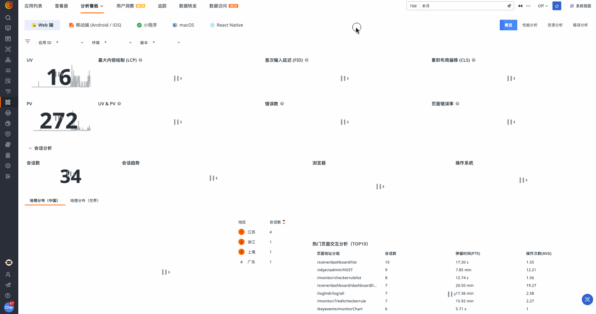

# 用户访问监测
---

<video controls="controls" poster="https://static.guance.com/dataflux/help/video/rum.png" >
      <source id="mp4" src="https://static.guance.com/dataflux/help/video/rum.mp4" type="video/mp4">
</video>

## 为何需要用户访问监测（RUM）？

云原生时代，如何提升用户体验成为企业关注的新命题。企业不仅需要观测全面、真实的数据来确保其系统的稳定性和可靠性，还需要快速监测用户的使用行为和遇到的问题。

由此，观测云提供用户访问监测（RUM）功能，力图完整追踪用户的每次访问，了解每个请求背后的真实需求，高效优化产品性能。

## 数据从何而来？

观测云用户访问监测通过 RUM Headless 自动化部署，采集 Web、Android、iOS、小程序和第三方框架的用户访问数据。您可以实时查看与分析用户访问数据，洞察用户访问环境，回溯用户操作路径及分解操作响应时间；还可以了解用户操作导致的一系列调用链的应用性能指标情况，实现端到端的全面监测，高效提高应用程序性能和用户体验。

## 如何开启用户访问监测（RUM）？

要开启用户访问监测功能，**首先需要部署一个公网 DataKit 作为 Agent**，客户端的用户访问数据通过这个 Agent 将数据上报到观测云工作空间。

> 具体的 DataKit 安装方法与配置方法，可参考 [DataKit 安装](../datakit/datakit-install.md)。

DataKit 安装完成后，**开启 [RUM 采集器](../integrations/rum.md)**，接入应用配置，即可开始采集用户访问的相关数据。

## 开始配置 {#create}

登录观测云控制台，进入**用户访问监测 > 应用列表 > 新建应用**。

1、输入**应用名称**、**应用 ID**；

- 应用名称：用于识别当前用户访问监测的应用名称；  
- 应用 ID：应用在当前工作空间的唯一标识，对应字段：`app_id`。该字段仅支持英文、数字、下划线输入，最多 48 个字符。

2、选择**应用类型**，目前支持 <u>Web、小程序、Android、iOS 和自定义</u>五种类型。

3、SDK 配置

您可以点击以下链接查看对应的应用接入配置方式：

|                         应用接入配置                         |                                                              |                                                              |
| :----------------------------------------------------------: | :----------------------------------------------------------: | :----------------------------------------------------------: |
| [Web 应用接入](web/app-access.md){ .md-button .md-button--primary } | [Android 应用接入](android/app-access.md){ .md-button .md-button--primary } | [iOS 应用接入](ios/app-access.md){ .md-button .md-button--primary } |
| [小程序应用接入](miniapp/app-access.md){ .md-button .md-button--primary } | [React Native 应用接入](react-native/app-access.md){ .md-button .md-button--primary } | [Flutter 应用接入](flutter/app-access.md){ .md-button .md-button--primary } |
| [UniApp 应用接入](uni-app/app-access.md){ .md-button .md-button--primary } | [macOS 应用接入](macos/app-access.md){ .md-button .md-button--primary } | [C++ 应用接入](cpp/app-access.md){ .md-button .md-button--primary } |

关于选择自定义应用类型的相关配置说明：

- 选择**自定义**应用类型，可在右侧查看对应的应用接入说明。

- 在**分析看板**一栏，您可自定义选择工作空间内内置视图作为此应用的关联分析看板。

- 默认自定义应用类型<u>无分析看板</u>，需要您手动配置关联。您可以同时绑定多个内置视图。

| 操作      | 说明                          |
| ----------- | ------------------------------------ |
| 筛选下拉框       | 单选，支持模糊匹配搜索，范围：内置视图。  |
| 跳转       | 点击即可跳转打开展示分析看板，并将当前应用 ID 带入到视图变量中。 |
| 删除    | 点击即可删除已添加的关联分析看板。 |

- 配置完成后，回到**应用列表**。您可以点击 :material-dots-horizontal: ，对该条应用进行编辑或删除。

???+ warning "注意事项"

    - 应用 ID 一经更改，需要同步更新 SDK 中的配置信息；   
    - SDK 更新成功后，新的分析视图和查看器列表仅展示最新 `app_id` 关联数据，旧的应用 ID 对应数据将不会做显示；   
    - 用户访问指标检测监控器请及时变更到最新应用 ID 配置或重新创建基于新的应用 ID 对应数据的指标检测；    
    - 旧的应用 ID 数据可以通过用户访问内置视图、自定义仪表板或者 DQL 工具等方式查看分析；  
    - 若在进行配置自定义应用时未添加关联分析看板，则无法跳转至分析看板。

- 您可以通过点击 **[分析看板](./app-analysis.md)** 或 **[查看器](./explorer/index.md)** 进一步查看当前用户访问应用程序的详细信息。

## 何为会话重放？

观测云用户访问监测的基本概念围绕用户操作和用户会话展开。基于用户在应用程序中执行的各种访问行为，观测云可以捕捉 Web 端、小程序、Android、iOS 和自定义应用的用户会话。

借助现代浏览器提供的强大 API 拓展能力，观测云会话重放实时捕获用户的操作数据、重放用户的操作路径。如此一来，能有效重现、定位并解决错误。

- [ :fontawesome-solid-arrow-up-right-from-square: &nbsp; 会话重放配置说明](./session-replay/index.md)

 

## 可视化分析用户访问数据

### 分析看板 {#panel}

用户访问监测 > 分析看板涵盖不同端口的多种分析场景，从性能、资源和错误三方面为您展示多项指标数据，您能够通过关键性能指标了解用户前端的真实体验，快速定位用户访问应用的问题，提高用户访问性能。

- [ :fontawesome-solid-arrow-up-right-from-square: &nbsp; 分析看板查看多维度数据](./app-analysis.md)

 

### 查看器 {#explorer}

接入应用并完成数据采集后，除上面的分析看板外，您还可以在查看器进一步了解每个用户会话（Session）、页面性能（View）、错误（Error）以及其他相关数据，并通过一系列设置全面了解和改善应用的运行状态和使用情况。

- [ :fontawesome-solid-arrow-up-right-from-square: &nbsp; 探索查看器妙用](./explorer/index.md)

 

## 自建链路异常数据追踪

观测云用户访问监测可以设置自定义追踪任务，实时监控追踪轨迹，基于全面的追踪信息，快速精准定位异常根因；同时能保证链路上下文在不同环境下都能够完整透传，避免出现上下文丢失导致的断链现象，从而及时发现漏洞、异常和风险；还能通过浏览器插件的实现方式，创建简洁无代码的端到端测试。

- [ :fontawesome-solid-arrow-up-right-from-square: &nbsp; 配置自建追踪](./self-tracking.md)

 

## 利用生成指标细分数据

面对庞大的原始数据体量，观测云用户访问监测的生成指标功能可以帮助 Dev & Ops 和业务方降低多维度分析的难度。其基于当前空间内的现有数据生成新的指标数据，联动绑定自定义仪表板，从而根据指标维度进行定期统计。

- [ :fontawesome-solid-arrow-up-right-from-square: &nbsp; 自定义生成指标](./generate-metrics.md)

 

## 数据存储策略与计费规则

观测云为用户访问数据提供 <u>3 天、7 天、14 天</u>三种数据存储时长选择，您可以按照需求在**管理 > 基本设置 > 变更数据存储策略**中调整。

> 更多数据存储策略，可参考 [数据存储策略](../billing-method/data-storage.md)。

基于<u>按需购买，按量付费</u>的计费方式，用户访问监测计费统计当前空间下一天内所有页面浏览产生的 PV 数量，采用梯度计费模式。

> 更多计费规则，可参考 [计费方式](../billing-method/index.md#pv)。

