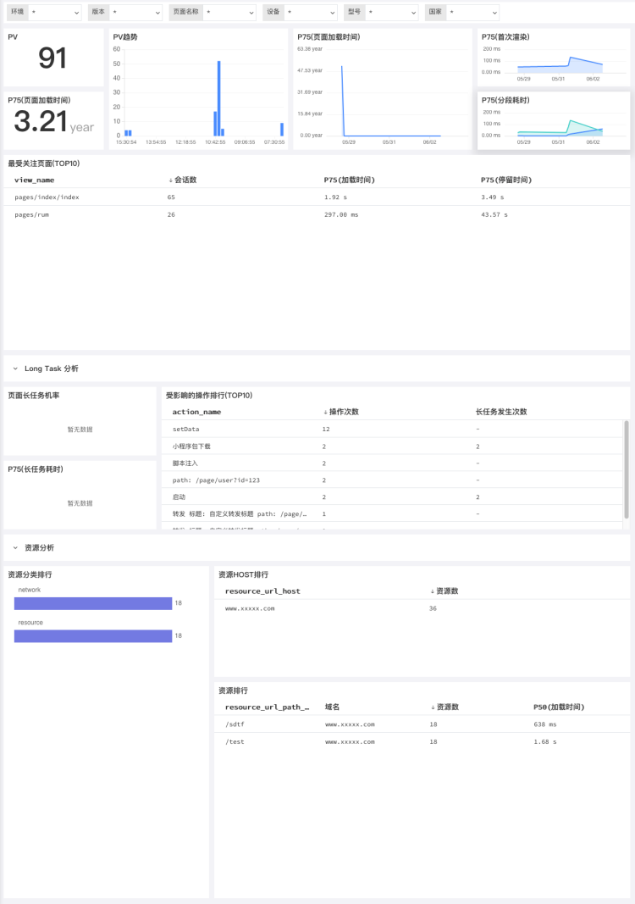
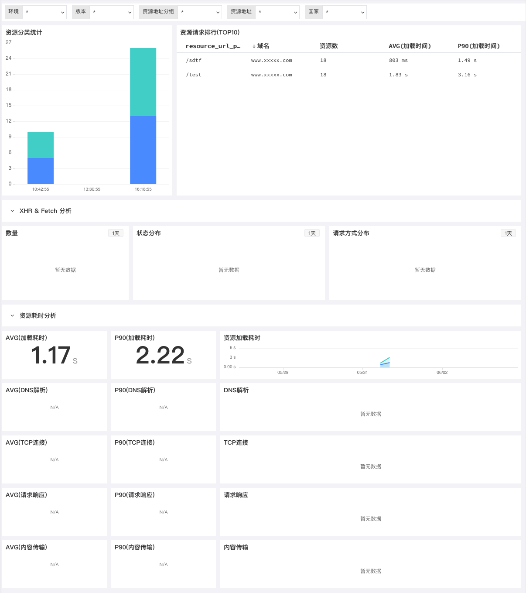
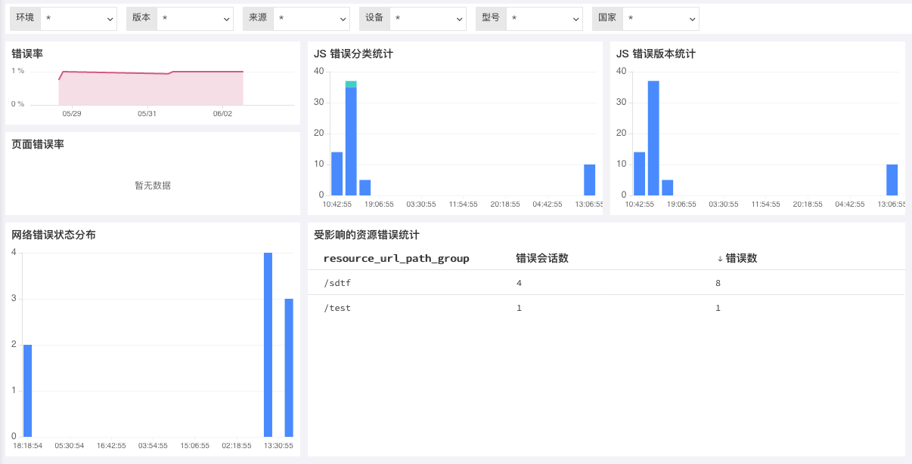

# 小程序应用分析
---

## 简介

应用数据采集到{{{ custom_key.brand_name }}}后，可以通过{{{ custom_key.brand_name }}}控制台查看应用性能分析。

## 查看器分析

{{{ custom_key.brand_name }}}提供用户访问监测查看器，帮助您查看与分析用户访问应用程序的详细信息。在{{{ custom_key.brand_name }}}工作空间内打开**用户访问监测**，点击任意一个应用后即可通过**查看器**了解每个用户会话、页面性能、资源、长任务、操作中的错误、延迟对用户的影响、帮助您通过搜索、筛选和关联分析全面了解和改善应用的运行状态和使用情况，提高用户体验。更多详情可参考文档 [查看器](../explorer/index.md)。

## 场景分析

{{{ custom_key.brand_name }}}提供可视化的小程序应用分析，内置多种小程序应用监测方案，您可以在**用户访问监测**-「分析看板」-「小程序」，查看概览、性能分析、资源分析、错误分析。

### 概览

小程序应用的概览场景统计小程序访问的启动次数、PV数、页面错误率、页面加载时间、启动分析、会话分析、性能分析、错误分析等指标，从小程序启动、会话分布、访问用户设备、受欢迎页面排行、页面访问量排行、资源错误排行等方面，可视化的展示用户访问小程序应用的数据统计，快速定位用户访问小程序应用的问题，提高用户访问性能。可通过环境、版本筛选查看已经接入的小程序应用。

### 性能分析

小程序应用的性能分析，通过统计PV数、页面加载时间、首次渲染时间、分段耗时、最受关注页面会话数、页面长任务分析、资源分析等指标，可视化的实时查看整体的小程序应用页面性能情况，更精准的定位需要优化的页面，可通过环境、版本等筛选查看已经接入的小程序应用。

### 资源分析

小程序应用的资源分析，通过统计资源分类、XHR & Fetch 分析、资源耗时分析等指标，可视化的实时查看整体的小程序应用资源情况；通过统计资源请求排行，更精准的定位需要优化的资源；可通过环境、版本等筛选查看已经接入的小程序应用。

### 错误分析

小程序应用的JS错误分析，通过统计错误率、错误分类、错误版本、网络错误状态分布等指标，可视化的实时查看整体的小程序应用错误情况；通过受影响的资源错误统计，可快速定位资源错误；可通过环境、版本等筛选查看已经接入的小程序应用。

