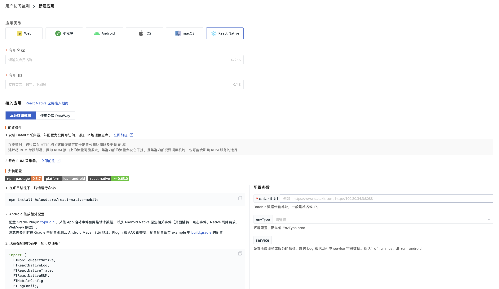

# Unity 应用接入
---
## 前置条件

**注意**：若您开通了 [RUM Headless](../../dataflux-func/headless.md) 服务，前置条件已自动帮您配置完成，直接接入应用即可。

- 安装 [DataKit](../../datakit/datakit-install.md)；  
- 配置 [RUM 采集器](../../integrations/rum.md)；
- DataKit 配置为[公网可访问，并且安装 IP 地理信息库](../../datakit/datakit-tools-how-to.md#install-ipdb)。

## 应用接入 {#integration}
当前 Unity 版本暂时支持 Android 和 iOS 平台。登录观测云控制台，进入「用户访问监测」页面，点击左上角「新建应用」，即可开始创建一个新的应用。

1.输入「应用名称」、「应用ID」，选择 「自定义」 应用类型

- 应用名称：用于识别当前用户访问监测的应用名称。
- 应用 ID ：应用在当前工作空间的唯一标识，对应字段：app_id 。该字段仅支持英文、数字、下划线输入，最多 48 个字符。




## 安装 {#install}
 

**源码地址**：[https://github.com/GuanceCloud/datakit-unity](https://github.com/GuanceCloud/datakit-unity)

**Demo 地址**：[https://github.com/GuanceCloud/datakit-unity/blob/dev/Assets/Scenes](https://github.com/GuanceCloud/datakit-unity/blob/dev/Assets/Scenes/ClickEvent.cs)

* 下载最新 [ft-sdk-unity.unitypackage](https://static.guance.com/ft-sdk-package/unitypackage/alpha/ft-sdk-unity.unitypackage)

```
Assets/Plugins
├── Android
│   ├── FTUnityBridge.java					// Android bridge 
│   ├── ft-sdk-release.aar					// Android SDK
│   ├── gson-2.8.5.jar						// Android SDK 依赖第三方库
├── FTSDK.cs								// FTSDK.prefab 绑定脚本
├── FTSDK.prefab							// SDK 初始化预制件
├── FTUnityBridge.cs						// Unity bridge 桥接 iOS Android 等平台方法
├── FTViewObserver.cs						// FTViewObserver.prefab 绑定脚本
├── FTViewObserver.prefab					// View 页面监听预制件
├── UnityMainThreadDispatcher.cs			// UnityMainThreadDispatcher.prefab 绑定脚本
├── UnityMainThreadDispatcher.prefab 		// 主线程消费队列预制件
├── iOS
│   ├── FTMobileSDK.framework 				// iOS SDK
│   ├── FTUnityBridge.mm					// iOS bridge
	
```

* `Asserts` -> `Import Package` -> `Custom Package...` 导入 `ft-sdk-unity.unitypackage`
* 添加 json 解析第三方库 `"com.unity.nuget.newtonsoft-json"`，可以在 `Pakcage Manager` -> `Add Package by name ...` 
*  将 `FTSDK.prefab` 拖拽至第一个场景页面，并在 `FTSDK.cs` 中 `_InitSDK` 方法中初始化 SDK，如果原生 Android 和 iOS 工程已集成了原生 SDK，需要注释 `_InitSDK`方法，避免重复设置
*  将 `FTViewObserver.prefab`拖拽至其他场景页面，来达到页面 `View` 生命周期监听的目的，包括应用休眠和唤醒
*  通过 `Application.logMessageReceived` 监听转化 Unity 崩溃数据和普通日志数据，见 `FTSDK.cs` `OnEnable` `OnDisable` 方法

>注意：如果已经集成原生 SDK Android gson-2.8.5.jar、ft-sdk-release.aar	，iOS FTMobileSDK.framework 可以在项目中移除。
> 另外，Android  Okhttp 请求和启动耗时功能，需要配合 ft-plugin 使用，详细配置请见 [Android SDK](../android/app-access.md#gradle-setting) 

## 初始化
```csharp
FTUnityBridge.Install(new SDKConfig
            {
                serverUrl = "http://10.0.0.1:9529",
                env = "prod",
                debug = true,

            });

```

| **字段** | **类型** | **必须** | **说明** |
| --- | --- | --- | --- |
| serverUrl | string | 是 | datakit 访问 URL 地址，例子：http://10.0.0.1:9529，端口默认 9529。注意：安装 SDK 设备需能访问这地址 |
| env | string | 否 | 环境，默认`prod`.prod：线上环境；gray：灰度环境；pre：预发布环境；common：日常环境；local：本地环境，支持自定义 |
| debug | bool | 否 | 是否开启调试模式 |
| globalContext | dictionary | 否 | 添加 SDK 全局属性，添加规则请查阅[此处](#key-conflict)|
| serviceName| string |否|影响 Log 和 RUM 中 service 字段数据， 默认为 android 为`df_rum_android`，iOS 为 `df_rum_ios` |


### RUM 配置
```csharp
FTUnityBridge.InitRUMConfig(new RUMConfig()
            {
                androidAppId = "androidAppId",
                iOSAppId = "iOSAppId",
                sampleRate = 0.8f,
            });
```

| **字段** | **类型** | **必须** | **说明** |
| --- | --- | --- | --- |
| androidAppId | string | 是 | 对应设置 RUM `appid`，才会开启`RUM`的采集功能，[获取 appid 方法](#integration) |
| iOSAppId | string | 是 | 对应设置 RUM `appid`，才会开启`RUM`的采集功能，[获取 appid 方法](#integration) |
| sampleRate | float | 否 | 采样率，取值范围 [0,1]，0 表示不采集，1 表示全采集，默认值为 1。作用域为同一 session_id 下所有 View，Action，LongTask，Error 数据  |
| globalContext | dictionary | 否 | 添加标签数据，用于用户监测数据源区分，如果需要使用追踪功能，则参数 `key` 为 `track_id` ,`value` 为任意数值。添加规则请查阅 [此处](#key-conflict) |
| enableNativeUserAction | bool | 否 |  是否开启 Native Action 收集，默认 false |
| enableNativeUserView | bool | 否 |  是否开启 Native View 收集，默认 false |
| enableNativeUserResource | bool | 否 |  是否开启 Native Resource 收集，Android 支持 Okhttp，iOS 使用 NSURLSession，默认 false |
| extraMonitorTypeWithError | enum | 否 | 添加附加监控数据到 `Rum` 崩溃数据中，`memory` 为内存用量，`cpu` 为 CPU 占有率，`all` 为全部 |
| deviceMonitorType | enum | 否 | 页面监控补充类型： `all` 、`battery`（仅Android支持)、 `memory`、`cpu`、`fps` |
| detectFrequency | enum | 否 | 页面监控频率： `normal`(默认)、 `frequent`、`rare `|

### Log 配置
```csharp
FTUnityBridge.InitLogConfig(new LogConfig
            {
                sampleRate = 0.9f,
                enableCustomLog = true,
                enableLinkRumData = true,
            });
```

| **字段** | **类型** | **必须** | **说明** |
| --- | --- | --- | --- |
| sampleRate | float | 否 | 采样率，取值范围 [0,1]，0 表示不采集，1 表示全采集，默认值为 1。 |
| globalContext | dictionary | 否 | 添加标签数据，添加规则请查阅 [此处](#key-conflict)  |
| logLevelFilters | array | 否 | 设置等级日志过滤，`ok`，`info`，`warning`，`error`，`critical`，默认不过滤 |
| enableCustomLog | bool | 否 | 是否上传自定义日志 ，默认为 `false` |
| discardStrategy | enum | 否 | `discard`为丢弃追加数据，`discard_oldest` 丢弃老数据，默认为 `discard` |

### Trace 配置
```csharp
FTUnityBridge.InitTraceConfig(new TraceConfig
            {
                sampleRate = 0.9f,
                traceType = TraceType.DDTrace,
                enableAutoTrace = true,
                enableLinkRumData = true

            });
```

| **字段** | **类型** | **必须** | **说明** |
| --- | --- | --- | --- |
| sampleRate | float | 否 |采样率，取值范围 [0,1]，0 表示不采集，1 表示全采集，默认值为 1。 |
| traceType | enum | 否 | 默认为 `ddtrace`，目前支持 `zipkin` , `jaeger`, `ddtrace`，`skywalking` (8.0+)，`traceParent` (W3C)，如果接入 OpenTelemetry 选择对应链路类型时，请注意查阅支持类型及 agent 相关配置  |
| enableLinkRUMData | bool | 否 | 是否与 RUM 数据关联，默认为 `false` |

## RUM 用户数据追踪
目前只能通过手动方法调用来实现 RUM 数据传输

### Action
#### 使用方法
```csharp
/// <summary>
///  添加 Action 
/// </summary>
/// <param name="actionName"> action 名称</param>
/// <param name="actionType"> action 类型</param>
public static void StartAction(string actionName, string actionType)

/// <summary>
/// 添加 Action
/// </summary>
/// <param name="actionName">action 名称</param>
/// <param name="actionType">action 类型</param>
/// <param name="property">附加属性参数</param>
public static void StartAction(string actionName, string actionType, Dictionary<string, object> property)
		
```

#### 代码示例
```csharp
 FTUnityBridge.StartAction("click", "test");
```

### View
#### 使用方法
```csharp
/// <summary>
///  View 开始
/// </summary>
/// <param name="viewName">当前页面名称</param>
public static void StartView(string viewName)
    
/// <summary>
/// View 开始
/// </summary>
/// <param name="viewName">当前页面名称</param>
/// <param name="property">附加属性参数</param>
public static void StartView(string viewName, Dictionary<string, object> property)

/// <summary>
/// View 结束
/// </summary>
public static void StopView()
    
/// <summary>
/// View 结束
/// </summary>
/// <param name="property">附加属性参数</param>
public static void StopView(Dictionary<string, object> property)
```

#### 代码示例

```csharp
FTUnityBridge.StartView("TEST_VIEW_ONE");

FTUnityBridge.StopView();
```

### Resource
#### 使用方法
```csharp
/// <summary>
///  resource 开始
/// </summary>
/// <param name="resourceId">资源 Id</param>
/// <returns></returns>
public static async Task StartResource(string resourceId)
    
/// <summary>
/// resource 开始
/// </summary>
/// <param name="resourceId">资源 Id</param>
/// <param name="property">附加属性参数</param>
/// <returns></returns>
public static async Task StartResource(string resourceId, Dictionary<string, object> property)
	
/// <summary>
/// resource 结束
/// </summary>
/// <param name="resourceId">资源 Id</param>
/// <returns></returns>
public static async Task StopResource(string resourceId)
    
/// <summary>
/// resource 结束
/// </summary>
/// <param name="resourceId">资源 Id</param>
/// <param name="property">附加属性参数</param>
public static async Task StopResource(string resourceId, Dictionary<string, object> property)


/// <summary>
/// 添加网络传输内容和指标
/// </summary>
/// <param name="resourceId">资源 Id</param>
/// <param name="resourceParams">数据传输内容</param>
/// <param name="netStatus">网络指标数据</param>
public static async Task AddResource(string resourceId, ResourceParams resourceParams, NetStatus netStatus)

```
##### NetStatus

| **方法名** | **类型** | **必须** | **说明** |
| --- | --- | --- | --- |
| fetchStartTime | long| 否 | 请求开始时间，ns|
| tcpTime | long | 否 | tcp 连接耗时，ns |
| dnsTime | long | 否 | dns 解析时间，ns |
| responseTime | long | 否 |  响应内容传输耗时，ns|
| sslTime |long | 否 | ssl 链接耗时，ns |
| firstByteTime |long | 否 | ssl dns 解析到接收到第一个数据包的总时，ns |
| ttfb | long | 否 | 请求响应时间，开始发送请求到接收到响应首包的时长，ns|
| tcpStartTime | long  | 否 | tcp 连接时间，ns |
| tcpEndTime | long | 否 | tcp 结束时间 ，ns|
| dnsStartTime | long | 否 | dns 开始时间 ，ns|
| dnsEndTime | long | 否 | dns 结束时间，ns |
| responseStartTime | long | 否 |响应开始时间 ，ns |
| responseEndTime | long | 否 | 响应结束时间，ns |
| sslStartTime | long | 否 | ssl 开始时间，ns |
| sslEndTime | long | 否 |ssl 结束时间，ns |

##### ResourceParams
| **方法名** | **类型** | **必须** | **说明** |
| --- | --- | --- | --- |
| url | string| 是 | url 地址  |
| requestHeader | string | 否 | 请求头参数，没有格式限制 |
| responseHeader | string | 否 | 响应头参数，没有格式限制 |
| responseConnection | string | 否 | 响应  connection |
| responseContentType | string | 否 | 响应  ContentType |
| responseContentEncoding | string | 否 | 响应  ContentEncoding |
| resourceMethod | string | 否 | 请求方法 GET,POST 等 |
| responseBody | string | 否 | 返回 body 内容 |

#### 代码示例
```csharp
FTUnityBridge.StartResource(resourceId);

FTUnityBridge.StopResource(resourceId);

ResourceParams resourceParams = new ResourceParams();
resourceParams.url = url;
resourceParams.requestHeader = client.DefaultRequestHeaders.ToDictionary(header => header.Key, header => string.Join(",", header.Value));
resourceParams.responseHeader = response.Headers.ToDictionary(header => header.Key, header => string.Join(",", header.Value));
resourceParams.resourceStatus = (int)response.StatusCode;
resourceParams.responseBody = responseData;
resourceParams.resourceMethod = "GET";
NetStatus netStatus = new NetStatus();
netStatus.fetchStartTime = DateTimeOffset.Now.ToUnixTimeMilliseconds() * 1000000;

FTUnityBridge.AddResource(resourceId, resourceParams, netStatus);

```

### Error
#### 使用方法
```csharp
/// <summary>
/// 添加错误信息
/// </summary>
/// <param name="log">日志</param>
/// <param name="message">消息</param>
/// <param name="errorType">错误类型</param>
/// <param name="state">程序运行状态</param>
/// <returns></returns>
public static async Task AddError(string log, string message)
    
    
/// <summary>
/// 添加错误信息
/// </summary>
/// <param name="log">日志</param>
/// <param name="message">消息</param>
/// <param name="errorType">错误类型</param>
/// <param name="state">程序运行状态</param>
/// <param name="property">附加属性参数</param>
/// <returns></returns>
public static async Task AddError(string log, string message,
    Dictionary<string, object> property)
```


#### 代码示例
```csharp
void OnEnable()
{
    Application.logMessageReceived += LogCallBack;

}

void OnDisable()
{
    Application.logMessageReceived -= LogCallBack;
}
    
void LogCallBack(string condition, string stackTrace, LogType type)
{
    if (type == LogType.Exception)
    {
        FTUnityBridge.AddError(stackTrace, condition);
    }

}
```

### LongTask
#### 使用方法
```csharp
/// <summary>
/// 添加长耗时任务
/// </summary>
/// <param name="log">日志内容</param>
/// <param name="duration">持续时间，纳秒</param>
/// <returns></returns>
public static async Task AddLongTask(string log, long duration)

/// <summary>
/// 添加长耗时任务
/// </summary>
/// <param name="log">日志内容</param>
/// <param name="duration">持续时间，纳秒</param>
/// <param name="property">附加属性参数</param>
/// <returns></returns>
public static async Task AddLongTask(string log, long duration, Dictionary<string, object> property)
```

#### 代码示例
```csharp
FTUnityBridge.AddLongTask("long task test", 100002);
```

## Log 日志打印
> 目前日志内容限制为 30 KB，字符超出部分会进行截断处理
### 使用方法
```csharp
/// <summary>
/// 添加日志
/// </summary>
/// <param name="log">日志内容</param>
/// <param name="level">日志等级 info，warning，error，critical，ok</param>
/// <returns></returns>
public static async Task AddLog(string log, LogLevel level)
    
 /// <summary>
/// 添加日志
/// </summary>
/// <param name="log">日志内容</param>
/// <param name="level">日志等级 info，warning，error，critical，ok</param>
/// <param name="property">附加属性参数</param>
/// <returns></returns>
public static async Task AddLog(string log, LogLevel level, Dictionary<string, object> property)
```

### LogLevel

| **方法名** | **含义** |
| --- | --- |
| info | 提示 |
| warning | 警告 |
| error | 错误 |
| critical | 严重 |
| ok | 恢复 |


### 代码示例
```csharp
FTUnityBridge.AddLog("test log", "test message");
```

## Tracer 网络链路追踪
链路通过生成 Trace Header，然后通过将 Header 添加到 http 请求头上来实现链路功能

### 使用方法
```csharp
/// <summary>
/// 获取链路 Id
/// </summary>
/// <param name="url">url 地址</param>
/// <returns>json 字符</returns>
public static async Task<string> GetTraceHeaderWithUrl(string url)
 
 
/// <summary>
/// 获取链路
/// </summary>
/// <param name="resourceId">资源 Id</param>
/// <param name="url">url 地址</param>
/// <returns>json 字符</returns>

public static async Task<string> GetTraceHeader(string resourceId, string url)
```

### 代码示例
```csharp
string headData = FTUnityBridge.GetTraceHeader(resourceId, FAKE_URL);

string headData = FTUnityBridge.GetTraceHeader(FAKE_URL);


```

## 用户信息绑定与解绑
### 使用方法

```csharp 
/// <summary>
/// 绑定 RUM 用户信息
/// </summary>
/// <param name="userId">用户唯一id</param>
public static async Task BindUserData(string userId)
	
/// <summary>
/// 绑定 RUM 用户信息
/// </summary>
/// <param name="userData"></param>
public static async Task BindUserData(UserData userData)

```

| **方法名** | **类型** | **必须** | **说明** |
| --- | --- | --- | --- |
| userId | string| 是 | 用户 id |
| userName | string | 否 | 用户名 |
| userEmail | string | 否 | 用户邮箱 |
| extra | dictionary | 否 | KV 方式赋值，添加规则请查阅 [此处](#key-conflict) |


### 代码示例
```csharp 
FTUnityBridge.BindUserData(new UserData
            {
                userId = "userid",
                userName = "userName",
                userEmail = "someone@email.com",
                extra = new Dictionary<string, string>{
                    {"custom_data","custom data"}
                }
            });
            
FTUnityBridge.UnBindUserdata()

```

## 关闭 SDK
```csharp
/// <summary>
/// SDK 释放
/// </summary>
public static void DeInit()
```

### 代码示例
```csharp        
FTUnityBridge.DeInit()
```

## Publish Package 相关配置
### Android
* [Android R8/Prograd 配置](../android/app-access.md#r8_proguard)
* [Android 符号文件上传](../android/app-access.md#source_map)

### iOS
* [iOS 符号文件上传](../ios/app-access.md#source_map)


## 常见问题 {#FAQ}
### 添加局变量避免冲突字段 {#key-conflict}

为了避免自定义字段与 SDK 数据冲突，建议标签命名添加 **项目缩写** 的前缀，例如 `df_tag_name`，项目中使用 `key` 值可[查询源码](https://github.com/GuanceCloud/datakit-android/blob/dev/ft-sdk/src/main/java/com/ft/sdk/garble/utils/Constants.java)。SDK 全局变量中出现与 RUM、Log 相同变量时，RUM、Log 会覆盖 SDK 中的全局变量。


