# 更新日志（2022年）
---

本文档记录<<< custom_key.brand_name >>>每次上线发布的更新内容说明，包括 DataKit、<<< custom_key.brand_name >>>最佳实践、<<< custom_key.brand_name >>>集成文档和<<< custom_key.brand_name >>>。

## 2022 年 12 月 29 号

### <<< custom_key.brand_name >>>更新

#### 新增 MFA 认证管理

<<< custom_key.brand_name >>>提供 MFA 认证管理，帮助在账号用户名和密码之外再额外增加一层安全保护，开启 MFA 认证后，您在登录时需要进行二次校验，帮助您提高账户的安全性。更多详情可参考文档 **MFA 管理**。

#### 新增工作空间 IP 访问登录白名单

<<< custom_key.brand_name >>>支持为工作空间配置 IP 白名单来限制来访用户。开启 IP 白名单后，仅白名单中的 IP 来源可以正常登录，其他来源请求均会被拒绝访问。更多详情可参考文档 **IP 白名单**。

注意：IP 白名单仅支持管理员及拥有者可以设置，同时「拥有者」不受 IP 白名单访问限制。


#### 新增 Service 网络拓扑

在 K8S 环境下，您可以使用 Service 网络拓扑图查看 K8S 环境中各 Service 之间的请求关系、响应时间、错误率等，当发现某个 Service 存在连接问题时，您可以点击查看该 Service 对应的日志来定位其问题。更多详情可参考文档 **Service 网络**。


#### 其他功能优化

- Pipeline 使用优化
- 日志聚类分析支持自定义字段
- 超大日志切割后支持查看其关联日志
- 备份日志显示优化
- 数据授权敏感字段支持除指标以外所有类型的数据

### DataKit 更新

- Prometheus 采集器支持通过 Unix Socket 采集数据
- 允许**非 root 用户运行 DataKit**

- 优化 eBPF 中 httpflow 协议判定
- 优化 Windows 下 Datakit 安装升级命令
- 优化 Pythond 使用封装
- Pipeline 提供更详细的操作报错信息
- Pipeline reftable 提供基于 SQLite 的本地化存储实现

更多 DataKit 更新可参考 **DataKit 版本历史**。

### 智能巡检更新

#### 官方智能巡检下线

官方智能巡检「内存泄露」、「应用性能检测」、「磁盘使用率」今起下线，用户可以通过 **自建巡检** 脚本库进行配置。

#### 新增云账户实例维度账单巡检

云账户实例维度账单巡检帮助用户管理云服务实例级别的异常费用预警、预测费用情况并为用户提供高增长、高消耗的实例提示及账单可视化能力，支持多维度可视化云服务资源的消费情况。

#### 新增阿里云抢占式实例存活巡检

由于抢占式实例的市场价格会随供需变化而浮动，需要在创建抢占式实例时指定出价模式，当指定实例规格的实时市场价格低于出价且库存充足时，才能成功创建抢占式实例。所以说对于云资产的抢占实例巡检就显得尤为重要，通过巡检当发现抢占式实例即将被释放时，会提示当前规格的抢占实例的所有可用区的最新价格以及改抢占式实例的历史价格并给出恰当的处理意见。

更多智能巡检更新可参考 **智能巡检更新日志**。

## 2022 年 12 月 15 号

### <<< custom_key.brand_name >>>更新

#### 新增 Profile、Network 计费

<<< custom_key.brand_name >>>新增 Profile 、Network 计费项，Profile 是统计工作空间内当天上报的应用性能 Profile 数量，Network 是统计工作空间内当天有网络数据上报的主机（host）数量。更多详情可参考文档 **计费方式**。

#### <<< custom_key.brand_name >>>注册流程优化

<<< custom_key.brand_name >>>简化了注册流程，帮助您快速完成注册并开始使用<<< custom_key.brand_name >>>。更多详情可参考文档 **注册<<< custom_key.brand_name >>>商业版**。

#### 新增作战室功能

<<< custom_key.brand_name >>>提供「作战室」看板，您可以在「作战室」看板纵观所有工作空间的关键指标趋势，帮助您快速了解每个工作空间的关键数据情况，及时发现和解决异常问题。更多详情可参考文档 **关键指标管理**。


#### 新增仪表板轮播功能

<<< custom_key.brand_name >>>为多个关联的业务仪表板提供轮播的功能，设置以后，您可以在大屏上进行展示。更多详情可参考文档 **轮播仪表板**。


#### 工作空间绑定外部 SLS 索引

<<< custom_key.brand_name >>>新增支持绑定 SLS 索引，帮助您统一快速查看和分析您的日志数据，同时<<< custom_key.brand_name >>>新增支持字段映射功能，帮助您映射 SLS 索引的字段进行聚类分析。更多详情可参考文档 **日志索引**。


#### 链路查看器图表显示优化

在链路查看器新增「Span 数量」、「Error Span 数量」趋势图表，您可以通过查看器的图表快速查看 Span 数量、Error Span 数量、请求数、Error 请求数、响应时间的指标趋势。


#### 其他功能优化

- 视图变量交互优化
- 绑定内置视图配置交互优化
- 工作空间欠费锁定流程优化
- 工作空间邀请用户体验优化
- 帮助文档新增评价系统，包括文档较好和较差
- 监控器批量功能优化
- SLO新增启用/禁用功能
- 模糊匹配 Wildcard 左 * 匹配查询限制优化

### DataKit 更新

- 新增 **Golang Profiling** 接入
- logfwd 支持通过 `LOGFWD_TARGET_CONTAINER_IMAGE` 来支持 image 字段注入
- trace 采集器：
    - 优化 error-stack/error-message 格式问题
    - SkyWalking 兼容性调整，支持 8.X 全序列
- eBPF httpflow 增加 `pid/process_name` 字段，优化内核版本支持
- datakit.yaml 有调整，建议更新 yaml
- GPU 显卡采集支持远程模式

更多 DataKit 更新可参考 **DataKit 版本历史**。

### 智能巡检更新

#### 智能巡检新增引导页

<<< custom_key.brand_name >>>默认支持三种智能巡检模版：内存泄露、磁盘使用率和应用性能检测，本次更新后，已有的工作空间支持手动删除默认的智能巡检模版，同时提示系统统一下线时间；新创建的工作空间不再默认提供这三个智能巡检，增加新手引导提示。


#### 智能巡检组件支持配置自定义跳转链接

在配置自建巡检时支持配置自定义跳转链接，关于如何配置自建巡检可以参考文档 **自建巡检**。

更多智能巡检更新可参考 **智能巡检更新日志**。

### 最佳实践更新

- 洞见
    - 场景 (Scene) - **SpringBoot 项目外置 Tomcat 场景链路可观测**。

更多最佳实践更新可参考 **最佳实践版本历史**。


## 2022 年 12 月 1 号

### <<< custom_key.brand_name >>>更新

#### 应用性能新增服务清单功能

应用性能监测服务清单，支持实时查看不同服务的所有权、依赖关系、性能、关联的仪表版以及关联分析，快速发现和解决服务的性能问题，帮助团队高效地构建及管理大规模的端到端的分布式应用。更多详情可参考文档 **服务清单**。


#### 仪表板图表使用体验优化

- 新增图表单位、颜色、别名的手动输入，您可以按照当前的规范自定义预设单位、颜色和别名，如单位的输入格式为：聚合函数(指标)，如 `last(usage_idle)`
- 时序图新增 Y 轴配置，您可以手动配置 Y 轴的最大值和最小值
- 时序图、饼图新增分组显示，开启后图例中仅显示标签值
- 蜂窝图、中国地图、世界地图新增渐变区间，包括自动和自定义
- 柱状图、直方图显示优化

更多详情可参考文档 **可视化图表**。


#### 视图变量使用体验优化

- 视图变量新增支持多选
- 视图变量配置时新增是否设置多个默认值

更多详情可参考文档 **视图变量**。


#### 用户访问监测 Session 查看器调整

在用户访问监测 Session 查看器，新增“会话”和“所有记录”查看列表：

- 会话：统计当前时间范围内 Session（会话）去重后的数据，默认显示最新一条的 Session（会话）数据；
- 所有记录：显示所有 Session（会话）的上报数据，同一个 Session（会话）可能对应多条数据。

注意：在 Session 会话列表，支持添加显示列，若用户添加的显示列是当前 Session 数据内不存在的字段，那么在会话列表存在空数据的情况。更多详情可参考文档 **Session（会话）**。


#### 事件新增移动端跳转选项

用户在收到告警事件通知后，点击「前往<<< custom_key.brand_name >>>查看」可前往<<< custom_key.brand_name >>>移动端 APP 查看异常事件的详情信息。

#### 其他功能优化

- 新手引导页优化，支持最小化
- 用户访问监测应用列表优化，新增时间控件自定义区间切换查询
- 主机添加 Label 交互优化

### DataKit 更新

- 新增 Python Profiling 接入
- Pythond 新增自定义事件上报功能
- netstat 支持特定端口的指标采集

- 优化 Redis 采集器 CPU 使用率采集，增加了新的指标字段
- 优化 logfwd 采集器配置
- 补全主机对象的字段采集，增加网络、磁盘等相关字段

更多 DataKit 更新可参考 **DataKit 版本历史**。

### 智能巡检更新

- Kubernetes Pod 异常重启巡检
- MySQL 性能巡检
- 服务端应用错误巡检
- 内存泄漏巡检
- 磁盘使用率巡检
- 应用性能巡检
- 前端应用日志错误巡检

更多智能巡检更新可参考 **智能巡检更新日志**。

### 最佳实践更新

- 监控 Monitoring
    - 应用性能监控 (APM) - 性能优化 - **利用 async-profiler 对应用性能调优**

更多最佳实践更新可参考 **最佳实践版本历史**。


## 2022 年 11 月 17 号

### <<< custom_key.brand_name >>>更新

#### Pipeline 使用体验优化 

- Pipeline 支持过滤条件配置多选

- 支持将任意一个 Pipeline 脚本设置为“默认 Pipeline 脚本“，若当前数据类型在匹配 Pipeline 处理的时候，未匹配到其他的 Pipeline 脚本，则数据会按照默认 Pipeline 脚本的规则处理。

- 脚本函数归类


#### 事件优化

- 支持写入用户的自定义事件，更多详情可参考文档 **通过 openAPI 写入事件数据**。

- 未恢复事件查看器左侧新增快捷筛选


#### 自定义查看器支持选择更多类型的数据

在场景新建查看器时，支持选择日志、应用性能、用户访问、安全巡检、Profile 这 5 种数据类型，保存后不可更改。


#### 成员管理新增成员分组功能

在成员管理新增成员分组功能，您可对成员组进行编辑操作，一个成员可以支持处于多个分组；同时在配置告警策略的通知对象时支持配置成员分组的标签。


#### 优化内置视图绑定功能

在场景「内置视图」-「用户视图」，绑定字段新增支持模糊匹配，字段绑定后，可在查看器关联查看对应的内置视图。更多详情可参考文档 **绑定内置视图**。


#### 新增一键导入导出工作空间内的仪表板、自定义查看器、监控器

在「管理」-「基本设置」，新增一键导入导出工作空间内的仪表板、自定义查看器、监控器等 JSON 配置，您可以在当前工作空间导入其他工作空间的仪表板、自定义查看器、监控器等。


#### 应用性能监测日志页面新增自定义关联字段

在应用性能监测详情页，关联日志页面，若您是管理员及以上权限，支持您自定义关联字段。您可以点击关联字段右侧的设置按钮，在弹出的对话框中选择需要关联的字段，支持手动输入，支持拖拽顺序，确认即可完成配置。


#### 其他功能优化

- 当筛选条件使用模糊匹配和模糊不匹配的时候，支持左*匹配
- 基础设施分析维度优化，在主机详情页主机最后上报时间
- 支持用户快速登录到上一次单点登录
- 黑名单的应用性能监测新增支持过滤“全部服务”
- “中国区4（广州）”站点注册的用户升级到商业版流程优化
- 字段描述支持在快捷筛选、显示列等处查看

### DataKit 更新

- 新增 **SNMP 采集器**
- 新增 **IPMI 采集器**
- 新增批量注入 DDTrace-Java 工具
- 最新 DDTrace-Java SDK 增强了 SQL 脱敏功能
- 远程 Pipeline 优化
    - Pipeline 支持来源映射关系配置，便于实现 Pipeline 和数据源之间的批量配置
    - Pipeline 提供了函数分类信息，便于远程 Pipeline 编写
- 优化 **Kafka 消息订阅**，不再局限于获取 SkyWalking 相关的数据，同时支持限速、多版本覆盖、采样以及负载均衡等设定
- 通过提供额外配置参数（`ENV_INPUT_CONTAINER_LOGGING_SEARCH_INTERVAL`），缓解短生命周期 Pod 日志采集问题
- 纯容器环境下，支持 **通过 label 方式** 配置容器内日志采集
- 新增 Pipeline 函数
    - **sample()**：采样函数
    - **b64enc()**：Base64 编码函数
    - **b64dec()**：Base64 解码函数
    - **append()**：列表追加函数

更多 DataKit 更新可参考 **DataKit 版本历史**。

### 最佳实践更新

- 洞见
    - <<< custom_key.brand_name >>>小妙招(Skills) - DataKit 配置 HTTPS

- 监控 Monitoring
    - 应用性能监控 (APM) - ddtrace 常见参数用法
    - 应用性能监控 (APM) - ddtrace-api 使用指南
    - 应用性能监控 (APM) - ddtrace 采样
    - 应用性能监控 (APM) - ddtrace log 关联

更多最佳实践更新可参考 **最佳实践版本历史**。


## 2022 年 11 月 11 号

#### <<< custom_key.brand_name >>>新增“中国区4（广州）”站点

<<< custom_key.brand_name >>>支持多站点注册登录，新增“中国区4（广州）”站点，结合现有的“中国区1（杭州）”、“中国区2（宁夏）”、“海外区1（俄勒冈）”，全面覆盖国内及国外的不同地域，为用户提供全面的数据可观测。

需要注意的是<<< custom_key.brand_name >>>不同站点的账号和数据相互独立，无法互相共享和迁移数据。您可以根据使用资源的情况，选择适合的站点进行注册登录。目前<<< custom_key.brand_name >>>支持以下四个站点。

| **站点**          | **登录地址 URL**             | **运营商** | 结算方式                     |
| ----------------- | ---------------------------- | ---------- | ---------------------------- |
| 中国区1（杭州）   | https://auth.guance.com/     | 阿里云     | <<< custom_key.brand_name >>>企业账号、云账号       |
| 中国区2（宁夏）   | https://aws-auth.guance.com/ | AWS        | <<< custom_key.brand_name >>>企业账号、云账号       |
| 海外区1（俄勒冈） | https://us1-auth.guance.com/ | AWS        | <<< custom_key.brand_name >>>企业账号、云账号       |
| 中国区4（广州）   | https://cn4-auth.guance.com/ | 华为云     | <<< custom_key.brand_name >>>企业账号、华为云储值卡 |

## 2022 年 11 月 3 号

### <<< custom_key.brand_name >>>更新

#### 新增<<< custom_key.brand_name >>>、SLS 联合解决方案

<<< custom_key.brand_name >>>新增 SLS 存储方案，支持阿里云 SLS 用户能够快速使用<<< custom_key.brand_name >>>做数据查看分析。在<<< custom_key.brand_name >>>进行商业版注册/升级时，选择”阿里云账号结算“后，您可以选择SLS 存储方案，将数据存放在自己的阿里云账号下，实现数据专属。更多详情可参考文档 **SLS 存储**。

<<< custom_key.brand_name >>>和 SLS 的联合解决方案支持您通过绑定日志索引的功能，将阿里云账号下的数据同步到<<< custom_key.brand_name >>>工作空间进行查询和分析，您可以在<<< custom_key.brand_name >>>工作空间「日志」-「索引」，点击「绑定索引」来同步索引中的日志数据。更多详情可参考文档 **日志索引**。


#### 优化新手引导页面

<<< custom_key.brand_name >>>新增场景、事件、基础设施、指标、日志、应用性能监测、用户访问监测、可用性监测、安全巡检、CI 可视化、监控各大功能模块的新手引导页，同时优化了工作空间欢迎首页，让您可以通过新手引导更容易的了解<<< custom_key.brand_name >>>、使用<<< custom_key.brand_name >>>。

#### 新增 3 个智能巡检配置文档

- **云账户账单巡检** ：帮助用户管理云服务的预算预警、异常费用预警、预测费用情况并为用户提供可视化能力，支持多维度可视化云服务资源的消费情况；
- **前端应用日志错误巡检** ：帮助发现前端应用过去一小时内新出现的错误消息（聚类之后的 Error Message），帮助开发和运维及时修复代码，避免随着时间的积累对客户体验产生持续性伤害；
- **阿里云资产巡检** ：帮助用户对云厂商的产品性能状态有更多的了解。

#### 新增链路错误追踪查看器

在应用性能监测，新增错误追踪查看器，帮助您快速查看链路中的类似错误及其分布情况，快速定位性能问题。更多详情可参考文档 **链路追踪**。


#### 优化时序图、概览图同期对比功能

同期对比功能不再与锁定时间联动。按钮默认显示且为关闭状态，开启同期对比后，对比维度支持 4 个选项：小时（与一小时前对比）、日（与一天前对比）、周（与一周前对比）、月（与一个月前对比）。更多详情可参考文档 **同期对比**。

#### 其他功能优化

- 仪表板/笔记/查看器在「设置」里面新增 “保存快照” 的按钮；
- 时间控件新增更多选项；

- Pipeline 和黑名单功能，新增导入、批量导出、批量删除功能；
- 智能巡检新增仪表盘、柱状图图表组件；
- 集成菜单下 Func 页面优化。

### DataKit 更新

- 完善 Prometheus 生态兼容，增加 **ServiceMonitor 和 PodMonitor 采集识别**
- 增加基于 async-profiler 的 **Java Profiling 接入**

- eBPF 采集增加 **interval 参数**，便于调节采集的数据量
- 所有远程采集器默认以其采集地址作为 `host` 字段的取值，避免远程采集时可能误解 `host` 字段的取值
- DDTrace 采集到的 APM 数据，能自动提取 error 相关的字段，便于中心做更好的 APM 错误追踪
- MySQL 采集器增加额外字段 `Com_commit/Com_rollback` 采集

更多 DataKit 更新可参考 **DataKit 版本历史**。

### 最佳实践更新

- 监控 Monitoring
    - 应用性能监控 (APM) - Kafka 可观测最佳实践

- 云平台接入
    - 阿里云 - 阿里云 ACK 接入<<< custom_key.brand_name >>>

更多最佳实践更新可参考 **最佳实践版本历史**。

## 2022 年 10 月 20 号

### <<< custom_key.brand_name >>>更新

#### 监控优化

##### 新增离群检测

离群检测是一个通过算法检测特定分组下检测对象的指标/统计数据是否存在离群偏差情况，若存在有超过一定程度的不一致情况，则会产生离群检测的异常事件用于后续的告警追踪。更多详情可参考文档 **离群检测**。


##### 突变检测逻辑优化

新版突变检测通过比较两个不同时间段内同一个指标的绝对或相对（%）变化值来判断是否产生异常情况。多应用于追踪某个指标的峰值或者数据变化，当出现异常情况时可以更精准的产生事件留做记录。更多详情可参考文档 **突变检测**。


##### 区间检测逻辑优化

新版区间检测针对选中的检测区间时间范围内的指标数据做异常检测，当突变异常的数据点占比超出设定的百分比后，产生区间检测的异常事件。多应用于监测趋势稳定的数据/指标。更多详情可参考文档 **区间检测**。


##### 其他优化

- 调整只读成员权限，支持查看监控器、智能巡检、SLO、静默管理以及告警策略的配置内容
- 数据断档配置选择“触发数据断档事件”与“触发恢复事件”配置调整为时间范围配置，支持手动输入


- 支持基于 “事件” 数据配置监控器检测


- 告警配置新增“信息”事件通知等级选择


#### 场景图表优化

##### 新增直方图图表组件

直方图，又称质量分布图，用于表示数据的分布情况，是一种常见的统计图表，一般用横轴表示数据区间，纵轴表示分布情况。更多详情可参考文档 **直方图**。


##### 图表功能优化

- 概览图、矩形树图、漏斗图新增时间分片功能
- 时序图“查看相似趋势指标”从仅支持指标查询调整为支持所有数据类型，包括日志、应用性能、用户访问等
- 排行榜支持查看超出图表宽度全部内容
- 蜂窝图显示优化

#### 查看器优化

##### 查看器支持分析模式

在日志、应用性能监测、用户访问监测、可用性检测、安全巡检、CI 查看器新增「分析」功能，基础设施调整「分组」为「分析」，支持基于 **1-3 个标签**进行多维度分析统计，以反映出数据在不同的维度下，不同时间的分布特征与趋势。在分析模式下，支持多种数据图表分析，包括时序图、排行榜、饼图和矩形树图。更多详情可参考文档 **查看器的分析模式**。


##### 优化关联日志查看体验

在基础设施、应用性能监测、用户访问监测、CI 可视化查看器详情页，优化关联日志查看体验，默认按照日志查看器设置的 “最大显示行数”、“显示列” 来展示日志内容，支持通过“显示列”进行自定义调整。


#### 日志索引优化

在「日志」-「索引」设置索引以后，日志相关的查询新增索引选项，默认为索引 `default` ，您可以根据您设置的索引对日志数据进行查询和分析，涉及的功能包括日志查看器、场景自定义查看器、图表日志查询、日志监控器等，更多详情可参考文档 **日志索引**。


#### 优化指标分析的图表查询

在指标分析新增时间间隔和图例选项，调整图例的聚合函数展现顺序。更多详情可参考 **指标分析**。


#### 其他功能优化

- 在用户访问监测应用列表，点击进入应用，在左上角新增下拉菜单选项，帮助用户快速切换查看不同的应用数据
- 在指标、用户访问监测、应用性能监测、基础设施、安全巡检目录新增 Pipelines 快捷入口

### DataKit 更新

- DataKit 采集器配置和 Pipeline 支持**通过 etcd/Consul 等配置中心**来同步
- Prometheus Remote Write 优化
    - 采集支持通过正则过滤 tag
    - 支持通过正则过滤指标集名称
- Pipeline 优化
    - 优化 **grok()** 等函数，使得其可以用在 `if/else` 语句中，以判定操作是否生效
    - 增加 **match()** 函数
    - 增加 **cidr()** 函数
- 进程采集器增加打开的文件列表详情字段
- 完善外部接入类数据（T/R/L）的磁盘缓存和队列处理
- Monitor 上增加用量超支提示：在 monitor 底部，如果当前空间用量超支，会有红色文字 `Beyond Usage` 提示
- 优化日志采集 position 功能，在容器环境下会将该文件外挂到宿主机，避免 DataKit 重启后丢失原有 position 记录
- 优化稀疏日志场景下采集延迟问题

更多 DataKit 更新可参考 **DataKit 版本历史**。

### 最佳实践更新

- 监控 Monitoring
    - 基础设施监控 (ITIM) - **Ansible 批处理实战**。

- 云原生
    - 日志 - **<<< custom_key.brand_name >>>采集 Amazon ECS 日志**。

更多最佳实践更新可参考 **最佳实践版本历史**。

## 2022 年 9 月 29 号

### <<< custom_key.brand_name >>>更新

#### 新增字段管理

<<< custom_key.brand_name >>>支持对当前工作空间的字段数据进行统一的管理，包括系统字段和自定义字段两种类型，您可以在场景图表查询、监控器的检测指标、DQL 查询的简单查询模式等查看字段说明，帮助您快速理解字段含义并应用字段。下图是在场景图表查询中查看 `host` 的字段说明，更多详情可参考文档 **字段管理**。


#### 优化指标功能

##### 指标查看器改造

原「指标查看器」更改为「指标分析」，支持用户以时序图方式（折线图、面积图、柱状图）可视化查询数据。更多详情可参考 **指标分析**。


##### 优化指标管理

- 支持在「指标管理」中搜索 “指标集” 和 “指标”；

- 支持在「指标管理」中修改指标的“单位”和“描述”；
- 支持在「指标管理」中查看标签的描述信息。

更多详情可参考 **指标管理**。


#### 新增以 PDF  格式导出事件内容

在事件详情页， **跳转到监控器** 按钮新增文案说明，点击 :material-export-variant: 按钮，可选择**导出 JSON 文件**与**导出 PDF 文件**，获取当前事件所对应的所有关键数据。


#### 监控器调整

- 监控器名称不支持自定义，事件标题输入后同步生成监控器名称；
- 监控器支持 “info” 事件生成逻辑。触发条件可以选择开启或关闭信息：正常检测结果也产生事件；
- 监控器配置步骤顺序调整为：检测配置-事件通知-关联。

**注意：**最新版本中 “监控器名称” 将由 “事件标题” 输入后同步生成。旧的监控器中可能存在 “监控器名称” 和 “事件标题” 不一致的情况，为了给您更好的使用体验，请尽快同步至最新，支持一键替换事件标题。


#### 静默规则支持动态配置

在静默管理，优化静默范围，支持监控器、智能巡检、自建巡检、SLO、告警策略等多种选项，新增标签选项。

**注意：**静默范围必填，标签非必填。只有当同时满足「静默范围」和「标签」的条件时，静默才会生效。如静默范围选择 `应用性能检测` 和 `磁盘使用率` ，标签选择：`host:izbp152ke14timzud0du15z` ，当条件同时符合  `应用性能检测` 和`host:izbp152ke14timzud0du15z` 或者条件同时符合 `磁盘使用率` 和`host:izbp152ke14timzud0du15z` ，该告警通知静默，不会发送给告警通知对象。


#### 优化 Pipeline 配置页面

在文本处理（Pipeline）中，支持添加多个样本解析测试，修复指标数据一键获取样本错误问题。更多详情可参考 **文本处理（Pipeline）**。


#### 其他功能优化

- 笔记新增全局锁定时间配置，配置好全局锁定时间后，该笔记页面的所有图表都按照该锁定时间显示数据
- 未恢复事件查询修改成最近 48 小时数据，支持手动刷新
- 用户访问监测支持同名用户视图覆盖逻辑
- 用户访问监测 Web 、微信小程序、基于uniapp开发框架的小程序接入的初始化参数新增 `isIntakeUrl` 配置，用于根据请求资源 url 判断是否需要采集对应资源数据，默认都采集 
- 智能巡检新增支持自建巡检
- 生成指标页面操作列调整，新增“在指标分析中打开”和“在指标管理中打开”操作图标
- 管理导航菜单位置调整，SSO 管理迁移至成员管理，通知对象管理迁移至监控，内置视图迁移至场景

### 最佳实践更新

- 云原生：**多个 Kubernetes 集群指标采集最佳实践**。

更多最佳实践更新可参考 **最佳实践版本历史**。

## 2022 年 9 月 15 号

### <<< custom_key.brand_name >>>更新

#### 新增日志查看器 DQL 搜索模式

在日志查看器，您可以通过点击搜索栏的切换小图标  ，切换到 DQL 手动输入查询模式，支持自定义输入筛选条件和搜索条件。

- 筛选条件：支持 `and / or`  任意组合，支持使用 `()` 括号表示执行搜索的优先级，支持 `=` 、`!=` 等操作符；
- 搜索条件：支持通过 DQL 函数 `query_string()` 对日志进行搜索。

更多详情可参考文档 **DQL 搜索**。


#### 优化应用性能监测

##### 链路查看器详情页优化

- 优化详情页布局显示，新增持续时间、http 方法、http url 、http 状态码、TraceId 等
- 火焰图新增缩略图、双击 Span 放大展示、点击服务名称高亮展示对应 Span
- Span 列表新增搜索、点击选择 Span 切换到火焰图同步展示
- 服务调用关系新增搜索 

更多详情可参考文档 **链路查看器**。


##### Profile 查看器详情页优化

在 Profile 查看器详情页新增快捷操作，包括搜索、复制和点击选择查看方法。更多详情可参考文档 **快捷操作说明**。


#### 优化监控器事件通知内容编辑模式

在创建监控器时，满足触发条件时发送的事件通知内容，支持输入和预览 markdown 格式文本信息，支持使用模版变量。


#### 新增静默管理支持配置周期性静默

静默管理新增周期性静默功能，在静默时间中可选择「仅一次」、「重复」。更多详情可参考 **静默管理**。


#### 其他功能优化

- 场景仪表板分组显示优化，场景笔记优化文本组件 Markdown 格式
- 基础设施查看器显示优化，新增显示列 CPU 使用率、MEM 使用率等提示信息；「Pods」、「Deployments」、「Services」查看器详情页新增查看和复制对应的 YAML 文件
- 指标查看器删除列表查看模式，保留平铺查看模式和混合查看模式

- 日志多索引支持跳转查看
- 查看器快捷筛选值 TOP 5 支持查看占比数量，查看器时间字段格式优化，默认显示格式为 `2022/09/15 20:53:40`
- 链路查看器时序图新增图例显示、快捷筛选新增 HTTP 相关字段

### DataKit 更新

- 增加自动云同步功能，不再需要手动指定云厂商
- 支持将 k8s label 作为 tag 同步到 pod 的指标和日志中
- 支持将 k8s 中各类 yaml 信息采集到对应的**对象数据**上
- Trace 采集支持自动提取一些关键 meta 信息
- 支持安装过程中指定安装源地址，以简化**离线安装**流程
- Pipeline 新增功能：
    - 新增 for 循环/字典/数组支持
    - 新增算数表达式支持
    - Pipeline 出错信息将在采集的数据上展示
    - 如果时间字段切割出错，支持自动修正时间字段(`time`)，以避免控制台页面上时间无法展示
    - 新增 **len()** 函数

更多 DataKit 更新可参考 **DataKit 版本历史**。

### 最佳实践更新

- 监控 Monitoring\- 中间件（Middleware） -  **洞见 MySQL**。

更多最佳实践更新可参考 **最佳实践版本历史**。

## 2022 年 9 月 1 号

### <<< custom_key.brand_name >>>更新

#### 计费更新

<<< custom_key.brand_name >>>计费项备份日志调整计费规则，调整后备份日志按照 0.007 元每 1 GB 数据/天。您可以根据实际需求调整对应数据保存策略来节约费用成本。更多详情可参考文档 **计费方式**。

#### 帮助文档目录更新

- 拆分更新日志目录，支持按年查看<<< custom_key.brand_name >>>的更新内容；
- 新增自定义开发目录，可查看自定义采集器（Pythond）、自定义安全巡检（Scheck）、自定义 DDtrace 等文档；
- 新增私有化部署目录，可查看<<< custom_key.brand_name >>>部署的相关文档。

#### 时序图新增事件关联分析

时序图新增的事件关联分析，支持通过“添加筛选字段”匹配与选定字段相关的异常事件，从而达到时序数据与事件关联显示的目的，帮助用户在查看趋势的同时，感知数据波动期间是否有相关事件产生，以实现定位问题。

- 时序图配置事件关联后，在时间轴上，若存在与选定关联字段（例如：“host:DESKTOP-NEN89U3” ）相关的事件记录就会用阴影色块标注显示；
- 时序图配置事件关联后，在分析模式下，点击高亮的阴影色块，即可查看与选定字段（例如：“host:DESKTOP-NEN89U3” ) 相关的异常事件。

更多详情可参考文档 **时序图**。


#### 日志新增多索引模式

<<< custom_key.brand_name >>>支持设置日志多索引，筛选符合条件的日志保存在不同的日志索引中，并通过为日志索引选择不同的数据存储策略，帮助用户节约日志数据存储费用。更多详情可参考文档 **日志索引**。


#### 优化备份日志规则

备份日志新建规则迁移至日志索引菜单下，备份周期从每天 0 点备份前一天的日志，调整为每 5 分钟执行一次规则校验并进行备份，即配置备份规则最多 5 分钟后即可查看备份的日志数据。更多详情可参考文档 **备份日志**。

#### 优化日志上下文

在日志详情页查看上下文打开新的日志查看器时，会以 “host”、“source”、“service”、“filename” 为筛选条件，查看当前日志时间前后的数据。


#### 优化用户访问监测

##### 新增自定义用户访问监测应用 ID

用户访问监测支持用户自定义应用 ID 作为当前工作空间的唯一标识（原<<< custom_key.brand_name >>>的应用 ID 是全局唯一，即不同空间的应用 ID 也不可重复），不同工作空间可使用相同的应用 ID 作为同一应用的唯一标识，用于 SDK 采集数据上传匹配。更多详情可查看文档：

- **Web应用接入**

- **Android应用接入** 

- **iOS应用接入**

- **小程序应用接入**


##### 新增用户访问监测网络请求 error 错误关联链路查看

用户访问监测支持用户在RUM查看器中关联查看网络（ network）错误的相关链路。


#### 智能巡检全面升级

- 智能巡检列表调整「分组」为「告警策略」，支持在编辑的时候为智能巡检选择告警策略；
- 智能巡检相关事件详情页全面调整，包括详情页相关页面，如基础属性、事件详情、根因分析、告警通知、历史记录、关联事件等；同时优化异常图表分析，新增数据关联跳转链接、异常区间提示、根因分析区间提示、图例显示操作等。

更多详情可参考 **智能巡检**。


#### 优化监控

##### 调整分组为告警策略

在「监控」，调整「分组管理」页面为「告警策略管理」，通过新建告警策略筛选监控器以及设置告警通知。


在**监控器**，原「分组」筛选调整为「告警策略」筛选，支持在配置监控器时选择告警策略，支持点击监控器的告警策略修改告警设置。


##### 优化监控器配置

- 调整监控器的配置流程步骤，包括检测频率、检测区间、告警策略等；

- 优化检测指标，支持配置外层函数（fx），包括「Label 筛选」、「转换函数」、「数据断档填充」；支持切换到 DQL 查询模式；

- 优化触发条件文案提示；

- 优化事件通知，去除部分监控器自定义数据断档事件标题和内容；调整模版变量提示文案；调整分组为告警策略，并支持编辑告警策略；

- 优化日志检测、应用性能指标检测、用户访问指标检测「检测指标」配置。

更多详情可参考 **监控器管理**。


##### 新增「基础设施存活检测」

「基础设施存活检测」用于监控基础设施的运行状态。更多详情可参考 **基础设施存活检测**。


##### 新增「进程异常检测」

「进程异常检测」用于监控工作空间内的进程数据，支持对进程数据的一个或多个字段类型设置触发告警。更多详情可参考 **进程异常检测**。

注意：基础设施对象检测已去除，已存在的相关监控器可以继续使用，但不再支持新建。


##### 优化「应用性能指标检测」

「应用性能指标检测」中新增「链路统计」检测方式，统计规定时间内符合条件的链路数量，当超出自定义阈值则触发异常事件。可用于服务链路异常错误通知。更多详情可参考 **应用性能指标检测** 


#### 优化成员管理

- 只读成员不再支持查看成员管理页面；
- 支持普通成员和 SSO 成员筛选过滤，SSO 成员仅显示当前已配置的身份提供商（IDP）对应的成员。

更多详情可参考 **成员管理**。

#### 新增 DEMO 工作空间

<<< custom_key.brand_name >>>提供工作空间 Demo 帮助您更好的使用<<< custom_key.brand_name >>>的各项功能模块。您可以点击左上角的「工作空间」，在弹出的对话框中点击「体验 Demo 空间」，即可进入 Demo 空间进行查看。


#### 其他功能优化

- 图表中指标聚合函数从默认的 last 变更为 avg，日志类数据聚合函数从默认的 last 变更为 count
- 优化时序图、饼图图例复制体验
- 优化笔记编辑模式下的交互显示
- 快照支持保存当前查看器的显示列信息 
- 链路详情页针对时间的字段做格式化显示，把时间戳转换成日期格式显示
- 部署版管理后台支持修改工作空间的数据保存策略

### DataKit 更新

#### Breaking changes

- Gitlab 以及 Jenkins 采集器中，CI/CD 数据有关的时间字段做了调整，以统一前端页面的数据展示效果

#### 采集器功能调整

- 优化 IO 模块的数据处理，提升数据吞吐效率
- 在各类 Trace 上加上的磁盘缓存功能
- DataKit 自身指标集增加 goroutine 使用有关的指标集（`datakit_goroutine`）
- MySQL 采集器增加 `mysql_dbm_activity` 指标集
- 增加 **netstat 采集器**
- TDengine 增加日志采集
- 优化磁盘采集器中的 fstype 过滤，默认只采集常见的文件系统
- 日志采集器中，针对每条日志，增加字段 `message_length` 表示当前日志长度，便于通过长度来过滤日志
- CRD 支持通过 DaemonSet 来定位 Pod 范围
- eBPF 移除 go-bindata 依赖
- 容器采集器中默认会打开 **k8s 和容器相关的指标**，这在一定程度上会消耗额外的时间线

#### Bug 修复

- 修复 DataKit 自身 CPU 使用率计算错误
- 修复 SkyWalking 中间件识别问题
- 修复 Oracle 退出问题
- 修复 Sink DataWay 失效问题
- 修复 HTTP /v1/write/:category 接口 JSON 写入问题

#### 文档调整

- 几乎每个章节都增加了跳转标签，便于其它文档永久性引用
- pythond 文档已转移到自定义开发目录
- 采集器文档从原来「集成」迁移到 「DataKit」文档库
- DataKit 文档目录结构调整，减少了目录层级
- 几乎每个采集器都增加了 k8s 配置入口
- 调整文档头部显示，除了操作系统标识外，对支持选举的采集器，增加选举标识

更多 DataKit 更新可参考 **DataKit 版本历史**。

### 最佳实践更新

- 云原生
    - 使用 CRD 开启您的 Ingress 可观测之路

- 监控 Monitoring
    - 应用性能监控 (APM) - DDtrace 自定义 Instrumentation
    - 应用性能监控 (APM) - DDtrace <<< custom_key.brand_name >>>二次开发实践

更多最佳实践更新可参考 **最佳实践版本历史**。

## 2022 年 8 月 18 号

### <<< custom_key.brand_name >>>更新

#### <<< custom_key.brand_name >>>计费更新

<<< custom_key.brand_name >>>计费项应用性能、用户访问、日志新增数据保存策略以及对应单价，日志类数据新增 7 天的数据保存策略，应用性能和用户访问新增 3 天的数据保存策略，您可以根据实际需求调整对应数据保存策略来节约费用成本。更多详情可参考文档 **计费方式**。

#### 优化查看器

##### 新增筛选历史

<<< custom_key.brand_name >>>新增查看器筛选历史功能，支持当前用户在本地浏览器保存查看器 `key:value` 的搜索条件历史，在当前工作空间，您可以在不同的查看器直接使用历史搜索条件，有助于避免重复配置筛选条件。

- 打开筛选历史：支持通过点击查看器右下角的展开小图标，或者直接通过快捷键（ Mac OS: shift+cmd+k / Windows: shift+ctrl+k ）快速打开筛选历史；
- 收起筛选历史：点击关闭按钮 `x` 或者使用 `esc` 按键可收起筛选历史。

更多详情可参考文档 **筛选历史说明**。


##### 新增快捷筛选值排序

在查看器快捷筛选，新增支持字段值按照百分比排序显示，点击快捷筛选项右上角的「设置」按钮，选择「查询值 TOP 5」，可查看当前筛选项排在前五名的字段属性值统计数量百分比。在排行榜右侧，支持点击「正向筛选」、「反向筛选」按钮，以 `key:value` 的形式对当前排名的字段属性值进行数据筛选查询。更多查看器快捷筛选详情可参考文档 **快捷筛选说明**。


##### 新增时间控件输入格式提示页				

在查看器时间控件，新增时间控件输入格式提示页，优化时间控件的文本输入框，支持和提示框实时联动，帮助用户快速了解时间控件支持输入的格式类型。更多查看器时间控件详情可参考文档 **时间控件说明**。


##### 新增显示列字段分割线及文案提示

在查看器添加显示列时，新增字段分割线及其添加文案提示。在显示列输入字段时，预设字段通过分割线和现有字段区分，并提示文案 “创建并添加”，支持通过键盘上下切换键（↑ ↓ ）选择添加显示列；更多查看器显示列可参考文档 **显示列说明**。


#### 新增场景仪表板/笔记/查看器的查看权限。

在场景新建 **仪表板**、**笔记**、**查看器** 时，支持创建者自定义查看权限，以防止创建者自己的仪表板被误动，或提前公布未搭建完成或不便于公布的仪表板 / 笔记 / 查看器。权限设置包括 “公开” 和 “仅自己可见”。

- 公开：对当前工作空间内所有成员开放，其他成员的查看和编辑权限不受影响；
- 仅自己可见：仅创建人可见，其他成员不具备查看权限。

注意：通过链接等访问非公开的仪表板/笔记/查看器时，非创建人不可见，提示用户无权限查看。

#### 新增快照的查看权限

在场景或查看器保存快照时，支持自定义查看权限，权限设置包括 “公开” 和 “仅自己可见”。

- 公开：表示当前工作空间的用户都可以查看保存的快照；
- 仅自己可见：表示除当前用户外，其他用户都无法查看保存的快照


在查看器保存快照后，支持查看历史快照的时间范围、筛选条件，时间范围根据保存快照时的选择分成 “绝对时间”、“相对时间” 和 “默认” 三种。更多快照使用详情可参考文档 **快照**。


#### 优化监控器和事件

##### 新增监控器测试

监控器新增手动触发监控器检测。若当前检测规则触发，您可以在事件查看器查看相关详情。


##### 优化智能巡检信息展示

智能巡检列表新增 “数据范围”、 “检测频率”、 “分组”、 “最后触发时间” 、“触发状态”。操作新增 “导出 JSON 配置”，导出文件名格式：智能巡检名称.json 。


智能巡检事件详情页新增 “基础属性”、“历史记录”、“关联事件” 等通用页面。


##### 优化事件详情页

在事件详情页，优化 “基础属性” 页面；“复制当前事件内容” 调整为 “导出事件 JSON” 按钮，同时在左侧新增 “查看监控器配置” 按钮，支持一键跳转到当前事件的监控器配置页面，方便实时调整监控器规则。


若监控器配置了告警，则关联事件详情页新增 “告警通知” 页面。若监控器设置了告警沉默，在告警沉默期间不会发送相同的告警事件给到通知对象，在事件详情页的 “告警通知” 页面，该告警通知被标注为 ”通知未发送“。


#### 其他功能优化

- <<< custom_key.brand_name >>>新增支持邮箱验证方式认证
- 查看器详情页关联网络页面优化主机、Pod、Deployment 类型显示；
- 仪表板和内置视图等地方添加图表时新增切换图标，调整视图变量编辑按钮位置；
- 时序图图例值新增 `sum` 求和统计，同时优化图例显示和交互；
- 监控器、图表查询日志类数据时筛选条件新增 wildcard 和 not wildcard 。

### DataKit 更新

#### 新功能
- Pipeline 中新增 reftable 功能
- DataKit 9529 HTTP 支持绑定到 domain socket
    - 对应的 eBPF 采集 和 Oracle 采集，其配置方式也需做对应变更。
- RUM sourcemap 增加 Android R8 支持
- CRD 增加日志配置支持
    - 完整示例

#### 优化
- 优化容器采集器文档
- 新增 常见 Tag 文档
- 优化选举的配置和一些相关的命名
- 选举类采集器在 DataKit 开启选举的情况下，仍然支持在特定的采集器上关闭选举功能
- 支持指定数据类型的 io block 配置
- DDTrace 采集器的采样增加 meta 信息识别
- DataKit 自身指标集增加 9529 HTTP 请求相关指标
- 优化 Zipkin 采集的内存使用
- DDTrace 采集器在开启磁盘缓存后，默认变成阻塞式 IO feed
- eBPF 增加进程名（process_name）字段
- DCA 新版本发布
- 日志类 HTTP 数据写入（logstreaming/Jaeger/OpenTelemetry/Zipkin）均增加队列支持
- 日志采集增加自动多行支持

#### Bug 修复
- 修复 MySQL 采集器 连接泄露问题
- 修复 Pipeline Json 取值问题
- 修复 macOS 上 ulimit 设置无效问题
- 修复 sinker-Dataway 在 Kubernetes 中无效问题
- 修复 HTTP 数据写入类接口数据校验问题
- 修复 eBPF 采集器因内核变更后结构体偏移计算失败问题
- 修复 DDTrace close-resource 问题

更多 DataKit 更新可参考 **DataKit 版本历史**。


### 最佳实践更新

- 监控 Monitoring
    - **使用 extract + TextMapAdapter 实现了自定义 traceId**

- 洞见 Insight
    - 场景 - **内网场景 Dubbo 微服务接入<<< custom_key.brand_name >>>**

更多最佳实践更新可参考 **最佳实践版本历史**。

## 2022 年 8 月 4 号

### <<< custom_key.brand_name >>>更新

#### DCA Web 端上线

<<< custom_key.brand_name >>>新增 DataKit 的 Web 端管理工具 DCA ，旨在方便管理已经安装和配置的采集器，支持查看采集器运行情况、采集器配置管理、Pipeline管理、黑名单管理以及采集器文档帮助等功能。更多详情可参考文档 **DCA**。


#### 优化查看器搜索、快捷筛选、时间控件、显示列

##### 查看器搜索

- 在查看器搜索栏，新增「存在」、「不存在」筛选逻辑，通过判断筛选字段是否存在来返回搜索结果；
- 在查看器搜索栏，新增针对数字类型的运算方式，支持包括 `等于、大于等于、小于等于、大于、小于、不等于` 等运算符；
- 新增字段数据类型提示，匹配模式说明

更多查看器搜索详情可参考文档 **搜索说明**。


##### 快捷筛选

- 在快捷筛选项，新增标签字段搜索功能，当快捷筛选项超过 10 个标签字段，支持按照「字段名」或者「显示名」进行模糊搜索；
- 在快捷筛选项新增「设置」按钮，支持添加 / 移除显示列；
- 在快捷筛选项新增「设置」按钮，自定义添加的个人级筛选项字段支持编辑显示名和删除字段。

更多查看器快捷筛选详情可参考文档 **快捷筛选说明**。


##### 时间控件

- 新增区间显示，支持点击时间控件的显示框手动输入时间范围，包括「区间范围」、「时间戳范围」和「标准时间格式」；
- 下拉列表新增自定义选项，自定义范围内支持 `时:分:秒` 的格式输入；
- 新增最近 20 条历史绝对时间记录查看。

更多查看器时间控件详情可参考文档 **时间控件说明**。


##### 显示列

在查看器列表，当鼠标放在显示列上时，新增「设置」按钮，支持对显示列进行升序、降序、向左移动列、向右移动列、向左添加列、向右添加列、替换列、添加到快捷筛选、添加到分组、移除列等操作。更多查看器显示列可参考文档 **显示列说明**。


#### 优化查看器详情页

- 调整扩展字段快速筛选“筛选字段值”、“反向筛选字段值”、“添加到显示列”和“复制”等操作的位置；
- 支持通过键盘上下切换键（↑ ↓ ），切换查看上下日志详情；
- 支持通过键盘 esc 按钮直接关闭详情页弹窗。
- 新增“查看上下文”功能：在日志详情页查看上下文打开新的日志查看器时，会以 “host”、“source”、“service”、“filename” 为筛选条件，以当前日志时间做为开始时间、 当前日志时间 + 30分钟做为结束时间带到时间控件上进行上下文日志筛选。更多详情可参考文档 **查看上下文**。


#### 新增全局的查看器自动刷新配置

在<<< custom_key.brand_name >>>工作空间，点击「账号」，可开启 / 关闭 「查看器自动刷新」。

- 开启：查看器的数据按照时间控件的默认数据刷新时间 30 秒进行自动刷新，如选择最近 15 分钟，按照 30 秒刷新一次显示最近 15 分钟的数据
- 关闭：查看器的时间控件进入时关闭 30 秒自动刷新，如选择最近 15 分钟，即显示该15分钟绝对时间的内容数据且不再自动刷新，可点击「播放」按钮刷新查看最近 15 分钟的数据。

注意：查看器自动刷新仅对本地浏览器生效。更多查看器时间控件详情可参考文档 **时间控件说明**。


#### 新增全局黑名单功能

<<< custom_key.brand_name >>>支持通过设置黑名单的方式过滤掉符合条件的不同类型的数据，即配置黑名单以后，符合条件的数据不再上报到<<< custom_key.brand_name >>>工作空间，帮助您节约数据存储费用。全局黑名单功能目前支持过滤的数据类型包括日志、基础对象、资源目录、网络、应用性能监测、用户访问监测、安全巡检、事件、指标、Profile。更多详情可参考文档 **黑名单**。


#### 新增自定义功能菜单

<<< custom_key.brand_name >>>支持手动设置功能菜单，包括隐藏/显示和调整菜单顺序，帮助您自定义当前工作空间的菜单显示。在<<< custom_key.brand_name >>>工作空间，点击左下角账号，选择「功能菜单管理」，即可对菜单进行调整。更多详情可参考文档 **功能菜单管理**。


#### 新增图表查询别名
在场景可视化图表，新增图标查询别名，在添加别名后，图例的名称也随之变化，方便更直观的区分相关指标。目前支持的图表包括时序图、饼图、柱状图、散点图、气泡图、漏斗图。


#### 新增时序图、饼图图例样式
在场景可视化图表，饼图新增支持包括底部、右侧、环绕、隐藏的图例样式，时序图支持包括底部、右侧和隐藏的图例样式，在默认状态下隐藏图例样式。


#### 优化对象历史数据保存策略

<<< custom_key.brand_name >>>为所有上报到工作空间的对象（主机、容器、pod）存储 48 小时历史数据，方便用户回溯过去两天内某个时刻对象的数据表现情况。查看某条日志、链路、安全巡检数据时，可以在关联的主机、容器、Pod 的「属性视图」查看对应时刻的对象情况。


#### 调整保存快照的位置

查看器顶部导航栏去掉「保存快照」按钮，统一迁移至「历史快照」中，场景仪表板和笔记可通过快捷键来创建快照。更多详情可参考文档 **快照**。


#### 其他功能优化

- 时序图时间间隔新增到毫秒级
- 管理后台新增工作空间级别的索引配置调整入口
- 日志查看器分布图新增支持自定义选择时间间隔
- RUM查看器页面新增当前数据扩展字段页面展示


### DataKit 更新

- 部分数据类型发送失败后，支持缓存到磁盘，延后再发送
- 支持通过不同的 dataway 地址，将满足条件的数据发送到不同的工作空间
- Sourcemap 增加 Android 和 iOS 支持
- 容器采集器相关更新：
    - 修复 Kubernetes 中 Node 主机操作系统信息采集错误
    - Kubernetes 中 Prom 采集不再自动追加 pod 相关信息，避免时间线暴增
    - Pod 对象中追加对应 yaml 信息
- Pipeline 相关更新：
    - 优化 Pipeline 执行步骤
    - **grok()** 和 **json()** 函数默认执行 trim-space 操作
- DDTrace 相关更新：
    - 修复潜在的 goroutine 泄露问题
    - 支持配置磁盘缓存来缓解内存占用问题
- 其它 Bug 修复：
    - 优化行协议构造
    - 日志采集中，移除定期清理尾部数据功能，以缓解可能导致的日志截断问题

更多 DataKit 更新可参考 **DataKit 版本历史**。


## 2022 年 7 月 21 号

### <<< custom_key.brand_name >>>更新

#### 新增智能巡检功能

智能巡检基于<<< custom_key.brand_name >>>的智能检测算法，支持自动检测基础设施和应用程序问题，帮助用户发现 IT 系统运行过程中发生的问题，通过根因分析，快速定位异常问题原因；通过<<< custom_key.brand_name >>>的智能预测算法，帮助用户提前预见基础设施和应用程序的潜在问题，评估问题对系统运行的影响等级，更好的确定排障工作的优先级，减少排障过程的不确定性。

智能巡检目前支持三种巡检模板：

-  **内存泄漏**：检测当前工作空间主机是否存在内存泄漏问题
- **磁盘使用率**：检测当前工作空间主机的磁盘是否存在使用率过高问题
- **应用性能检测**：检测当前工作空间服务 QPS、平均响应时间、P90响应时间以及错误率是否存在波动变化


#### 优化查看器搜索和筛选功能

1.查看器搜索新增「not wildcard 反向模糊匹配」，即不匹配模糊查询结果。


2.查看器快捷筛选新增空间级和个人级筛选方式

- 空间级筛选项：由管理员/拥有者进行配置，点击快捷筛选旁的「设置」按钮，即可配置空间级筛选项
- 个人级筛选项：所有成员都可以配置基于本地浏览器的快捷筛选项，点击快捷筛选右侧的「编辑」，即可配置个人级筛选项

更多详情可参考文档 **查看器的搜索和筛选**。


#### 新增修改 URL 中的时间范围进行数据查询

<<< custom_key.brand_name >>>支持在浏览器的 URL 中直接修改当前工作空间查看器/仪表板的 `time` 参数的时间范围进行数据查询，支持秒、分、时、天 4 种单位，如 time=30s、time=20m、time=6h、time=2d 等，如下图所示在浏览器修改 `time=2h` ，查看器展示最近 2 小时的数据。更多详情可参考文档 **URL 的时间范围**。


#### 新增仪表板视图变量日志、应用性能、用户访问、安全巡检数据来源配置

仪表板视图变量新增「日志」、「应用性能」、「用户访问」、「安全巡检」数据来源配置，同时优化仪表板新建和编辑视图变量的交互。

- 在未添加过视图变量的仪表板，顶部导航栏增加「添加视图变量」按钮，点击即可添加视图变量
- 若仪表板已添加过视图变量，顶部导航栏下面会直接显示视图变量名称，点击右侧「编辑」按钮，即可进入视图变量编辑页面

更多详情可查看文档 **视图变量**。


#### 优化图表查询交互

- 点击图表和查询中间的「分隔条」即可上下拖动
- 点击查询语句左侧的「拖拽」按钮，上下拖动即可调整查询的顺序
- 滚动条仅作用于查询语句区域，不影响图表


#### 新增用户访问指标检测事件通知模板变量

在「用户访问指标检测（RUM）」监控器中配置通知事件，除了通用的模板变量外，额外支持下列模板变量。更多详情可参考文档 **事件标题、内容模版**。

| 模板变量   | 类型   | 说明     |
| ---------- | ------ | -------- |
| `app_id`   | String | 应用 ID  |
| `app_name` | String | 应用名称 |
| `app_type` | String | 应用类型 |


#### 优化事件内容一键打开链接

配置监控器时，在事件内容添加链接，当触发事件后，在事件详情页的「事件内容」，点击链接即可打开新页跳转页面。

### DataKit 更新

- prom 采集器的内置超时时长为 3 秒
- 日志相关问题修复：
    - 添加日志采集的 `log_read_offset` 字段
    - 修复日志文件在 rotate 后没有正确 readAll 的 bug
- 容器采集相关问题修复：
    - 修复对环境变量 `NODE_NAME` 的不兼容问题
    - k8s 自动发现的 prom 采集器改为串行式的、node 分散采集
    - 添加日志 source 和多行的的映射配置
    - 修复容器日志替换 source 后还使用之前的 multiline 和 pipeline 的 bug
    - 修正容器日志，设置文件活跃时长是 12 小时
    - 优化 docker 容器日志的 image 字段
    - 优化 k8s pod 对象的 host 字段
    - 修复容器指标和对象采集没有添加 host tag 的问题
- eBPF 相关：
    - 修复 uprobe event name 命名冲突问题
    - 增加更多环境变量配置，便于云 k8s 环境的部署
- 优化 APM 数据接收接口的数据处理，缓解卡死客户端以及内存占用问题
- SQLServer 采集器修复：
    - 恢复 TLS1.0 支持
    - 支持通过 instance 采集过滤，以减少时间线消耗
- Pipeline 函数 `adjust_timezone()` 有所调整
- IO 模块优化，提高整体数据处理能力，保持内存消耗的相对可控
- Monitor 更新：
    - 修复繁忙时 Monitor 可能导致的长时间卡顿
    - 优化 Monitor 展示，增加 IO 模块的信息展示，便于用于调整 IO 模块参数
- 修复 Redis 奔溃问题
- 去掉部分繁杂的冗余日志
- 修复选举类采集器在非选举模式下不追加主机 tag 的问题

更多 DataKit 更新可参考 **DataKit 版本历史**。

### 最佳实践更新

- 云平台接入
    - Rancher 部署 DataKit 最佳实践
    - 腾讯云产品可观测最佳实践 (Function)

更多最佳实践更新可参考 **最佳实践版本历史**。

## 2022 年 7 月 7 号

### <<< custom_key.brand_name >>>更新

#### 优化查看器正选、反选、模糊匹配三种筛选模式
 <<< custom_key.brand_name >>>查看器支持按照“字段:值”的方式进行精确筛选、模糊筛选（wildcard）和反选，支持对筛选的“字段:值”进行编辑修改。更多详情可参考文档 **查看器搜索与筛选**。


#### 优化查看器快捷筛选

在<<< custom_key.brand_name >>>查看器快捷筛选，默认全选，支持“正选”、“反选”、“重置”、“All”和“only”多种筛选，若在搜索框同时包括正选和反选，则对应的快捷筛选标签置灰不可选择。更多详情可参考文档 **快捷筛选**。


#### 新增查看器显示列多种快捷操作

在<<< custom_key.brand_name >>>查看器，通过「显示列」，您可以向查看器列表添加、删除显示列。

- 当鼠标放在添加的显示列上时，支持对添加的显示列进行升降序、向左移动列、向右移动列、移除列等操作。
- 若显示列的内容显示不完整，支持把鼠标放在显示列右侧分割线上「双击分割线」，即可展开该列的内容。


#### 优化查看器详情页属性/字段快捷筛选

在查看器详情页，当鼠标点击属性字段如「主机」、「来源」，支持“正向筛选”、“反向筛选”、“添加到显示列”和“复制”进行快速筛选查看；在日志查看器的详情页，当鼠标选中扩展字段，显示“复制”、“正向筛选”、“反向筛选”和“添加到显示列”的小图标进行快速筛选查看。

- “复制”，即复制该字段至剪贴板 
- “正向筛选”，即添加该字段至查看器，查看与该字段相关的全部数据
- “反向筛选”，即添加该字段至查看器，查看除了该字段以外的其他数据
- “添加到显示列”，即添加该字段到查看器列表进行查看


#### 优化历史快照功能，支持三种时间保存策略

在指标、日志、事件、应用性能监测、用户访问监测、云拨测、安全巡检等查看器，您可以点击「保存快照」保存当前查看器所展示的数据内容，支持选择开启/关闭「时间筛选」。

- 快照开启时间筛选，按当前页面所选时间进行保存，分享出去的链接不支持切换时间控件
- 快照开启时间筛选，并开启锁定绝对时间，将当前页面所选时间范围转换成“绝对时间”进行保存
- 快照关闭时间筛选，跟随系统默认时间，分享出去的快照可以切换时间控件


快照保存后，可在查看器历史快照列表进行查看，选择并打开历史快照，点击右上角「返回查看器」即可回到默认查看器。

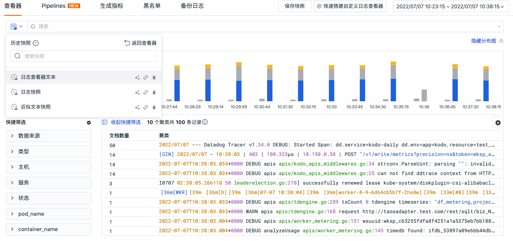

#### 新增 Pipeline 一键获取样本测试数据

在新建或者编辑 Pipeline 时，在样本解析测试右侧新增「一键获取」按钮，便于您获取数据进行切割调试。

- 日志数据：返回 message 数据
- 其他数据类型：返回行协议格式数据

更多详情可参考文档 **文本处理 Pipeline**。

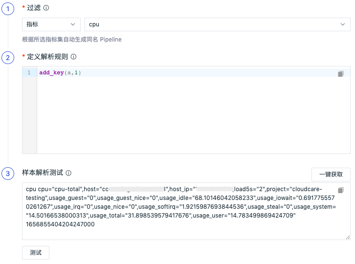

#### 新增场景自定义查看器文本分析模式

在场景自定义查看器，编辑查看器时，在自定义配置显示列，支持选择「近似文本分析」查看器字段，默认使用 `message` 字段对应内容做近似文本分析。更多详情可参考 **场景自定义查看器**。


#### 新增日志查看器详情页关联网络 pod 和 deployment 视图

<<< custom_key.brand_name >>>支持在日志查看器详情页的「网络」，选择查看主机、Pod 和 Deployment 视图的数据连接情况。 

注意：在日志详情中查看相关网络，需要匹配对应的字段。


#### 新增查看器详情页关联网络 48 小时数据回放功能

在日志、进程、链路、主机、Pod 查看器详情页关联网络，支持点击时间控件选择回放 48 小时网络数据。

- 时间范围：默认查看前后 30 分钟的数据，若是当前发生的，默认查看最近 1 小时的数据；
- 支持任意拖动时间范围查看对应的网络流量；
- 拖动后，点击「播放」按钮或刷新页面，回到查看「最近 1 小时」的网络数据。


#### 调整未恢复事件保存策略，支持手动恢复事件

在未恢复事件列表中，鼠标移至事件，在事件右侧可以查看到“已恢复”的功能。点击“已恢复”即可恢复事件，同时会产生一条恢复的事件，在该事件中可查看到对应的操作者。

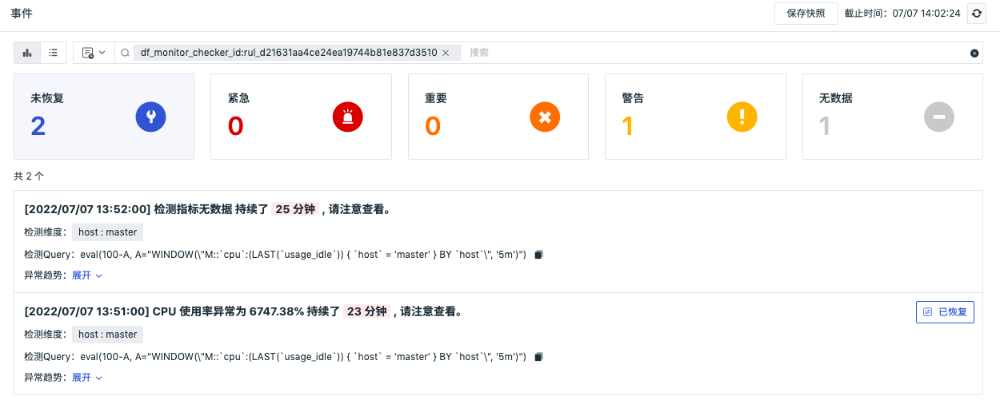

#### 其他功能优化

- 图表锁定时间新增【最新5分钟】时间范围，时间间隔新增【5s】【10s】【30s】三个秒级时间选择
- 场景查看器显示列、视图变量基础对象字段属性/标签支持自定义输入
- 调整事件详情关联仪表板位置
- 在指标管理新增时间线数量统计
- 优化日志详情页关联链路，根据日志当中的 trace_id 和 span_id 显示火焰图并选中对应 span 的所有数据
- 优化用户访问监测服务显示及交互
- RUM、网络、可用性监测、CI 查看器下拉选项调整为平铺显示
- 监控器事件通知内容支持配置模版变量字段映射，支持通过在 DQL 查询语句配置模板变量对应值。
- 帮助中心首页新增重点功能快捷跳转入口

### DataKit 更新

- 调整全局 tag 的行为，避免选举类采集的 tag 分裂
- SQLServer 采集器增加选举支持
- 行协议过滤器支持所有数据类型
- 9529 HTTP 服务增加超时机制
- MySQL
    - dbm 指标集名字调整
    - service 字段冲突问题
- 容器对象增加字段 container_runtime_name 以区分不同层次的容器名
- Redis 调整 slowlog 采集，将其数据改为日志存储
- 优化 TDEngine 采集
- 完善 Containerd 日志采集
- Pipeline 增加 Profile 类数据支持
- 容器/Pod 日志采集支持在 Label/Annotation 上额外追加 tag
- 修复 Jenkins CI 数据采集的时间精度问题
- 修复 Tracing resource-type 值不统一的问题
- eBPF 增加 HTTPS 支持
- 修复日志采集器可能的崩溃问题
- 修复 prom 采集器泄露问题
- 支持通过环境变量配置 io 磁盘缓存
- 增加 Kubernetes CRD 支持

更多 DataKit 更新可参考 **DataKit 版本历史**。

### 最佳实践更新

- 接入集成
    - Skywalking 采集 JVM 可观测最佳实践
    - Minio 可观测最佳实践

更多最佳实践更新可参考 **最佳实践版本历史**。


## 2022 年 6 月 21 号

### <<< custom_key.brand_name >>>更新

#### <<< custom_key.brand_name >>>帮助文档全新上线

为了提高<<< custom_key.brand_name >>>帮助文档的阅读体验，<<< custom_key.brand_name >>>帮助文档已迁至<<< custom_key.brand_name >>>域名下，您可以更简单、更快速的查看<<< custom_key.brand_name >>>帮助文档。新的<<< custom_key.brand_name >>>帮助文档地址为：**https://docs.guance.com**。

#### 新增 Profile 可观测

Profile 支持采集使用 Java / Python 等不同语言环境下应用程序运行过程中的动态性能数据，帮助用户查看 CPU、内存、IO 的性能问题。采集 profile 数据需要先安装 DataKit，并配置 Profile 采集器，配置完成后，DataKit 会将采集到的 profile 数据上传到您的<<< custom_key.brand_name >>>工作空间，您可以通过 Profile 实时数据查看器了解您的程序代码性能。更多详情可参考文档 **Profile**。


#### Pipeline 覆盖全数据的文本分析处理

文本处理（Pipeline）用于数据解析，通过定义解析规则，将各种数据类型切割成符合我们要求的结构化数据。在<<< custom_key.brand_name >>>工作空间「管理」-「文本处理（Pipeline）」，点击「新建Pipeline」即可创建一个新的 pipeline 文件。更多详情可参考文档 **文本处理（Pipeline）**。


#### 新增 Deployment 网络详情及网络分布

Deployment 网络支持查看 Deployment 之间的网络流量。支持基于 IP/端口查看源 IP 到目标 IP 之间的网络流量和数据连接情况，通过可视化的方式进行实时展示，帮助企业实时了解业务系统的网络运行状态，快速分析、追踪和定位问题故障，预防或避免因网络性能下降或中断而导致的业务问题。

Deployment 网络数据采集成功后会上报到<<< custom_key.brand_name >>>控制台，您可以在「基础设施」-「容器」-「Deployment」详情页中的「网络」，查看到Deployment 的网络性能监测数据信息；在「基础设施」-「网络」-「Deployment」，您可以查看到工作空间内全部 Deployment 的网络分布与数据连接情况。更多详情可参考 **Deployment 网络**。


#### 优化事件检测维度跳转到其他查看器

在事件未恢复查看器，支持点击检测维度查看相关容器、进程、日志、链路、RUM、可用性检测、安全巡检、CI 等。若相关查看器无相关数据，对应跳转链接为灰色不可点击。


#### 新增日志查看器 JSON 格式的 message 信息搜索

日志查看器新增搜索 JSON 格式的日志内容（message），搜索格式为：`@key.key:value` 。

注意：JSON 搜索仅支持此次功能上线后创建的工作空间。


#### 新增用户访问监测新建应用时支持用户自定义输入 app_id 信息

新增自定义应用 ID 功能。支持在使用用户访问监测新建应用的功能时，自定义输入 app_id ，生成当前空间内唯一的应用 ID 标识，可用于区分应用类型、数据上传匹配等。

- 应用名称（必填项）：用于识别当前实施用户访问监测的应用名称。
- 应用 ID 标识（选填）：当前空间内唯一的应用 ID 标识，支持自定义，可用于数据上传匹配；应用ID标识最多为 20 个字符，仅支持输入大小写字母。
- 应用 ID：若创建应用时填写了应用 ID 标识，点击创建应用以后，会把填写的应用 ID 标识信息拼接到应用 ID 的前面，便于区分应用进行查询和筛选。


#### 优化进程检测为基础设施对象检测

进程检测优化为基础设施对象监测，新增主机、容器、进程、Pod、Deployment、Replicaset、Job、资源目录等基础对象选择，用于监控工作空间内的基础设施对象数据。更多详情可参考文档 **基础设施对象检测**。

#### 其他功能优化

- 基础设施POD查看器蜂窝模式下新增 CPU 使用率、内存使用量填充指标
- 优化日志黑名单配置。支持手动输入日志来源，作为日志黑名单的来源
- 优化应用性能监测服务列表数据查询时间组件，支持自定义时间范围选择
- 优化在 K8S 上安装 DataKit 引导文案，配置 DataWay 数据网关地址中自动增加当前工作空间的 token
- 优化监控器配置 UI 样式

### DataKit 更新

#### 2022/06/21

- gitrepo 支持无密码模式
- prom 采集器
    - 支持日志模式采集
    - 支持配置 HTTP 请求头
- 支持超 16KB 长度的容器日志采集
- 支持 TDEngine 采集器
- Pipeline
    - 支持 XML 解析
    - 远程调试支持多类数据类型
    - 支持 Pipeline 通过 `use()` 函数调用外部 Pipeline 脚本
- 新增 IP 库（MaxMindIP）支持
- 新增 DDTrace Profile 集成
- Containerd 日志采集支持通过 image 和 K8s Annotation 配置过滤规则
- 文档库整体切换

#### 2022/06/16

- 日志采集支持记录采集位置，避免因为 DataKit 重启等情况导致的数据漏采
- 调整 Pipeline 在处理不同类数据时的设定
- 支持接收 SkyWalking 指标数据
- 优化日志黑名单调试功能： 
    - 在 Monitor 中会展示被过滤掉的点数
    - 在 datakit/data 目录下会增加一个 *.filter* 文件，用来记录拉取到的过滤器
- Monitor 中增加 DataKit 打开文件数显示
- DataKit 编译器升级到 golang 1.18.3

#### 2022/06/07

- 增加TCP/UDP 端口检测采集器
- DataKit 跟 DataWay 之间增加 DNS 检测，支持 DataWay DNS 动态切换
- **eBPF** L4/L7 流量数据增加 k8s deployment name 字段
- 优化OpenTelemetry指标数据
- **ElasticSearch** 增加 AWS OpenSearch 支持
- **行协议限制**中，字符串长度限制放宽到 32MB
- **prom** 采集器增加额外配置，支持忽略指定的 tag=value 的匹配，以减少不必要的时序时间线
- Sink 增加 Jaeger 支持
- Kubernetes 相关的指标采集，默认全部关闭，以避免时间线暴增问题
- DataKit Monitor 增加动态发现（比如 prom）的采集器列表刷新

更多 DataKit 更新可参考 **DataKit 版本历史**。


### 最佳实践更新

- APM
    - **GraalVM 与 Spring Native 项目实现链路可观测**
- 接入集成
    - **主机可观测最佳实践 (Linux)**

更多最佳实践更新可参考 **最佳实践版本历史**。

### 集成模板更新

#### 新增文档

- 阿里云
    - 阿里云 NAT
    - 阿里云 CDN

#### 新增视图

- 阿里云
    - 阿里云 NAT
    - 阿里云 CDN


## 2022 年 6 月 6 号

### <<< custom_key.brand_name >>>计费更新

<<< custom_key.brand_name >>>计费优化 **时间线** 计费逻辑，以及指标数据的 **数据保存策略**。原每 300 条 3 元下调为每 1000 条 3 元。同时指标数据新增 3 天、7 天、14 天数据保存策略，指标集支持 **自定义数据保存策略**。

时间线统计的是当前工作空间，上报的指标数据中基于标签可以组合而成的所有组合数量。数据保存策略即数据存储时长，是上报到当前工作空间的数据保存时间，超过存储时长的数据将会自动删除。

时间线为全量统计，即每天产生的时间线在数据保存策略期间会依次累加，数据保存策略越长，时间线的费用就越高。

此次优化通过下调时间线的费用以及缩短指标的数据保存策略，您可以更灵活的调整指标的数据保存策略，帮助您节约费用成本。

### <<< custom_key.brand_name >>>更新

#### 新增 Jenkins CI 可观测

<<< custom_key.brand_name >>>新增 Jenkins CI 可观测，您可以通过<<< custom_key.brand_name >>>的 CI 可视化功能直接查看在 Jenkins 的 CI 结果。CI 的过程是持续集成，开发人员在 push 代码的时候，若碰到问题，可以在<<< custom_key.brand_name >>>查看所有 CI 的 pipeline 及其成功率、失败原因、具体失败环节，帮助您提供代码更新保障。更多详情可参考 **CI 可视化**。


#### 新增自定义查看器图表同步搜索

自定义查看器新增图表同步搜索开关，用于决定搜索条件是否影响图表查询，默认开启。当搜索框有内容时，关闭开关，即图表查询回到默认状态；开启开关，即图表查询受到筛选内容的影响。


#### 新增网络拓扑和服务拓扑下钻分析

在基础设施网络拓扑图，点击主机/Pod 图标，点击“查看上下游”，即可查看当前节点的上下游节点关联。在上下游节点，点击左上角“返回总览”可返回到原网络拓扑图，在搜索框进行搜索或筛选可过滤关联的上下游节点，根据搜索或筛选的结果显示匹配的关联上下游节点。更多详情可参考文档 **网络查看上下游**。


在服务拓扑图，点击服务图标，点击“查看上下游”，即可查看当前服务的上下游服务关联。在上下游服务，点击左上角“返回总览”可返回到原服务拓扑图，在搜索框进行搜索或筛选可过滤关联的上下游服务，根据搜索或筛选的结果显示匹配的关联上下游服务。更多详情可参考文档 **服务查看上下游**。


#### 新增删除资源目录的数据及索引

<<< custom_key.brand_name >>>支持拥有者和管理员删除指定资源目录分类以及所有资源目录，进入「管理」-「基本设置」，点击「删除资源目录」后，选择删除资源目录的方式，即可删除对应的对象数据。

- 指定资源目录分类：仅删除所选对象分类下的数据，不会删除索引
- 所有资源目录：删除所有资源目录数据及索引

注意：所有资源目录一旦删除，上报到基础设施自定义的所有数据及索引全部会被删除且无法恢复，所有设置的资源目录分类数据需要重新上报，每天限制5次删除所有资源目录操作。

更多资源目录介绍可参考文档 **自定义**。

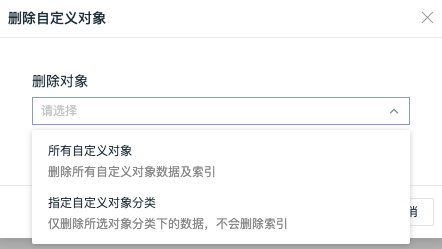

#### 新增查看器快照查看入口

在<<< custom_key.brand_name >>>指标、日志、事件、应用性能监测、用户访问监测、云拨测、安全巡检、CI 可视化等查看器，保存快照以后，可直接点击右上角查看快照图标侧滑展开查看已经保存的快照。

- 支持快照名称关键字搜索，通过关键词模糊匹配相关快照名称
- 第一个为默认视图，不支持分享、复制链接和删除功能
- 除第一个默认视图外，其他快照支持分享、复制链接和删除功能，点击「快照名称」即可在当前查看器打开对应的数据副本


#### 新增查看器筛选条件编辑功能

在<<< custom_key.brand_name >>>查看器搜索栏通过“字段:值”的方式进行筛选时，支持点击“字段:值”对“字段:值”进行编辑修改，并以修改后的结果进行筛选。


#### 优化用户访问 View 查看器关联链路为 Fetch/XHR

在<<< custom_key.brand_name >>>用户访问监测 View 查看器详情页，切换至「Fetch/XHR」时，支持查看用户访问时向后端应用发出的每一个网络请求，包括发生时间、请求的链路和持续时间。

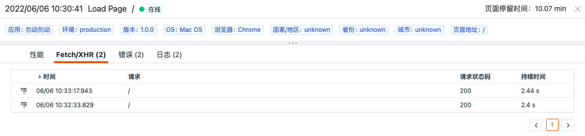
若网络请求存在对应的`trace_id`，在请求前会有提示的小图标，点击请求，可跳转至对应链路的详情页。


#### 新增图表数据加载高性能模式

<<< custom_key.brand_name >>>支持图表数据加载高性能模式，默认关闭，可通过点击左下角账号，在「高性能模式」选择开启。高性能模式开启以后，所有图表不进行动态加载，在点击进入页面的时候直接同时加载，即在超出当前页面使用往下滑动查看时图表已全部加载完成，可直接查看展示结果。

注意：高性能模式开启后仅针对当前用户查看图表。

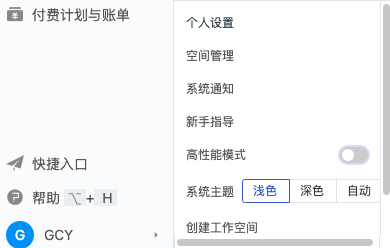

#### 新增告警配置事件通知等级

告警配置支持自定义选择事件通知等级，包括紧急、重要、警告、恢复、数据断档、数据断档恢复、数据断档视为恢复 7 种选择，支持多选，支持一键清空选项，清空后选项清除，需手动选择对应值。更多告警配置可参考文档 **告警设置**。


#### 其他功能优化

- 场景仪表板组合图表支持隐藏/显示大标题
- 优化事件详情页事件类型文案显示
- 基础设施列表查看新增按照字段排序功能
- 日志查看器新增隐藏分布图按钮
- 查看器支持通过关键字搜索显示列，支持自定义显示列作为预设字段，后续通过Pipeline切割字段并上报数据后可直接显示上报的数据。
- 在内置模板库和内置视图增加一键查看对应的集成文档，帮助您快速配置对应的采集器
- 内置视图除支持在查看器绑定链路服务、应用、日志源、项目、标签等相关视图外，新增支持自定义 key 和 value 绑定相关视图，同时支持服务侧滑详情页绑定内置视图
- 优化通知对象飞书机器人，支持自定义是否需要密钥安全校验
- 配置监视器时，若配置的数据范围小于检测频率，触发提示配置会存在数据空洞问题

### DataKit 更新（**2022/05/26**）

- Pipeline 做了调整，所有数据类型，均可通过配置 Pipeline 来额外处理数据
- grok() 支持直接将字段提取为指定类型，无需再额外通过 cast() 函数进行类型转换
- Pipeline 增加多行字符串支持，对于很长的字符串（比如 grok 中的正则切割），可以通过将它们写成多行，提升了可读性
- 每个 Pipeline 的运行情况，通过 datakit monitor -V 可直接查看
- 增加 Kubernetes Pod 对象 CPU/内存指标
- Helm 增加更多 Kubernetes 版本安装适配
- 优化 OpenTelemetry，HTTP 协议增加 JSON 支持
- DataKit 在自动纠错行协议时，对纠错行为增加了日志记录，便于调试数据问题
- 移除时序类数据中的所有字符串指标
- 在 DaemonSet 安装中，如果配置了选举的命名空间，对参与选举的采集器，其数据上均会新增特定的 tag（election_namespace）
- CI 可观测，增加 Jenkins 支持

#### Breaking changes

对于 Docker 类容器日志的采集，需要将宿主机（Node）的 _/varl/lib_ 路径挂载到 DataKit 里面（因为 Docker 日志默认落在宿主机的 _/var/lib/_ 下面），在 _datakit.yaml_ 中，`volumeMounts` 和 `volumes` 中新增如下配置：

```yaml
volumeMounts:
- mountPath: /var/lib
  name: lib

# 省略其它部分...

volumes:
- hostPath:
    path: /var/lib
  name: lib
```

### 最佳实践更新

- APM
    - 基于<<< custom_key.brand_name >>>，使用 SkyWalking 实现 RUM、APM 和日志联动分析
- 监控最佳实践
    - OpenTelemetry 可观测建设
    - OpenTelemetry to Jaeger 、Grafana、ELK
    - OpenTelemetry to Grafana
    - OpenTelemetry to <<< custom_key.brand_name >>>
- <<< custom_key.brand_name >>>小妙招
    - OpenTelemetry 采样最佳实践

更多最佳实践更新可参考 **最佳实践版本历史**。

### 集成模板更新
#### 新增文档和视图

- 数据采集
    - Opentelemetry Collector
- 容器编排
    - Kubernetes Scheduler
    - Kubernetes Controller Manager
    - Kubernetes API Server
    - Kubernetes Kubelet
#### 新增视图

- 容器编排
    - Kubernetes Nodes Overview
- 中间件
    - JVM Kubernetes


## 2022 年 5 月 19 号

### <<< custom_key.brand_name >>>更新

#### 优化<<< custom_key.brand_name >>>商业版注册流程

<<< custom_key.brand_name >>>注册时，提供体验版和商业版注册选项，您可以按照实际需求注册<<< custom_key.brand_name >>>账号。<<< custom_key.brand_name >>>支持按需购买，按量付费的计费方式，为您提供开箱即用，实现全面观测的云平台。

#### 新增场景仪表板用户视图模板库

<<< custom_key.brand_name >>>内置60余种系统视图模板，无需配置，即选即用，满足你各种监控场景的需求，您可以自定义视图作为用户视图模板来一键创建仪表板。更多仪表板的搭建可参考文档 **仪表板**。


#### 新增场景自定义查看器日志来源及筛选联动

场景自定义查看器的数据范围新增筛选功能，基于日志来源，筛选该日志来源下的字段数据，支持匹配多个字段数据，配合搜索和分组可对日志数据进一步筛选。

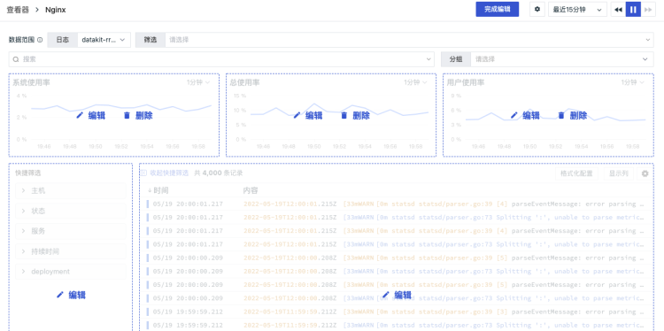

#### 新增事件详情页内容复制为Json格式

在事件详情页，支持点击“复制事件完整内容”按钮，获取当前事件所对应的所有关键数据，若在配置监控器时关联了仪表板，可点击“关联仪表板”按钮跳转到对应的仪表板。

在事件详情页的**关联信息**，若“日志检测”配置多个表达式查询（同一个对象类型），关联信息支持多个表达式查询的 tab 切换，若有两个表达式查询 A 和 B，则在关系信息包含 A 和 B 两个 tab 可切换查看。


#### 新增日志数据脱敏处理

<<< custom_key.brand_name >>>新增日志数据脱敏处理，数据采集上报到<<< custom_key.brand_name >>>工作空间以后，部分数据会存在一些敏感信息，比如说 IP 地址、用户信息等，针对这部分信息可以通过配置敏感字段来做脱敏处理。<br />注意：

- 脱敏后的数据仅支持工作空间管理员及以上的成员进行查看，标准和只读成员无法查看脱敏后的信息。
- 配置敏感字段仅支持工作空间管理员及以上的成员进行操作，标准和只读成员仅支持查看配置的敏感字段。

更多详情可参考文档 **数据权限管理**。

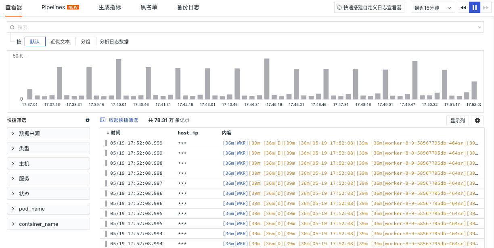

#### 优化日志查看器及详情页

<<< custom_key.brand_name >>> **日志查看器** 默认显示“time”和“message”字段，本次优化支持可隐藏“message”字段显示。

在日志详情页，日志内容根据 message 类型自动显示 Json 和文本两种查看模式。若日志没有 message 字段，则不显示日志内容部分，日志内容支持展开收起，默认为展开状态，收起后仅显示1行的高度。

扩展字段展示日志的所有相关字段，支持“复制”和“添加到筛选”进行快速筛选查看。


#### 新增网络数据检测监控器

**网络数据检测** 用于监测工作空间内网络性能的指标数据，通过设置阈值范围，当指标到达阈值后触发告警。“<<< custom_key.brand_name >>>”支持对单个指标设置告警和自定义告警等级。在**监控器**中，点击「+新建监控器」，选择「网络数据检测」，进入检测规则的配置页面。


#### 优化内置视图绑定功能

<<< custom_key.brand_name >>>内置视图包括系统视图和用户视图，本次优化取消自定义绑定系统视图为查看器视图，仅支持绑定用户视图为查看器视图，若需要绑定系统视图，可先克隆系统视图为用户视图，若系统视图和用户视图重名，在查看器优先显示用户视图。关于如何绑定用户视图为查看器视图，可参考文档 **绑定内置视图**。


#### 其他功能优化

- 付费计划与账单新增预购卡余额
- 基础设施详情样式优化
- 链路详情页属性换行显示优化
- 监控器配置模板变量显示优化
- 增加快捷入口，DQL查询和快照菜单移至快捷入口下
- <<< custom_key.brand_name >>>管理后台补充模板管理分类信息

### DataKit 更新（2022/5/12）

- eBPF 增加 arm64 支持
- 行协议构造支持自动纠错
- DataKit 主配置增加示例配置
- Prometheus Remote Write 支持 tag 重命名
- 合并社区版 DataKit 已有的功能，主要包含 Sinker 功能以及 filebeat 采集器
- 调整容器日志采集，DataKit 直接支持 containerd 下容器 stdout/stderr 日志采集
- 调整 DaemonSet 模式下主机名获取策略
- Trace 采集器支持通过服务名（`service`）通配来过滤资源（`resource`）

更多 DataKit 更新可参考 **DataKit 版本历史**。

### 最佳实践更新

- 云原生
    - 利用<<< custom_key.brand_name >>>一键开启Rancher可观测之旅
- 微服务可观测最佳实践
    - Kubernetes 集群 应用使用 SkyWalking 采集链路数据
    - Kubernetes 集群日志上报到同节点的 DataKit 最佳实践
- Gitlab-CI 可观测最佳实践
    - Gitlab-CI 可观测最佳实践

更多最佳实践更新可参考 **最佳实践版本历史**。

### 集成模板更新

#### 新增文档和视图

- 中间件
    - Resin
    - Beats
- 主机系统
    - Procstat
#### 新增视图

- 容器编排
    - Istio Service
- 阿里云
    - ASM Service


## 2022 年 5 月 6 号

### <<< custom_key.brand_name >>>更新

#### 优化<<< custom_key.brand_name >>>商业版升级流程

<<< custom_key.brand_name >>>升级到商业版默认开通 **<<< custom_key.brand_name >>>费用中心账户结算** ，支持更改结算方式为云账号结算，包括 **阿里云账号** 和 **AWS 云账号** 结算方式。

#### 新增进程、日志、链路详情页关联网络

<<< custom_key.brand_name >>> **进程**、**日志**、**链路** 详情页新增关联网络数据分析，支持基于 IP/端口查看源主机/源进程服务到目标之间的网络流量和数据连接情况，通过可视化的方式进行实时展示，帮助企业实时了解业务系统的网络运行状态，快速分析、追踪和定位问题故障，预防或避免因网络性能下降或中断而导致的业务问题。

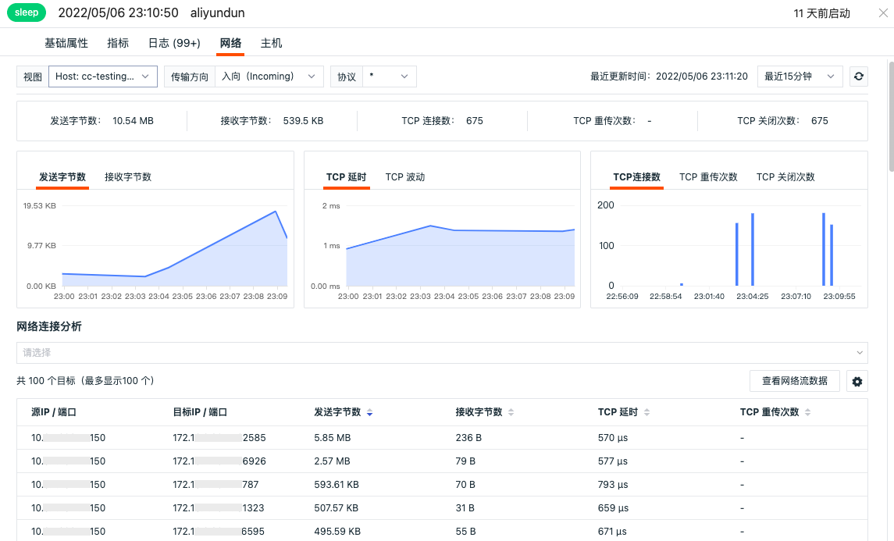

#### 场景模块优化

##### 优化仪表板，去掉编辑模式
在场景 **仪表板** 顶部导航栏，去掉“编辑”按钮，新增“添加图表”为仪表板添加新的图表，图表添加完成后，点击右上角「完成添加」即可。


在 **图表** 中，点击「设置」按钮，选择「修改」，即可对图表进行编辑。

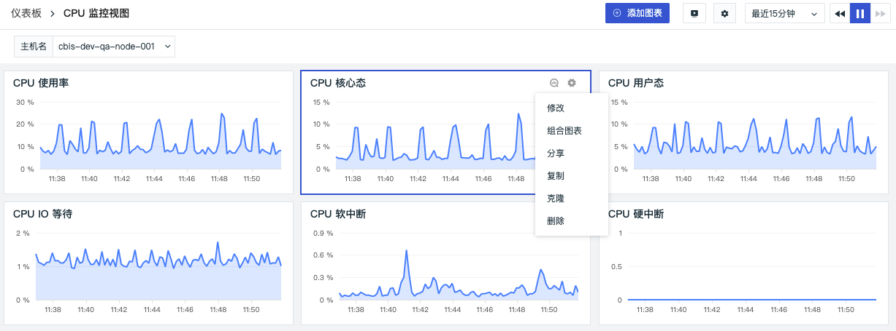

##### 新增图表链接显示开关
<<< custom_key.brand_name >>>支持图表内置链接和自定义链接，可以帮助您实现从当前图表跳转至目标页面。内置链接是<<< custom_key.brand_name >>>默认为图表提供的关联链接，主要基于当前查询的时间范围和分组标签，帮助您查看对应的日志、进程、容器、链路，内置链接显示开关默认关闭，可在编辑图表时开启；自定义链接创建完成后，显示开关默认开启。更多详情可参考文档 **图表链接**。


##### 优化 DQL 查询与简单查询转换
点击**DQL 查询**右侧的切换按钮，可切换 DQL 查询为简单查询。<br />注意：**DQL 查询**切换成**简单查询**时，若无法解析或者解析不完整：

- 在**简单查询**下未操作，直接切换回**DQL 查询**则显示之前的 DQL 查询语句；
- 在**简单查询**下调整了查询语句，再次切换回**DQL 查询**将按照最新的**简单查询**进行解析。

更多 DQL 查询和简单查询的应用，可参考文档 **图表查询**。


#### 监控器和事件模块优化

##### 新增事件关联信息
<<< custom_key.brand_name >>>支持查看触发当前事件的相关信息，如查看触发事件的相关日志。此**关联信息**仅支持 4 种监控器产生的事件：日志检测、安全巡检异常检测、进程异常检测以及可用性数据检测。

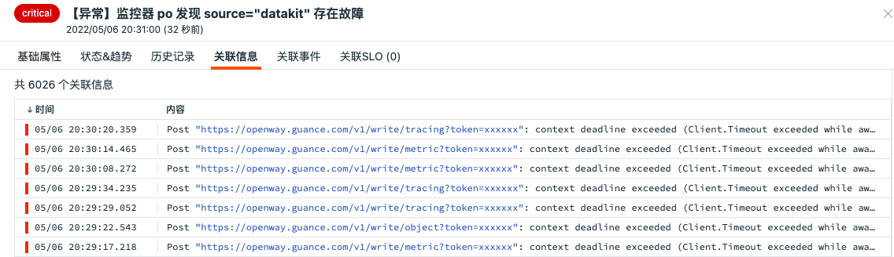

##### 新增数据断档事件名称和内容配置
<<< custom_key.brand_name >>>监控器“阈值检测”、“水位检测”、“区间检测”、“突变检测”、“进程异常检测”、“应用性能指标检测”、“用户访问指标检测”新增数据断档事件标题和内容配置，默认不可填写，当选择触发数据断档事件时为可填写数据断档事件名称，支持使用预置的模板变量，详情参考 **事件名称/内容模板**。


##### 优化可用性数据检测
<<< custom_key.brand_name >>>监控器 **可用性数据检测** ，优化支持选择 HTTP、TCP、ICMP、WEBSOCKET 拨测类型。

##### 优化告警通知模板，增加关联跳转链接
邮件、钉钉、微信、飞书收到的告警通知包含“<<< custom_key.brand_name >>>跳转链接”，点击可直接跳转到对应的<<< custom_key.brand_name >>>事件详情，时间范围为当前时间的往前15分钟，即18:45:00的事件，点击链接后跳转至事件详情页，时间范围固定为4.20 18:30:00 ~ 4.20 18:45:00。更多告警通知可参考文档 **告警设置**。

#### 其他功能优化

- 优化服务 servicemap 指标查询性能
- 新增查看器数值型字段支持 > | >= | < | <= | [] 5种写法
- 新增指标查看器标签支持级联筛选
- 优化 DQL 查询返回报错提示

### DataKit 更新

- 进程采集器的过滤功能仅作用于指标采集，对象采集不受影响
- 优化 DataKit 发送 DataWay 超时问题
- 优化 Gitlab 采集器
- 修复日志采集截断的问题
- 修复各种 trace 采集器 reload 后部分配置不生效的问题

更多 DataKit 更新可参考 **DataKit 版本历史**。

### 集成模板更新

#### 新增数据存储 Redis Sentinel 集成文档和视图

Redis-sentinel 观测场景主要展示了 Redis 的集群、slaves、节点分布信息等。


## 2022 年 4 月 26 号

### <<< custom_key.brand_name >>>更新

#### 优化 SSO 单点登录

<<< custom_key.brand_name >>>支持用户基于工作空间开启 SSO 单点登录，用户在登录时通过输入公司邮箱，获取对应SSO登录，实现对应验证登录。在<<< custom_key.brand_name >>>工作空间「管理」-「SSO管理」-「启用」，即可为员工设置SSO单点登录。本次优化内容主要包括以下几点：

- 一个工作空间从支持创建多个身份提供商更新为仅支持配置一个 SSO 单点登录，默认会将您最后一次更新的 SAML2.0 配置视为最终单点登录验证入口
- 若多个工作空间配置同一份身份提供商（IdP）的数据，通过 SSO 单点登录后可切换查看对应工作空间的数据
-  在配置 SSO 单点登录时，“用户白名单”配置替换成“邮箱域名”，只需配置邮箱的后缀域名即可和身份提供商（IdP）配置的用户邮箱后缀匹配进行单点登录
- SSO 单点登录启用、配置更新、删除支持邮件通知和产生审计事件
- SSO 单点登录用户支持删除和编辑，编辑时可升级权限至“管理员”

更多 SSO 点单登录详情可参考文档 **SSO 管理**。

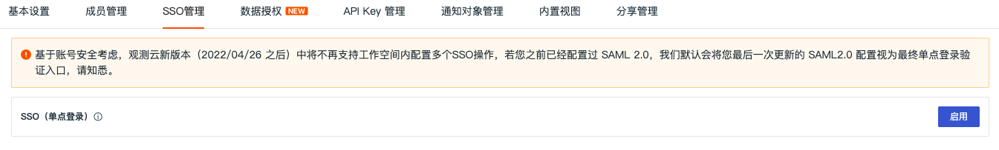

## 2022 年 4 月 21 号

### <<< custom_key.brand_name >>>社区版上线

<<< custom_key.brand_name >>>社区版为老师、学生、云计算爱好者等社区用户提供一个简单易得又功能完备的产品化本地部署平台。欢迎免费申请并下载试用，搭建您自己的<<< custom_key.brand_name >>>平台，体验完整的产品功能。

### <<< custom_key.brand_name >>>更新

#### 新增 Gitlab CI 可观测

<<< custom_key.brand_name >>>支持为 Gitlab 内置的 CI 的过程和结果进行可视化，您可以通过<<< custom_key.brand_name >>>的 CI 可视化功能直接查看在 Gitlab 的 CI 结果。CI 的过程是持续集成，开发人员在 push 代码的时候，若碰到问题，可以在<<< custom_key.brand_name >>>查看所有 CI 的 pipeline 及其成功率、失败原因、具体失败环节，帮助您提供代码更新保障。更多详情介绍可参考 **CI 查看器**。


#### 新增在线帮助奥布斯小助手

<<< custom_key.brand_name >>>奥布斯小助手支持您在工作空间快速查看基础入门、进阶指南、最佳实践、DataKit、Func等文档，通过点击提供的关键词或者在搜索栏直接输入关键字进行搜素，帮助您快速获取相关的文档说明。更多详情介绍可参考文档 **帮助**。


#### 新增仪表板设置刷新频率

<<< custom_key.brand_name >>>支持在场景仪表板设置刷新频率。初次设置刷新频率默认为 30 秒，支持 10 秒、30 秒、60 秒三种选项，若时间控件“暂停”，则不再刷新。

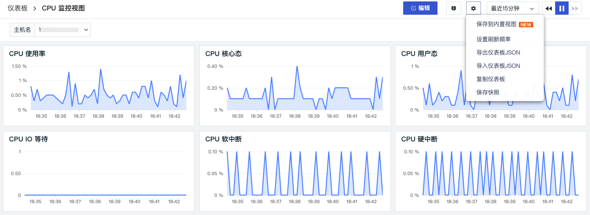

#### 新增进程 48 小时回放

<<< custom_key.brand_name >>>基础设施进程支持查看**最近十分钟内**采集的进程数据，点击时间范围可查看进程 48 小时回放，拖动后，刷新暂停，时间显示为：[ 开始时间-结束时间 ]，查询的时间范围为5分钟，点击「播放」按钮或刷新页面，回到查看「最近10分钟」的进程。


#### 新增集成 DataKit Kubernetes(Helm)安装引导页

在<<< custom_key.brand_name >>>集成 DataKit 安装引导页，新增 Kubernetes(Helm)安装引导，介绍在 K8S 中如何使用 Helm 安装 DataKit。

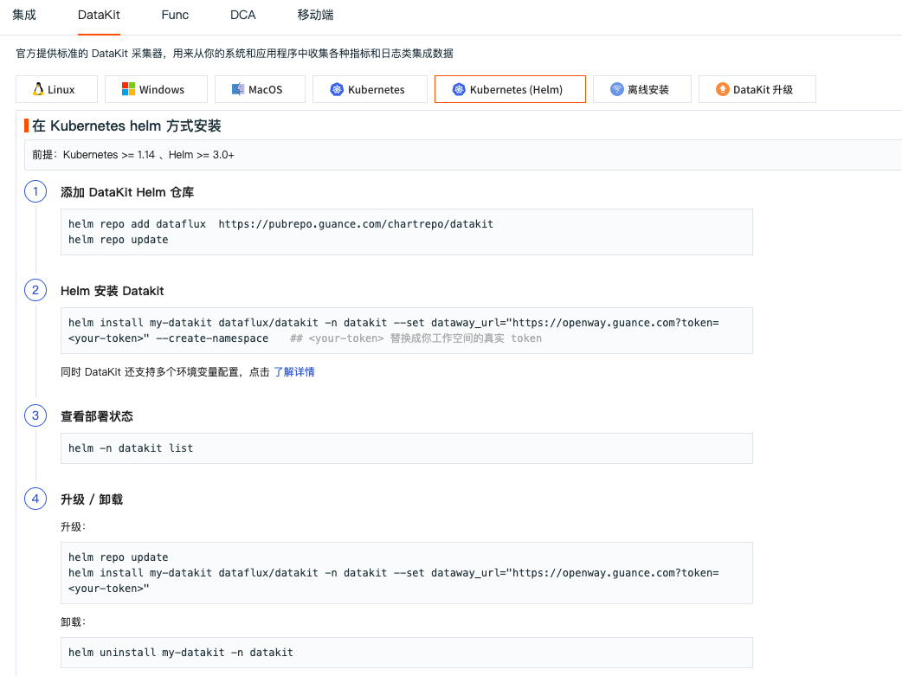

#### 新增应用性能全局概览、服务分类筛选、服务拓扑图区分环境和版本

应用性能监测新增全局性能概览视图，您可以在概览页面查看在线服务数量、P90 服务响应耗时、服务最大影响耗时、服务错误数、服务错误率统计，同时还可以查看 P90 服务、资源、操作的响应耗时 Top10 排行，以及服务错误率、资源 5xx 错误率、资源 4xx 错误率 Top10 排行。

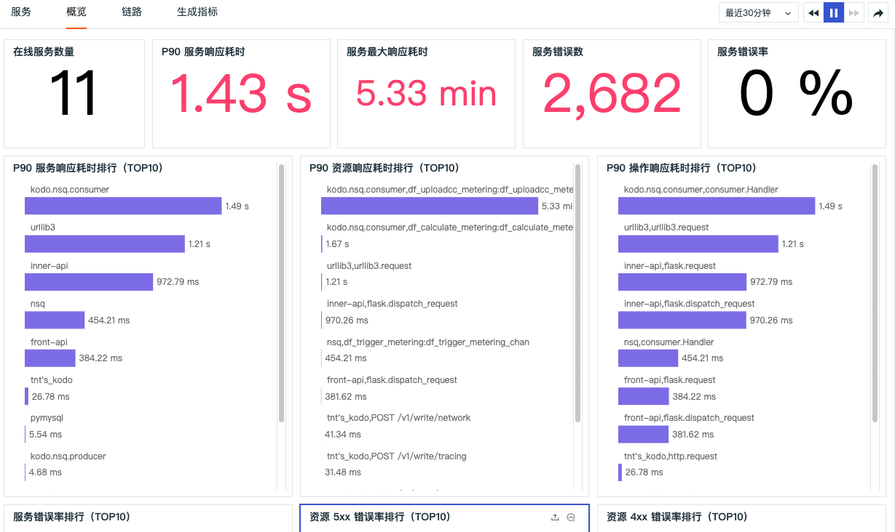

在应用性能服务列表中，支持您通过点击服务类型图标进行分类筛选，再次点击即可恢复全部查看。


在服务列表，切换至「拓扑图」模式可查看各个服务之间的调用关系。支持基于服务（service）和服务环境版本（service+env+version）两种维度绘制链路拓扑图，开启“区分环境和版本”后，将按照不同的环境版本绘制服务拓扑图。比如说金丝雀发布，通过开启环境和版本，即可查看不同环境版本下的服务调用情况。

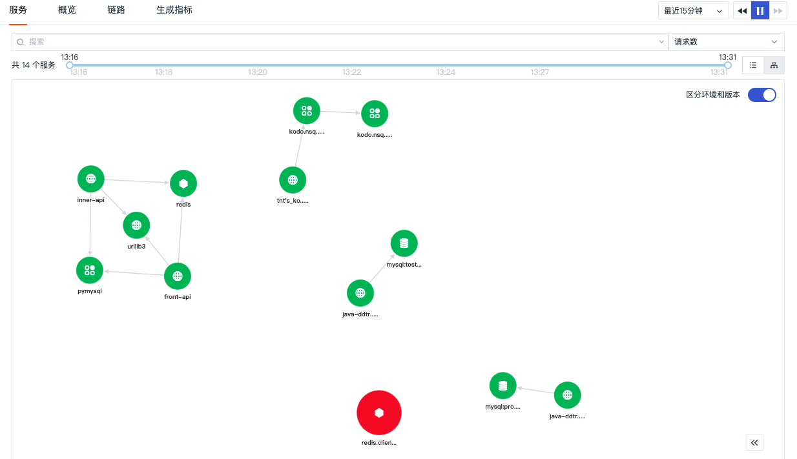

#### 优化 SSO 单点登录配置
SSO 单点登录配置用户白名单调整为邮箱域名，用于校验单点登录处输入邮箱后缀是否匹配，匹配的邮箱可以在线获取 SSO 的登录链接。更多 SSO 配置详情可参考文档 **SSO管理**。

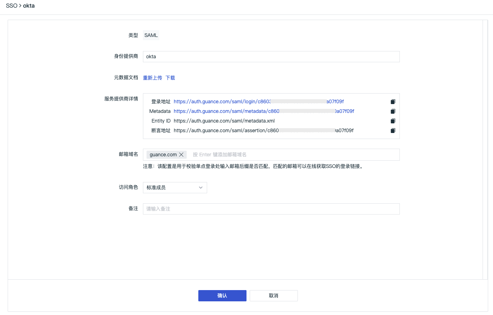

#### 其他功能优化

- 新增链路详情页中关联日志“全部来源”选项 
- 新增指标筛选支持反选，聚合函数位置调整
- 优化日志、应用性能、用户访问、安全巡检生成指标，“频率”所选时间也作为聚合周期
- 优化<<< custom_key.brand_name >>>部署版工作空间拥有者移交权限功能取消，支持管理后台设置
- 优化告警通知短信模板
- 优化可用性监测新建拨测列表，支持直接选择 HTTP、TCP、ICMP、WEBSOCKET 拨测

### DataKit 更新

- Pipeline 模块修复 Grok 中动态多行 pattern 问题
- DaemonSet 优化 Helm 安装，增加开启 pprof 环境变量配置，DaemonSet 中所有默认开启采集器各个配置均支持通过环境变量配置
- Tracing 采集器初步支持 Pipeline 数据处理。
- 拨测采集器增加失败任务退出机制
- 日志新增 `unknown` 等级（status），对于未指定等级的日志均为 `unknown`
- 容器采集器修复：
    - 修复 cluster 字段命名问题
    - 修复 namespace 字段命名问题
    - 容器日志采集中，如果 Pod Annotation 不指定日志 `source`，那么 DataKit 将按照此优先级来推导日志来源
    - 对象上报不再受 32KB 字长限制（因 Annotation 内容超 32KB），所有 Kubernetes 对象均删除 `annotation` 

更多 DataKit 更新可参考 **DataKit 版本历史**。

### 最佳实践更新

- 微服务可观测最佳实践
    - service mesh 微服务架构从研发到金丝雀发布全流程最佳实践(上)
    - service mesh 微服务架构从研发到金丝雀发布全流程最佳实践(下)
    - service mesh 微服务架构从研发到金丝雀发布全流程最佳实践(中)
- 监控最佳实践
    - JAVA OOM异常可观测最佳实践

更多最佳实践更新可参考 **最佳实践版本历史**。

### 集成模板更新

#### 新增文档

- 应用性能监测 (APM)
    - Node.JS
    - Ruby
- 中间件
    - RocketMQ
- 容器编排
    - Istio
    - Kube State Metrics
- 数据存储
    - Aerospike
#### 新增视图

- 容器编排
    - Kubernetes Overview by Pods
    - Istio Mesh
    - Istio Control Plane
- 阿里云
    - 阿里云 ASM Mesh
    - 阿里云 ASM Control Plane
    - 阿里云 ASM Workload
- 中间件
    - RocketMQ


## 2022 年 4 月 8 号

### <<< custom_key.brand_name >>>计费更新

#### 新增阿里云账户结算方式

在<<< custom_key.brand_name >>>费用中心「管理工作空间」，支持查看账户下绑定的所有工作空间，支持修改已绑定工作空间的结算方式，通过“更改结算方式”可任意切换<<< custom_key.brand_name >>>费用中心账户、亚马逊云账户和阿里云账户结算。

### <<< custom_key.brand_name >>>更新

#### 新增 DQL 查询查看器

DQL 是专为<<< custom_key.brand_name >>>开发的语言，语法简单，方便使用，可在<<< custom_key.brand_name >>>工作空间或者终端设备通过 DQL 语言进行数据查询。

在<<< custom_key.brand_name >>>工作空间，点击菜单栏的「DQL 查询」即可打开 DQL 查询查看器，或者您可以通过快捷键`Alt+Q`直接打开 DQL 查询。DQL 查询查看器支持表格和 JSON 两种返回结果，支持保存7天历史查询记录。

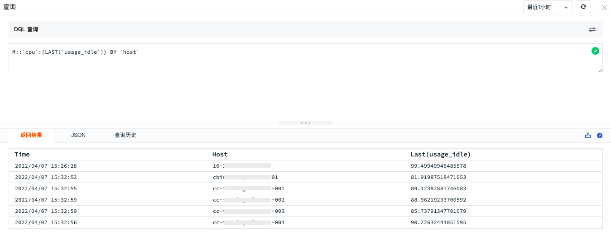

#### 可用性监测新增 TCP/ICMP/Websocket 拨测协议

<<< custom_key.brand_name >>>支持自定义拨测任务。通过创建基于 HTTP、TCP、ICMP、WEBSOCKET 等不同协议的拨测任务，全面监测不同地区、不同运营商到各个服务的网络性能、网络质量、网络数据传输稳定性等状况。


#### 新增基础设施网络模块

在基础设施，原主机网络 Map 和 Pod 网络 Map 从主机和容器模块迁移至新增模块“网络”下，支持查看主机和 Pod 的网络 Map。Pod 网络 Map 填充指标新增七层网络指标：每秒请求数、错误率以及平均响应时间。更多详情可参考文档 **网络**。


#### 基础设施容器 Pod 新增 HTTP 七层网络数据展示

基础设施容器 Pod 新增 HTTP 七层网络数据采集和展示，Pod 网络数据采集成功后会上报到<<< custom_key.brand_name >>>工作空间，在「基础设施」-「容器」-「Pod」详情页中的「网络」，您可以查看到工作空间内全部 Pod 网络性能监测数据信息。查看基础更多详情可参考文档 **Pod 网络**。


#### 新增查看器快捷筛选“反选”和“重置”功能

在任意查看器的“快捷筛选”，支持在选择字段筛选内容时进行“反选”或者“重置”，“反选”表示选中的字段筛选内容不展示（再次点击“反选”可返回字段选中状态），“重置”可清空筛选条件。更多详情说明可参考 **日志查看器快捷筛选 **。


#### 优化日志黑名单

<<< custom_key.brand_name >>>支持通过设置日志黑名单的方式过滤掉符合条件的日志，即配置日志黑名单以后，符合条件的日志数据不再上报到<<< custom_key.brand_name >>>工作空间，帮助用户节约日志数据存储费用。

日志黑名单优化支持匹配全部日志来源，支持两种黑名单配置方式：

- 满足任意一个过滤条件，触发黑名单过滤
- 满足所有过滤条件，触发黑名单过滤

更多黑名单配置可参考文档 **日志黑名单**。


#### 其他功能优化

- 新增链路详情页 span 数量统计
- 优化链路关联主机时间线绘制方式
- 优化概览图时间分片，取消选项，若之前的概览图开启了时间分片，优化后默认更改为不开启时间分片
- 优化组合图表在浏览器缩放情况下，进入编辑后无法实现组合图表切换编辑不同的图表查询
- 优化日志查看器手动暂停页面刷新后，滚轴滑动到顶部不触发自动刷新

### DataKit 更新

- 增加宿主机运行时的内存限制，安装阶段即支持内存限制配置，
- CPU 采集器增加 load5s 指标
- 支持<<< custom_key.brand_name >>>优化的日志黑名单功能，调整 monitor 布局，增加黑名单过滤情况展示
- DaemonSet 安装增加 Helm 支持，新增 DaemonSet 安装最佳实践
- eBPF 增加 HTTP 协议采集，主机安装时，eBPF 采集器默认不再会安装，如需安装需用特定的安装指令，DaemonSet 安装不受影响

更多 DataKit 更新可参考 **DataKit 版本历史**。

### <<< custom_key.brand_name >>>移动端 APP 更新

新增站点登录的能力，优化场景、事件查看器，保持了与网页端查看器相同的访问体验。

- 支持用户选择账号对应的站点，通过账号密码或验证码方式登录。
- 支持用户查看全部来源或任一来源的日志数据
- 支持用户查看当前空间下的全部仪表板，并通过下拉菜单切换“全部仪表板”，“我的收藏”、“导入项目”、“我的创建”和“经常浏览”，以快速过滤查找对应的仪表板。
- 支持用户在**事件**查看器中，通过「全部」查看、搜索和过滤异常检测库触发的全部未恢复事件内容；通过「我的」事件，查看通过邮件、钉钉机器人、企业微信机器人、Webhook等通知到用户的当前仍未恢复的事件内容。


### 最佳实践更新

- <<< custom_key.brand_name >>>小妙招
    - 多微服务项目的性能可观测实践
    - ddtrace 高级用法
    - Kubernetes 集群使用 ExternalName 映射 DataKit 服务
- 接入(集成)最佳实践
    - OpenTelemetry 链路数据接入最佳实践
- 微服务可观测最佳实践
    - 基于阿里云 ASM 实现微服务可观测最佳实践


更多最佳实践更新可参考 **最佳实践版本历史**。

### 集成模板更新

#### 新增阿里云 PolarDB Oracle 集成文档、视图和监控器

阿里云 PolarDB Oracle 指标展示，包括 CPU 使用率，内存使用率，网络流量，连接数，IOPS，TPS，数据盘大小等

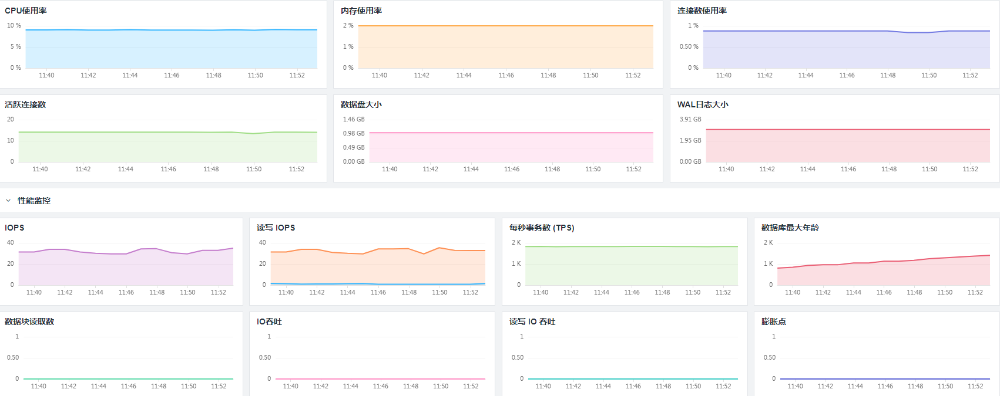

#### 新增阿里云 PolarDB PostgreSQL 集成文档、视图和监控器

阿里云 PolarDB PostgreSQL 指标展示，包括 CPU 使用率，内存使用率，网络流量，连接数，IOPS，TPS，数据盘大小等

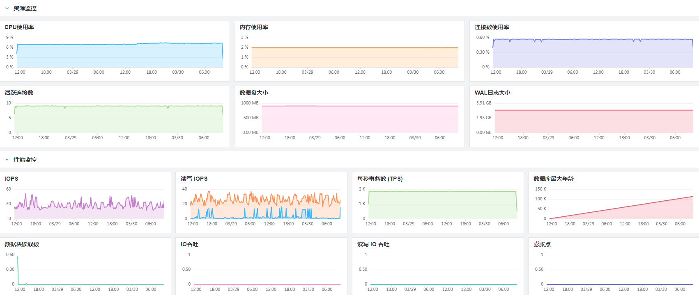

#### 新增阿里云 RDS SQLServer 集成文档、视图和检测库

阿里云 RDS SQLServer 指标展示，包括 CPU 使用率，磁盘使用率，IOPS，网络带宽，TPS，QPS 等


#### 新增 DataKit 集成文档、视图和监控器

DataKit 性能指标展示，包括 CPU 使用率，内存信息，运行时间，日志记录等


#### 新增 Nacos 集成文档、视图

Nacos 性能指标展示：Nacos 在线时长、Nacos config 长链接数、Nacos config 配置个数、Service Count、http请求次数等。

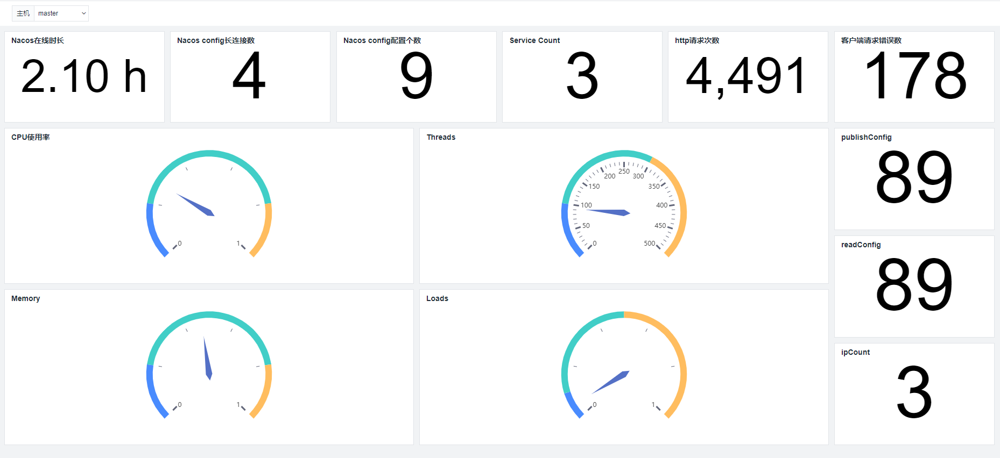


## 2022 年 3 月 24 号

### <<< custom_key.brand_name >>>站点更新

<<< custom_key.brand_name >>>支持多站点登录和注册，新增“海外区1（俄勒冈）”站点，原“中国区1（阿里云）”变更为“中国区1（杭州）”，原“中国区2（AWS）”并更为“中国区2（宁夏）”。

不同站点的账号和数据相互独立，无法互相共享和迁移数据。您可以根据使用资源的情况，选择适合的站点进行注册登录。目前<<< custom_key.brand_name >>>支持以下三个站点。关于如何选择站点，可参考文档 **<<< custom_key.brand_name >>>站点说明**。

| 站点 | 登录地址 URL | 运营商 |
| --- | --- | --- |
| 中国区1（杭州） | **https://auth.guance.com/** | 阿里云（中国杭州） |
| 中国区2（宁夏） | **https://aws-auth.guance.com/** | AWS（中国宁夏） |
| 海外区1（俄勒冈） | **https://us1-auth.guance.com/** | AWS（美国俄勒冈） |


### <<< custom_key.brand_name >>>更新

#### 新增工作空间数据授权

<<< custom_key.brand_name >>>支持通过数据授权的方式，授权多个工作空间的数据给到当前的工作空间，通过场景仪表板和笔记的图表组件进行查询和展示。若有多个工作空间，配置数据授权后，即可在一个工作空间查看所有工作空间的数据。更多配置详情，可参考文档 **数据授权**。

1.在「管理」-「数据授权」配置需要授权查看数据的工作空间


2.在工作空间获得数据授权后，打开「场景」-「仪表板或者笔记」，选择图表组件，在“设置”的“工作空间”选择被授权查看的工作空间，然后就可以通过**图表查询**查看和分析被授权工作空间的数据。

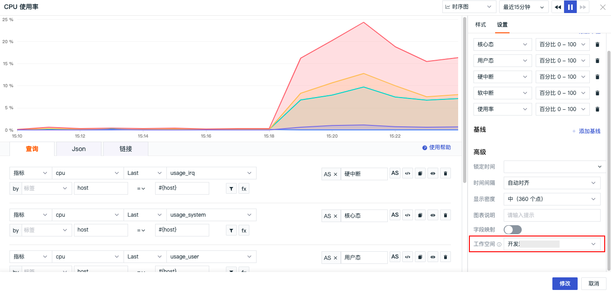

#### 新增保存在线 Pipeline 样本测试数据

<<< custom_key.brand_name >>> Pipeline 支持自定义和官方库两种：

- 自定义 Pipeline 脚本规则编写完成后，可以输入日志样本数据进行测试，来验证你配置的解析规则是否正确，自定义 Pipeline 保存后， 日志样本测试数据同步保存。
- Pipeline 官方库自带多个日志样本测试数据，在“克隆”前可选择符合自身需求的日志样本测试数据，克隆的 Pipeline 修改保存后， 日志样本测试数据同步保存。

更多在线 Pipeline 功能详情，可参考文档 **Pipelines**。


#### 优化资源目录查看器

在<<< custom_key.brand_name >>>工作空间，通过 「基础设施」-「自定义」-「添加对象分类」，您可以创建新的对象分类，并资源目录分类名称和对象字段。

添加完资源目录分类以后，即可通过 **Func 函数处理平台** 进行自定义数据上报。关于如何通过 Func 向<<< custom_key.brand_name >>>工作空间上报数据，可参考文档 **资源目录数据上报**。


#### 优化快照分享支持永久有效的链接

快照分享支持设置有效时间，支持选择 “48 小时”或者“永久有效”。在快照列表，点击分享按钮，即可在弹出对话框中进行高级设置“隐藏顶部栏”。更多快照分享详情，可参考文档 **快照**。

注意：永久有效分享容易存在数据安全风险，请谨慎使用。


#### 优化图表时间间隔

在场景仪表板的图表设置中时间间隔选择“自动对齐”， 在预览图表时，图表右上角会出现时间间隔选项，您可以按照您的实际情况选择时间间隔查看您的数据。

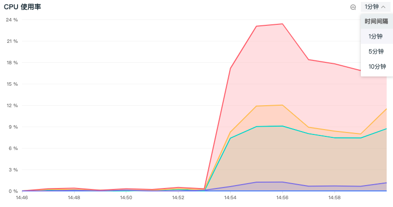

#### 优化进程、应用性能、用户访问检测数据断档触发策略

在<<< custom_key.brand_name >>>监控功能模块，配置进程异常检测、应用性能指标检测、用户访问指标检测监控时，数据断档状态支持「触发数据断档事件」、「触发恢复事件」、「不触发事件」三种配置，需要手动配置数据断档处理策略。

#### 其他功能优化

- 优化集成DataKit、Func 安装引导页
- 优化日志查看器单条日志完全展示
- 新增查看器关联搜索 NOT 组合
- 优化编辑成员权限显示

### DataKit 更新

- 增加 DataKit 命令行补全功能，帮助您在终端操作的时候进行命令提示和补全参数
- 允许 DataKit 升级到非稳定版，体验最新的试验性功能，若您是生产环境，请谨慎升级
- 初步支持 Kubernetes/Containerd 架构的数据采集
- 网络拨测增加 TCP/UDP/ICMP/Websocket 几种协议支持
- 调整 Remote Pipeline 的在 DataKit 本地的存储，避免不同文件系统差异导致的文件名大小写问题
- Pipeline新增 decode() 函数，可以避免在日志采集器中去配置编码，在 Pipeline 中实现编码转换；add_pattern() 增加作用域管理

更多 DataKit 更新可参考 **DataKit 版本历史**。

### 最佳实践更新

- 场景最佳实践
    - RUM 数据上报 DataKit 集群最佳实践
- 日志最佳实践
    - Pod 日志采集最佳实践

更多最佳实践更新可参考 **最佳实践版本历史**。

### 集成模板更新

#### 新增阿里云 PolarDB Mysql 集成文档、视图和检测库

阿里云 PolarDB Mysql 指标展示，包括 CPU 使用率，内存命中率，网络流量，连接数，QPS，TPS，只读节点延迟等


## 2022 年 3 月 10 号

### <<< custom_key.brand_name >>>计费更新

#### 新增<<< custom_key.brand_name >>>计费预购卡

<<< custom_key.brand_name >>>预购卡支持通过账户现金余额进行购买，适用于所有<<< custom_key.brand_name >>>的消费模式，包括按量付费和包年套餐。登录到<<< custom_key.brand_name >>>**费用中心**，点击“管理预购卡”，即可进入预购卡管理页面购买，预购卡购买并支付费用后，按照实付金额开具等额发票。更多详情可参考 **预购卡管理**。

### <<< custom_key.brand_name >>>更新

#### 新增用户访问监测 resource（资源）、action（操作）、long_task（长任务）、error（错误）查看器

用户访问监测查看器可以帮助您查看与分析用户访问应用程序的详细信息。在<<< custom_key.brand_name >>>工作空间内打开「用户访问监测」，点击任意一个应用后即可通过「查看器」了解每个用户会话、页面性能、资源、长任务、动态组件中的错误、延迟对用户的影响、帮助你通过搜索、筛选和关联分析全面了解和改善应用的运行状态和使用情况，提高用户体验。

<<< custom_key.brand_name >>>用户访问监测查看器包括 session（会话）、view（页面）、resource（资源）、action（操作）、long_task（长任务）、error（错误）。

| 查看器类型 | 概述 |
| --- | --- |
| session（会话） | 查看用户访问的一系列详情，包括用户访问时间、访问页面路径、访问操作数、访问路径和出现的错误信息等。 |
| view（页面） | 查看用户访问环境、回溯用户的操作路径、分解用户操作的响应时间以及了解用户操作导致后端应用一系列调用链的性能指标情况 |
| resource（资源） | 查看网页上加载的各种资源信息，包括状态码、请求方式、资源地址，加载耗时等 |
| action（操作） | 查看用户在使用应用期间的操作交互，包括操作类型，页面操作详情，操作耗时等 |
| long_task（长任务） | 查看用户在使用应用期间，阻塞主线程超过 50ms 的长任务，包括页面地址、任务耗时等 |
| error（错误） | 查看用户在使用应用期间，浏览器发出的前端错误，包括错误类型、错误内容等 |


#### 新增 Pod 网络详情及网络分布

Pod 网络支持查看 Pod 之间的网络流量。支持基于 IP/端口查看源 IP 到目标 IP 之间的网络流量和数据连接情况，通过可视化的方式进行实时展示，帮助企业实时了解业务系统的网络运行状态，快速分析、追踪和定位问题故障，预防或避免因网络性能下降或中断而导致的业务问题。

Pod 网络数据采集成功后会上报到<<< custom_key.brand_name >>>控制台，在「基础设施」-「容器」-「Pod」详情页中的「网络」，您可以查看到工作空间内全部 Pod 网络性能监测数据信息。更多详情可参考 **Pod 网络**。


在「基础设施」-「容器」-「Pod」，点击左上角网络分布图的小图标，即可切换到查看 Pod 网络分布情况。在「网络分布图」，你能够可视化查询当前工作空间 Pod 与 Pod 之间的网络流量，快速分析不同 Pod 之间的 TCP延迟、TCP波动、TCP重传次数、TCP连接次数以及 TCP关闭次数。更多详情可参考 **Pod 网络分布图**。

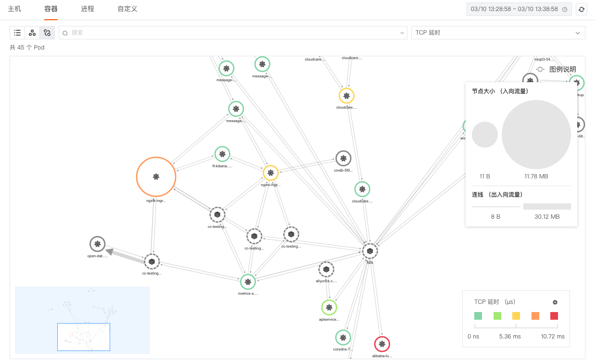

### DataKit 更新

- DataKit 采集器新增支持 SkyWalking、Jaeger、Zipkin 数据配置采样策略。
- DataKit 采集器新增支持 OpenTelemetry 数据接入。
- DataKit 文档库新增文档 DataKit 整体日志采集介绍，包括从磁盘文件获取日志、通过调用环境 API 获取日志、远程推送日志给 DataKit、Sidecar 形式的日志采集四种方式。

#### Breaking Changes

**2022/03/22**

-  本次对 Tracing 数据采集做了较大的调整，涉及几个方面的不兼容： 
    - DDtrace 原有 conf 中配置的 `ignore_resources` 字段需改成 `close_resource`，且字段类型由原来的数组（`[...]`）形式改成了字典数组（`map[string][...]`）形式
    - DDTrace 原数据中采集的 tag `**type**` 字段改成 `**source_type**`

**2022/03/04**

- 老版本的 DataKit 如果开启了 RUM 功能，升级上来后，需重新安装 IP 库，老版本的 IP 库将无法使用。

**2021/12/30**

- 老版本的 DataKit 通过 `datakit --version` 已经无法推送新升级命令，直接使用如下命令：

- Linux/Mac:

```shell
DK_UPGRADE=1 bash -c "$(curl -L https://<<< custom_key.static_domain >>>/datakit/install.sh)"
```

- Windows

```powershell
$env:DK_UPGRADE="1"; Set-ExecutionPolicy Bypass -scope Process -Force; Import-Module bitstransfer; start-bitstransfer -source https://<<< custom_key.static_domain >>>/datakit/install.ps1 -destination .install.ps1; powershell .install.ps1;
```

更多 DataKit 更新可参考 **DataKit 版本历史**。

### SDK 更新

用户访问监测兼容 Opentracing 协议链路追踪工具，Web、小程序、Android、iOS SDK 支持 OTEL、SkyWalking、Jaeger 等链路追踪工具数据联动。

### 最佳实践更新

- 自定义接入最佳实践
    - 快速上手 pythond 采集器的最佳实践
    - 阿里云“云监控数据”集成最佳实践
- 日志最佳实践
    - logback socket 日志采集最佳实践

更多最佳实践更新可参考 **最佳实践版本历史**。

### 场景模板更新

#### 新增场景自定义查看器 MySQL 数据库查看器模板

<<< custom_key.brand_name >>>的场景自定义查看器新增 MySQL 数据库查看器模板，可帮助你一键搭建 MySQL 日志的查看器。在<<< custom_key.brand_name >>>工作空间「场景」-「查看器」-「内置查看器模板」，点击「MySQL 查看器模板」，即可直接创建 MySQL 日志查看器，若已经采集相关日志，即可通过该日志查看器进行数据查看和分析。


### 集成模板更新

#### 新增主机系统 EthTool 集成文档和视图

EthTool 指标包括网络接口入/出流量，入/出数据包，丢弃的数据包等。


#### 新增主机系统 Conntrack 集成文档和视图

Conntrack 性能指标包括成功搜索条目数，插入的包数，连接数量等。


## 2022 年 2 月 22 号

#### 新增日志配置 pipeline 脚本

Pipeline 用于日志数据解析，通过定义解析规则，将格式各异的日志切割成符合我们要求的结构化数据。<<< custom_key.brand_name >>>提供三种日志 Pipeline 文本处理方式：

- DataKit：在服务器安装DataKit以后，在终端工具中配置DataKit的日志采集器及其对应的 pipeline 文件，对文本数据进行处理；
- DCA：DataKit Control APP，是DataKit的桌面客户端应用，需要先安装，安装完成后可在客户端查看和编辑 DataKit 默认自带的日志 pipeline 文件和自定义手动添加 pipeline 文件；
- Pipelines：支持在<<< custom_key.brand_name >>>工作空间手动配置和查看日志 pipeline 文件，无需登录 DataKit 服务器进行操作。


#### 新增 IFrame 图表组件

<<< custom_key.brand_name >>>新增 IFrame 图表组件，支持您配置 https 或者 http 链接地址。在 IFrame URL 可直接输入外网地址查看，或者在 IFrame URL 使用模板变量查看，更多配置详情可参考文档 **IFrame**。

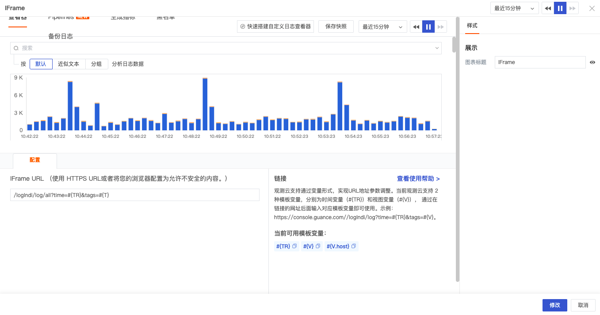

#### 新增事件详情历史记录、关联 SLO

观测在事件详情页优化基础属性、状态&趋势和关联事件布局，并新增历史记录和关联 SLO ，在异常事件列表中点击事件名称，即可查看。

新增事件的历史记录，支持查看检测对象主机、异常/恢复时间和持续时长。


若在监控配置了 SLO ，则可以查看关联 SLO ，包括 SLO 名称、达标率、剩余额度、目标等信息。


#### 新增保存快照默认开启绝对时间

<<< custom_key.brand_name >>>新增保存快照时默认开启绝对时间。

- 若在保存快照的时候选择开启绝对时间，分享后则显示保存快照时的绝对时间。如保存快照时，选择最近15分钟，您在14：00点开快照链接，显示之前的绝对时间的数据；
- 若在保存快照的时候选择关闭绝对时间，分享后则显示保存快照时的绝对时间。如保存快照时，选择最近15分钟，您在14：00点开快照链接，显示13：45 ~ 14：00的数据。

更多快照分享详情可参考文档 **快照**。


#### 优化监控器数据断档触发事件配置及触发条件单位提示

<<< custom_key.brand_name >>>新增三种数据断档状态配置「触发数据断档事件」、「触发恢复事件」、「不触发事件」。

- 指标类数据监控器配置时，需要手动配置数据断档处理策略；
- 日志类数据监控器配置时，默认选择「触发恢复事件」策略，不需要做数据断档的配置，获取「正常」条件处的周期作为数据断档恢复事件周期；


#### 优化图表查询表达式计算单位

<<< custom_key.brand_name >>>优化图表查询表达式计算单位逻辑。若查询 A 带单位，查询 A 与数字的运算结果同样带单位。例如：A 的单位是 KB，那么A+100的单位也是 KB。更多详情可参考文档 **图表查询**。

#### 新增“时间线”按量付费模式

<<< custom_key.brand_name >>>新增“时间线”按量付费模式，并优化“DataKit+时间线”按量付费模式，具体计费模式可参考文档 **按量付费**。

#### 其他优化功能

- 图表查询数据来源日志、应用性能、安全巡检和网络支持全选（`*`）;
- 图表查询文案、按钮样式以及文字提示优化；
- 工作空间操作按钮图标化，如编辑、删除等等。
- 其他 UI 显示优化

## 2022 年 1 月 20 号

#### 新增 Open API 及 API Key 管理

“<<< custom_key.brand_name >>>” 支持通过调用 Open API 接口的方式来获取和更新<<< custom_key.brand_name >>>工作空间的数据，在调用 API 接口前，需要先创建 API Key 作为认证方式。更多详情，可参考文档 **API Key 管理**。


#### 新增指标字典、指标单位管理

指标数据采集后，可以在<<< custom_key.brand_name >>>工作空间的「指标字典」查看所有采集的指标集及其指标和标签，支持为自定义指标数据手动设置单位。更多详情，可参考文档 **指标字典**。

- 指标可以帮助您了解系统的整体可用性，比如说服务器 CPU 使用情况，网站的加载耗时等，配合<<< custom_key.brand_name >>>提供的日志和链路追踪，可以帮助您快速定位和解决故障。
- 标签可以帮助您关联数据，<<< custom_key.brand_name >>>支持把所有的指标、日志、链路数据统一上报到工作空间，通过对采集的数据打上相同的标签进行关联查询，可以帮您进行关联分析，发现并解决存在的潜在风险。


#### 新增场景图表漏斗图

漏斗图一般适用于具有规范性、周期长、环节多的流程分析，通过漏斗图比较各环节的数据，能够直观地对比问题。另外漏斗图还适用于网站业务流程分析，展示用户从进入网站到实现购买的最终转化率，及每个步骤的转化率。更多详情，可参考文档 **漏斗图**。


#### 新增场景仪表板保存到内置视图，并绑定 Label 数据

仪表版视图创建完成后，可以点击“设置”按钮，选择“保存到内置视图”，把仪表板视图保存到内置视图的“用户视图”。

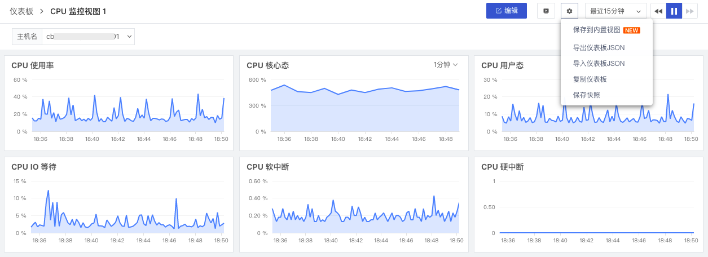

仪表板视图保存到内置视图时，支持选择绑定关系，选择绑定关系“label”。保存到内置视图后，即可在<<< custom_key.brand_name >>>工作空间「管理」-「内置视图」的「用户视图」查看保存的仪表版视图。同时因为设置了绑定关系`label:*`，在基础设施设置过 “Label 属性”的主机、容器详情页即可查看绑定的内置视图。更多详情，可参考文档 **保存仪表板为内置视图**。


#### 新增容器详情页关联 Pod

在容器详情页，支持您通过详情页查看相关 Pod（关联字段： pod_name ）的基本信息和**在选定时间组件范围内**的性能指标状态。更多容器关联查询，可参考文档 **容器**。<br />注意：在容器详情中查看相关 Pod，需要匹配字段“pod_name”，否则无法在容器详情查看到相关 Pod 的页面。

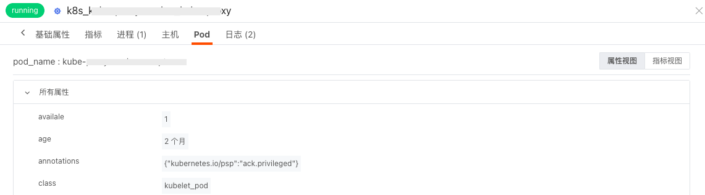

#### 新增监控器分组管理

<<< custom_key.brand_name >>>新增的分组功能支持您在设定监控器时，自定义创建有意义的监测器组合，支持通过「分组」筛选出对应监控器，方便分组管理各项监控器。

注意：
- 每个监控器创建时必须选择一个分组，默认选中「默认分组」；
- 当某个分组被删除时，删除分组下的监控器将自动归类到「默认分组」下。

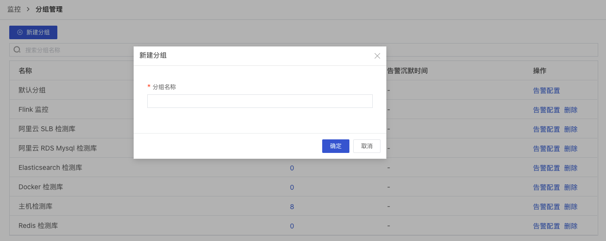

#### 新增日志查看器、表格图、日志流图格式化配置

<<< custom_key.brand_name >>>新增的格式化配置可以让您隐藏敏感日志数据内容或者突出需要查看的日志数据内容，还可以通过替换原有日志内容进行快速筛选。支持在日志查看器、表格图、日志流图进行格式化配置。


#### 优化静默管理，新增禁用/启用规则

<<< custom_key.brand_name >>>新增静默规则禁用/启用功能，帮助您快速禁用/启用静默任务。更多详情，可参考文档 **静默管理**。

- 启用：静默规则按照正常流程执行
- 禁用：静默规则不生效；若有设置静默通知策略，选择的是开始前“xx分钟”且静默通知操作还未执行的情况下，通知不会执行

注意：启用/禁用规则都会产生操作审计事件，可在<<< custom_key.brand_name >>>工作空间「管理」-「基本设置」下的操作审计进行查看。


#### 新增日志 pipeline 使用手册

<<< custom_key.brand_name >>>新增日志的 pipeline 使用手册，帮助您了解如何通过 DataKit 内置的调试工具，来辅助编写 Pipeline 脚本。
```
# 调试脚本示例
datakit --pl datakit.p --txt '2022-01-12T18:40:51.962+0800 WARN diskio diskio/input.go:320 Error gathering disk info: open /run/udev/data/b252:1: no such file or directory'

# 提取成功示例
Extracted data(drop: false, cost: 3.108038ms):
{
  "code": "diskio/input.go:320",
  "level": "WARN",
  "message": "2022-01-12T18:40:51.962+0800 WARN diskio diskio/input.go:320 Error gathering disk info: open /run/udev/data/b252:1: no such file or directory",
  "module": "diskio",
  "msg": "Error gathering disk info: open /run/udev/data/b252:1: no such file or directory",
  "time": 1641984051962000000
}
```

#### 新增 DQL 外层函数

<<< custom_key.brand_name >>>新增两个外层函数`rate()`和`irate()`。

- rate()：计算某个指标一定时间范围内的平均变化率。适合警报和缓慢移动的计数器。
- irate()：计算某个指标一定时间范围内的瞬时变化率，适合绘制易失性、快速变化的计数器。

更多详情，可参考文档 **DQL 外层函数**。

