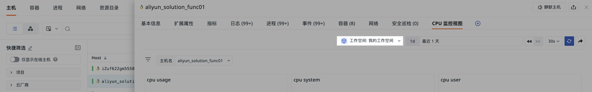

# 内置视图
---

视图是一种用于展示和分析数据的工具，帮助用户快速地获取和理解数据的洞察。视图可以用来：

- 数据监控：通过[系统视图](#system)实时监控关键指标和系统运行状态，如 Docker、JVM 等。
- 数据分析：利用[用户视图](#user)自定义分析，深入探索数据，发现潜在问题和趋势。
- 数据共享：将视图绑定到查看器，确保数据一致性和可访问性。

## 系统视图 {#system}

系统视图是系统提供的官方视图模板，涵盖多种监控场景，如 Docker、JVM、Kafka 等。

1. 进入场景 > 内置视图 > 系统视图；
2. 点击进入某一视图；
3. 可选择直接创建为[新仪表板](../dashboard/index.md#blank)或[新用户视图](./bind-view.md)；
4. 点击确定，即可复用该系统视图。

## 用户视图 {#user}

[自定义并保存](../../scene/built-in-view/bind-view.md)的视图模板。

???+ warning "注意"

    - 同一个工作空间下用户视图不允许重名；
    - 目前仅支持手动绑定用户视图为查看器视图。如需绑定系统视图，请先将其克隆为用户视图。若系统视图与用户视图重名，查看器将优先显示用户视图。

## 管理视图

### 导出视图 JSON

选择内置视图 > 系统视图/用户视图，点击“导出视图 JSON” 即可生成 JSON 文件。此文件可用于其他工作空间的场景仪表板或用户视图的导入。

### 导入视图 JSON

在自定义用户视图时，点击“导入视图 JSON” 可将 JSON 文件作为新的视图模板。

???+ warning "注意"

    导入会覆盖原有视图且无法恢复，且仅支持用户视图。

### 导出到仪表板

用户视图可直接导出到场景仪表板。

1. 点击“设置”；
2. 选择“导出至仪表板”；
3. 输入名称并选择标签；
4. 点击确定。

### pin

若当前工作空间被授权访问其他工作空间的数据，可在视图中 pin 住目标工作空间 A，使其成为默认查询空间。

若查看器详情页绑定了此用户视图，默认按 pin 的工作空间数据展示。

