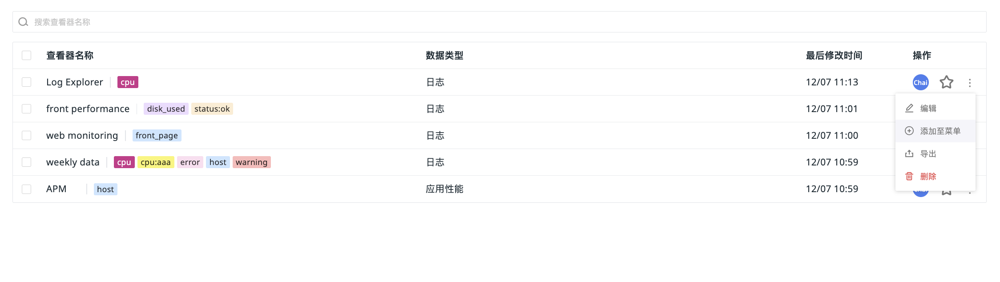
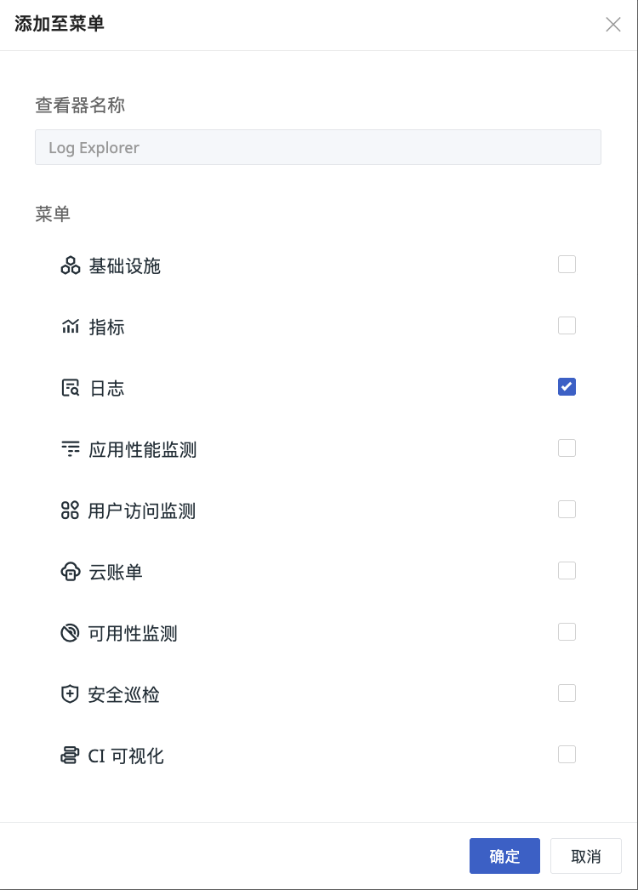

# 列表操作
---

您可通过以下操作对查看器列表进行管理。

## 搜索 & 筛选

在查看器列表，可通过顶部**搜索栏**和左侧**过滤**、**标签筛选**功能，可快速分组查看查看器，提升查询效率。

## 批量操作

支持对特定查看器进行批量删除或导出。

## 添加查看器导航 {#menu}

可将查看器添加至基础设施、指标、日志等导航菜单，方便快速访问：

1. 在查看器列表中选择需要添加的查看器（如 MySQL 查看器模板），点击右侧操作菜单下的编辑，选择添加至菜单。
2. 选择目标菜单（如日志）。
3. 添加完成后，即可在对应导航菜单中查看自定义查看器。
4. 若具有[场景配置管理权限](../../management/role-list.md)，还可点击编辑自定义查看器，跳转回自定义查看器进行编辑。

   

