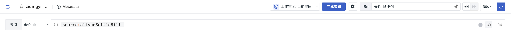

# 页面管理 
---

## 跨工作空间查询

工作空间若是被授予了其他工作空间，则可在当前查看器切换工作空间查看对应的图表信息。

## 设置 

### 新建 Issue

可将查看器中发现的异常现象创建为 Issue。
 
> 更多相关操作，可参考[如何在视图级别手动创建 Issue](../../exception/issue.md#dashboards)。关于 Issue 更多相关信息，可参考[异常追踪](../../exception/index.md)。

### 导入/导出/复制查看器

- 复制查看器：复制当前查看器为新的查看器进行编辑； 
- 导出查看器：导出为 JSON 文件，用于共享查看器模板；      
- 导入查看器：通过导入 JSON 文件新建或覆盖现有模板进行编辑。     