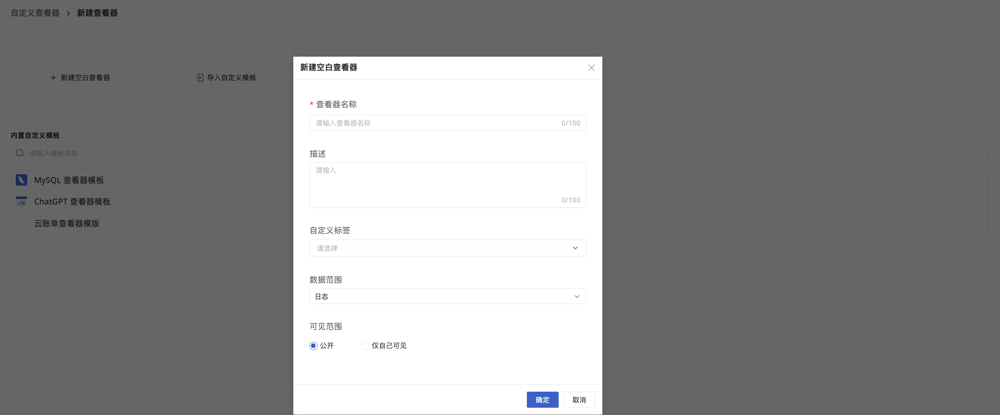

# 查看器
---

在处理日志数据时，快速定位和分析关键信息是关键。自定义查看器允许您根据需求创建个性化的日志查看工具。

- 多个自定义图表显示设置；
- 自定义快捷筛选字段；
- 自定义列表默认显示列；
- 绑定查看关联的内置视图。

## 开始新建

您可以通过三种方式创建一个查看器。

:material-numeric-1-circle: 直接创建[空白查看器](#blank)；

:material-numeric-2-circle: 导入[自定义模版](#custom)；

:material-numeric-3-circle: 在[内置模版库](#view)选择查看器。

### 空白查看器

1. 定义当前查看器的名称；
2. 按需输入针对该查看器的描述内容；
3. 选择[标签](../../management/global-label.md)，便于后续分组管理；
4. 选择当前查看器的数据类型，包含日志、应用性能、用户访问、安全巡检、Profile；
5. 选择当前查看器的[可见范围](#range)；
6. 点击确定，即可创建成功。

#### 可见范围 {#range}

查看器的可见范围，包括：

- 公开：对工作空间内所有成员开放；   
- 仅自己可见：仅创建人可查看。

???+ warning "注意"

    以链接形式分享的**非公开查看器**，非创建人不可见。

### 自定义模板 {#custom}

1. 定义当前查看器的名称；
2. 按需输入针对该查看器的描述内容；
3. 上传自定义的 JSON 文件；
4. 选择[标签](../../management/global-label.md)，便于后续分组管理；
5. 选择当前查看器的[可见范围](#range)；
6. 点击确定，即可创建成功。

### 内置模版库 {#view}

1. 查看器名称默认为当前选中视图的名称，可按需更改；
2. 按需输入针对该查看器的描述内容；
3. 选择[标签](../management/global-label.md)，便于后续分组管理；
4. 选择当前查看器的[可见范围](#range)；
5. 点击确定，即可创建成功。

