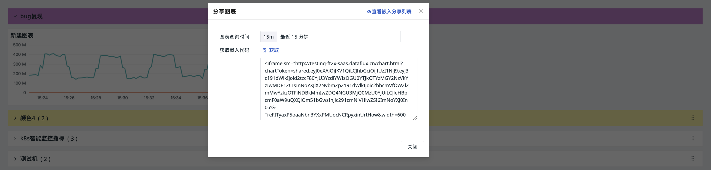

# 图表分享
---

**注意**：该功能仅支持空间拥有者、管理员和标准成员操作，只读成员无法查看到分享图表的功能。

可用于在观测云以外的平台代码中插入图表进行可视化数据展示和分析。被分享的图表即使嵌入到其他平台，仍会与观测云中图表的变化实时同步。

分享的图表统一存储于**管理 > 分享管理 > 分享图表**。

## 开始分享

1. 点击设置 > 分享；
2. 选择图表查询时间；
3. 获取嵌入代码；
4. 此时图表分享成功。

观测云会按照图表查询时间生成嵌入代码，如图表查询时间为最近 15 分钟，即嵌入其他平台后，该图表按照最近 15 分钟显示查询结果。

**注意：**

- 若图表设置了锁定时间，图表查询时间则显示为该锁定时间且不能更改；
- 图表分享的宽度和高度默认显示为视图中的尺寸大小，嵌入代码可进行修改；
- 若图表关联了视图变量，按照当前选中的视图变量做图表分享，如当前关联视图变量主机，则按照当前选中的主机做图表分享。

## 查看分享

观测云在场景视图分享的图表统一存储在**管理 > 分享管理 > [分享图表](../../management/share-management.md)**中。

