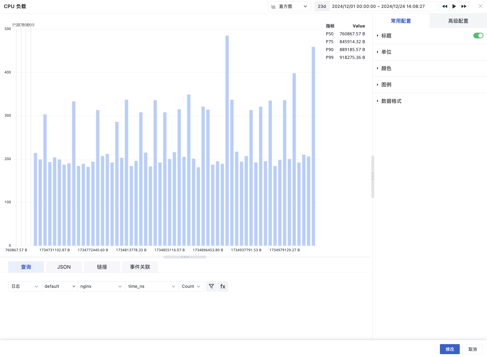

# 直方图
---

直方图，又称质量分布图，用于表示数据的分布情况，是一种常见的统计图表，一般用横轴表示数据区间，纵轴表示分布情况，图表形状类似柱状图，柱子越高，则落在该区间的数量越大。

直方图仅支持日志类数据，可用于表示 Elasticsearch 存储 `number` 类型数据的分布情况，包括"日志"、"基础对象"、"资源目录"、"事件"、"应用性能"、"用户访问"、"安全巡检"、"网络"、"Profile" 的数据查询；若工作空间为 SLS 存储，数据查询会报错。

<!--
## 应用场景

{{{ custom_key.brand_name }}}的直方图用于显示某个指标数据在一段时间内的数据分布走向。可用于以下场景：

- 查看应用性能指标数据在一定时间范围内的分布情况，如在最近 15 分钟内“请求数”的分布情况；
- 查看用户访问指标数据在一定时间范围内的分布情况，如在最近 15 分钟内“错误数”的分布情况；
- 其他日志类数据中 `number` 类型数据的分布情况。
-->

## 图表查询

支持**简单查询**、**表达式查询**、**PromQL 查询**和**数据源查询**。

> 更多图表查询条件详细说明，可参考 [图表查询](chart-query.md)。

> 更多存储说明，可参考 [数据存储策略](../../billing-method/data-storage.md#options)。

<!--
## 事件关联

通过**添加筛选字段**匹配与选定字段相关的异常事件，从而达到时序数据与事件关联显示的目的。这个功能可以帮助用户在查看趋势的同时，感知数据波动期间是否有相关事件产生，以帮助用户从另一个视角定位问题。

> 更多相关设置说明，可参考 [事件关联](events-relative.md)。
-->

## 图表配置

> 更多详情，可参考 [图表配置](./chart-config.md)。

<!--
## 常用配置

| 选项 | 说明 |
| --- | --- |
| 标题 | 为图表设置标题名称，设置完成后，在图表的左上方显示，支持隐藏。|
| 描述 | 为图表添加描述信息，设置后图表标题后方会出现【i】的提示，不设置则不显示。 |
| 单位 | **:material-numeric-1-box: 默认单位显示**： <li>若查询的数据为指标数据，且您在[指标管理](../../metrics/dictionary.md)中为指标设置了单位，则默认按照指标的单位进行进位显示； <li>若您在**指标管理**内无相关单位配置，则按照 [千分位](chart-query.md#thousand) 逗号间隔的数值进位方式显示。 **:material-numeric-2-box: 配置单位后**： 优先使用您自定义配置的单位进行进位显示，指标类数据支持针对数值提供两种选项：  **科学计数说明** <u>默认进位</u>：单位为万、百万，如10000 展示为 1 万，1000000 展示为 1 百万。保留两位小数点； <u>短级差制</u>：单位为 K, M, B。即以 thousand、million、billion、trillion 等依次表示中文语境下的千、百万、十亿、万亿等。如 1000 为 1 k，10000 为 10 k，1000000 为 1 million；保留两位小数点。|
| 颜色 | 设置图表数据的显示颜色，支持自定义手动输入预设颜色，输入格式为：聚合函数(指标){"标签": "标签值"}，如 `last(usage_idle){"host": "guance_01"}`。 |
| 图例 | 可选择底部、右侧、隐藏图例（点击图例中的指标行，可隐藏/显示对应指标）； 图例值包含 min、max、p50、p75、p90、p99。 |
| 数据格式 | 您可以选择【小数位数】以及【千分位分隔符】。 <li>千位分隔符默认开启，关闭后将显示原始值，无分隔符。更多详情，可参考 [数据千分位格式](../visual-chart/chart-query.md#thousand)。 |
| 百分位数 | 查询数据时默认在直方图的分布位置显示 p50 、 p75、p90、p99 ，以竖线定位，帮助更直观的查看数据分布情况。 |

## 高级配置

| 选项 | 说明 |
| --- | --- |
| 锁定时间 | 即固定当前图表查询数据的时间范围，不受全局时间组件的限制。设置成功后的图表右上角会出现用户设定的时间，如【xx分钟】、【xx小时】、【xx天】。如锁定时间间隔30分钟，那么当调节时间组件无论查询什么时间范围视图，仍只会显示最近 30 分钟数据。 |
| 字段映射 | 配合视图变量的对象映射功能，默认为关闭，若在视图变量已配置对象映射： <li>开启字段映射时，图表显示查询的**分组字段**和对应的**映射字段**，未指定映射的分组字段不显示； <li>关闭字段映射时，图表正常显示，不显示映射的字段。  |
| 空间授权 | 被授权的工作空间列表，选择后即可通过图表查询并展示该工作空间数据。 |
| 数据采样 | 仅针对 Doris 日志数据引擎的工作空间；开启后，会对除“指标”外的其他数据进行采样查询，采样率不固定，会根据数据量大小动态调整。 |
| 时间偏移 | 非时序数据在入库后存在至少 1 分钟的查询延迟。选择相对时间查询时，可能导致最近几分钟的数据未能被采集，从而出现数据丢失的情况。 启用时间偏移后，当查询相对时间区间时，实际查询时间范围向前偏移 1 分钟，以防止入库延迟导致数据获取为空。如：当前为 12:30，查询最近 15 分钟的数据，开启时间偏移后，实际查询的时间是：12:14-12:29。 :warning:  <li>该设置仅针对相对时间生效，若查询时间区间为“绝对时间范围”，时间偏移不生效。 <li>针对有时间间隔的图表，如时序图，设定时间间隔超出 1min 则时间偏移不生效，<= 1m 的情况下才偏移生效。针对没有时间间隔的图表，如概览图、柱状图等，时间偏移保持生效。|

-->