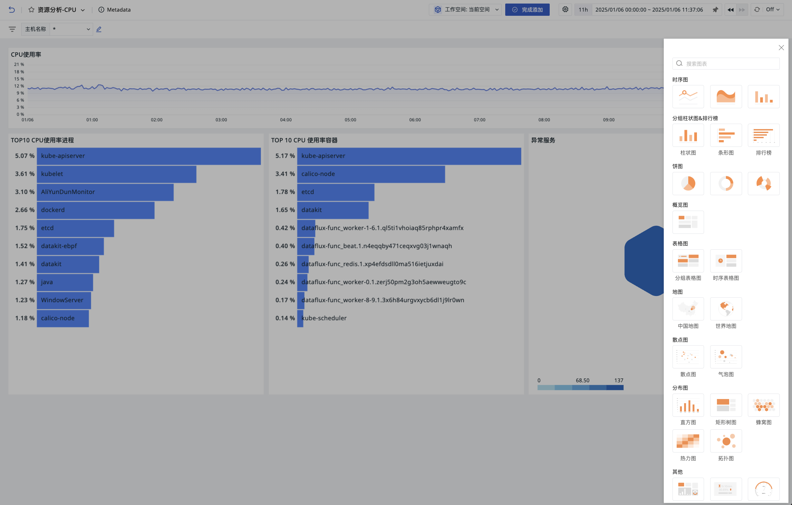

# 可视化图表
---

观测云配备了 20 余种标准化的可视化图表，您可以轻松根据业务需求定制仪表板。同时，利用视图变量等高级功能，可实现图表间的数据联动，确保数据展示的个性化与专业度。

<!--

- [ :fontawesome-solid-arrow-right-long: &nbsp; **时序图**](timeseries-chart.md)

- [ :fontawesome-solid-arrow-right-long: &nbsp; **概览图**](overview-chart.md)

- [ :fontawesome-solid-arrow-right-long: &nbsp; **表格图**](table-chart.md)

- [ :fontawesome-solid-arrow-right-long: &nbsp; **矩形树图**](treemap.md)

- [ :fontawesome-solid-arrow-right-long: &nbsp; **漏斗图**](funnel-chart.md)

- [ :fontawesome-solid-arrow-right-long: &nbsp; **饼图**](pie-chart.md)

- [ :fontawesome-solid-arrow-right-long: &nbsp; **柱状图**](bar-chart.md)

- [ :fontawesome-solid-arrow-right-long: &nbsp; **直方图**](histogram.md)

- [ :fontawesome-solid-arrow-right-long: &nbsp; **SLO**](slo-chart.md)

- [ :fontawesome-solid-arrow-right-long: &nbsp; **排行榜**](leaderboard.md)

- [ :fontawesome-solid-arrow-right-long: &nbsp; **仪表盘**](dashboard/index.md)

- [ :fontawesome-solid-arrow-right-long: &nbsp; **散点图**](scatter-plot.md)

- [ :fontawesome-solid-arrow-right-long: &nbsp; **气泡图**](bubble-chart.md)

- [ :fontawesome-solid-arrow-right-long: &nbsp; **中国地图**](china-map.md)

- [ :fontawesome-solid-arrow-right-long: &nbsp; **世界地图**](world-map.md)

- [ :fontawesome-solid-arrow-right-long: &nbsp; **蜂窝图**](cellular-map.md)

- [ :fontawesome-solid-arrow-right-long: &nbsp; **桑基图**](sankey.md)

- [ :fontawesome-solid-arrow-right-long: &nbsp; **图片**](picture.md)

- [ :fontawesome-solid-arrow-right-long: &nbsp; **文本**](text.md)

- [ :fontawesome-solid-arrow-right-long: &nbsp; **视频**](video.md)

- [ :fontawesome-solid-arrow-right-long: &nbsp; **命令面板**](command-panel.md)

- [ :fontawesome-solid-arrow-right-long: &nbsp; **IFrame**](iframe.md)

- [ :fontawesome-solid-arrow-right-long: &nbsp; **日志流图**](log-stream.md)

- [ :fontawesome-solid-arrow-right-long: &nbsp; **对象列表图**](object-list.md)

- [ :fontawesome-solid-arrow-right-long: &nbsp; **告警统计图**](alert-statistics.md)

- [ :fontawesome-solid-arrow-right-long: &nbsp; **拓扑图**](topology-map.md)

|                   :fontawesome-regular-circle-down: &nbsp;**图表详情**                 |                |                |   |   |
| :-------------------: | :--------------------: | :--------------------: | :--------------------: | :--------------------: |
| [时序图](timeseries-chart.md){ .md-button .md-button--primary } | [概览图](overview-chart.md){ .md-button .md-button--primary } | [表格图](table-chart.md){ .md-button .md-button--primary } |[矩形树图](treemap.md){ .md-button .md-button--primary } |[漏斗图](funnel-chart.md){ .md-button .md-button--primary } |
| [饼图](pie-chart.md){ .md-button .md-button--primary } | [柱状图](bar-chart.md){ .md-button .md-button--primary } | [直方图](histogram.md){ .md-button .md-button--primary } |[SLO](slo-chart.md){ .md-button .md-button--primary } |[排行榜](leaderboard.md){ .md-button .md-button--primary } |
| [仪表盘](dashboard/index.md){ .md-button .md-button--primary } | [散点图](scatter-plot.md){ .md-button .md-button--primary } | [气泡图](bubble-chart.md){ .md-button .md-button--primary } |[中国地图](china-map.md){ .md-button .md-button--primary } |[世界地图](world-map.md){ .md-button .md-button--primary } |
| [蜂窝图](cellular-map.md){ .md-button .md-button--primary } | [桑基图](sankey.md){ .md-button .md-button--primary } | [文本](text.md){ .md-button .md-button--primary } |[图片](picture.md){ .md-button .md-button--primary } |[视频](video.md){ .md-button .md-button--primary } |
| [命令面板](command-panel.md){ .md-button .md-button--primary } | [IFrame](iframe.md){ .md-button .md-button--primary } | [日志流图](log-stream.md){ .md-button .md-button--primary } |[对象列表图](object-list.md){ .md-button .md-button--primary } |[告警统计图](alert-statistics.md){ .md-button .md-button--primary } | 
| [拓扑图](topology-map.md){ .md-button .md-button--primary } |  |  |  |  |

-->

## 添加图表

1. 进入仪表板页面；
2. 开始添加图表；
3. 选择需要添加的图表类型；
4. 点击创建，即完成添加。

## 图表类型 {#type}

:material-numeric-1-circle: **常见图表**

- [时序图](./timeseries-chart.md)：用于展示数据随时间的趋势变化
    - 时序折线图
    - 时序柱状图
    - 时序面积图

- [分组柱状图](./bar-chart.md)：用于显示各项之间的对比情况
    - 分组柱状图
    - 分组条形图

- [排行榜](./leaderboard.md)：用于展示一段时间内分组数据的排名情况

- [饼图](./pie-chart.md)：用于展示数据的占比关系
    - 饼图
    - 环形图
    - 玫瑰图

- [概览图](./overview-chart.md)：用于展示一个关键的数值或指标

:material-numeric-3-circle: [**表格图**](./table-chart.md)

- 分组表格图：展示不同类别或分组的数据指标
- 时序表格图：展示随时间变化的数据趋势

:material-numeric-4-circle: **地图**

- [中国地图](./china-map.md)：用于在不同地理位置上的分布，通过颜色深浅表示数据大小
- [世界地图](./world-map.md)：用于展示数据在不同地理位置上的分布，通过颜色来表现数据大小

:material-numeric-5-circle: **散点图**

- [散点图](./scatter-plot.md)：将数据以点的形式展现，用于展示两个变量之间的关系及影响程度
- [气泡图](./bubble-chart.md)：用于展示三个变量之间的关系以及影响程度，以气泡的大小表示第三个变量

:material-numeric-6-circle: **分布图**

- [蜂窝图](./cellular-map.md)：用于展示多组数据的分布，通过色块颜色深浅表示数据大小
- [拓扑图](./topology-map.md)：用于展示不同事物之间的关系和相对位置
- [矩形树图](./treemap.md)：用于展示不同类别的占比情况，有效利用空间，相比饼图可以显示更多数据
- [直方图](./histogram.md)：又称质量分布图，由一系列高低不等的柱体表示数据分布情况
- [热力图](./heatmap_scene.md)：通过颜色深浅变化来表示数据的密度或强度，通常使用渐变色来表示不同的数值范围

:material-numeric-7-circle: **其他图表**

- [SLO](./slo-chart.md)：需直接选择已经设置好的 SLO 监控，以展示相关的性能数据
- [仪表盘](./dashboard.md)：用于展示指标的进度或完成情况
- [漏斗图](./funnel-chart.md)：用于展示业务流程中的转化情况
- [桑基图](./sankey.md)：是一种特殊的流程图，用于显示数据或能量的流动

:material-numeric-8-circle: **高级图表**

- [日志流图](./log-stream.md)：以时序表格图的形式展示日志数据，可以自定义显示的日志范围及显示列
- [对象列表图](./object-list.md)：以表格图的形式展示基础设施数据，包含“基础对象”和“资源目录”
- [告警统计图](./alert-statistics.md)：以列表的形式展示未恢复的告警事件，快速识别和响应系统中的紧急问题
- [文本](./text.md)：用于在 Markdown 格式的文档中添加提示、说明及各种内容，如文字、图像和超链接
- [视频](./video.md)：仪表板中可以通过添加视频地址来展示视频内容，增强信息的传达效果
- [图片](./picture.md)：在仪表板中展示图片，支持通过添加图片地址来实现，并提供多种图片显示选项，如填充、适应、拉伸和居中
- [命令面板](./command-panel.md)：由命令按钮组成，允许用户通过点击执行特定命令或跳转到指定链接
- [IFrame](./iframe.md)：用于在仪表板中嵌入外部页面，支持 https 和 http 链接

## 图表设置 {#settings}

1. 修改：编辑图表配置；
2. [组合图表](#conbine)；
3. 复制：即复制该图表的一切配置；可用于当前或其他仪表板、笔记中；
4. 克隆：直接克隆该图表至当前仪表板；
5. 删除：删除当前图表；
6. [分享](#share)：对外分享当前图表

### 时间间隔 {#interval}

#### 锁定时间

若在图表设置中锁定时间选择 “最近 15 分钟”；

在预览图表时，图表右上角会出现选择的锁定时间。

#### 自动对齐

若在图表设置中时间间隔选择**自动对齐**；

在预览图表时，图表右上角会出现时间间隔选项。

### 组合图表 {#conbine}

即可添加其他图表组合为新的组合图表，一般用于组合一个指标不同结果值的多个图表，帮助了解指标的对比结果，同时可以随意组合不同类型的图表。同时，还可选取当前仪表板中的视图变量作用于该组合图表，在组合对比的基础上灵活筛选数据。

1. 点击修改，进入图表组合配置页面；
2. 定义当前组合图表的标题；
3. 为该组合图表配置变量；
4. 选择图表；
5. 点击确定。

### 分享 {#share}

#### 开始分享

1. 点击设置 > 分享；
2. 选择图表查询时间；
3. 获取嵌入代码；
4. 此时图表分享成功。

观测云会按照图表查询时间生成嵌入代码，如图表查询时间为最近 15 分钟，即嵌入其他平台后，该图表按照最近 15 分钟显示查询结果。

**注意：**

- 若图表设置了锁定时间，图表查询时间则显示为该锁定时间且不能更改；
- 图表分享的宽度和高度默认显示为视图中的尺寸大小，嵌入代码可进行修改；
- 若图表关联了视图变量，按照当前选中的视图变量做图表分享，如当前关联视图变量主机，则按照当前选中的主机做图表分享。

#### 查看分享

观测云在场景视图分享的图表统一存储在**管理 > 分享管理 > [分享图表](../../management/share-management.md)**中。

### 下载图表 {#download}

点击 :material-tray-arrow-down: 即可将图表下载为 PNG 图片。

若图表为表格图，图表可下载为 PNG 图片、导出为 CSV 文件。

### 分析图表 {#analysis}

在仪表板中，点击图表上的**分析**按钮或双击图表空白处，可以放大图表进行查看和分析。您可以通过鼠标 hover 查看图表的数据信息；或通过选择[时间轴](timeseries-chart.md)查看特定时间范围的指标趋势。

- 在 hover 到图表里面的某一条时间线时，若其他图表存在 by 分组条件且有相同 tags，则会在其他图表中对应显示高亮区块； 
- 通过单击图表查看图表的 [DQL 查询语句](chart-query.md)。

#### [相似趋势指标](./timeseries-chart.md#similar) 

#### 相关查看

- 点击某条查询，您可以查看相关关联分析，如日志、容器、进程、链路等；

- 当图表查询存在主机（`host`）信息，且图表查询中分组条件选择了 `by host`，您还可以查看相关的主机监控视图。

#### 下钻分析 {#deep}

为深入从数据中挖掘事件的根本原因，进而实现更精准的数据分析与排查，您可以对所有**指标数据**进行**下钻分析**。

点击进入**下钻分析**，框选时间区域后，点击**开始检索**即可呈现下钻分析结果。您可以在查询结果中查看该时间区域内的下钻⼀级标签及对应时序图分析结果。

**注意**：下钻分析仅支持简单查询。

#### 根因分析 {#root}

为实现业务逻辑的根因定位，您可以使用**根因分析**功能来确定根因故障。目前，根因分析支持 `磁盘使用率` 以及 `内存使用率` 两种指标。

**注意**：根因分析仅支持简单查询。

