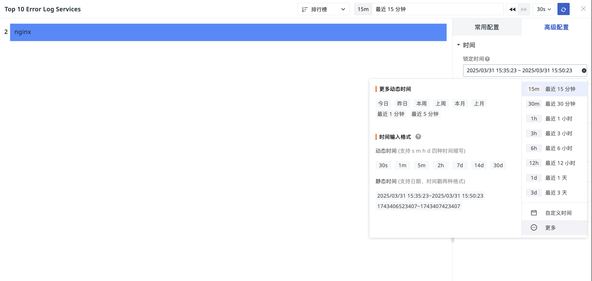
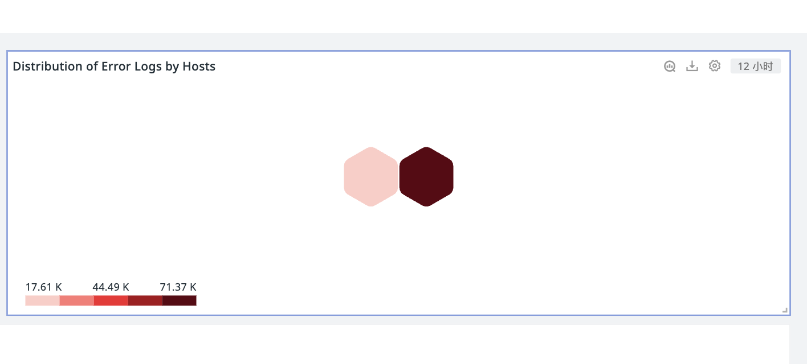
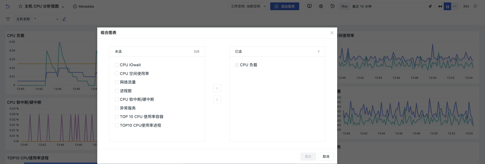
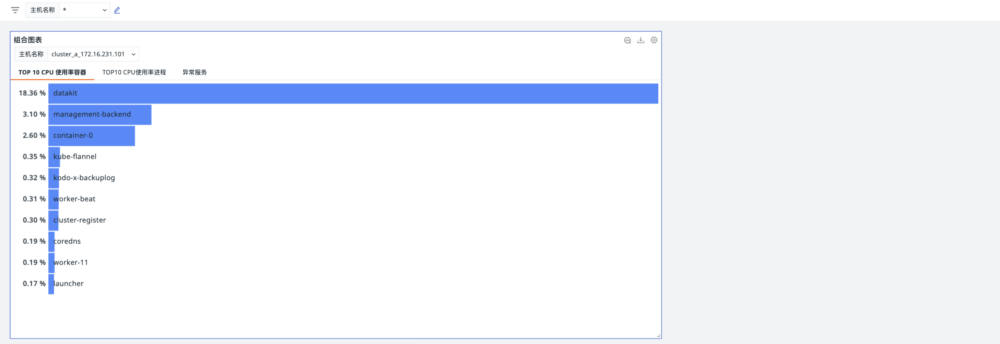
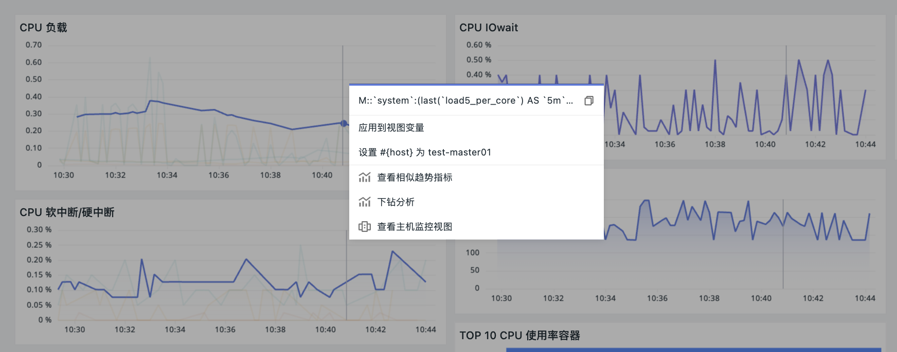
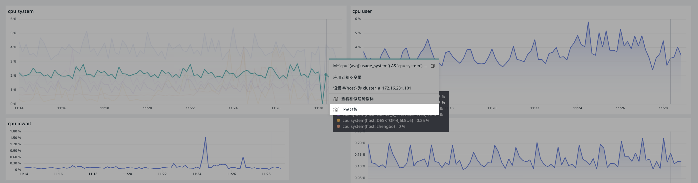
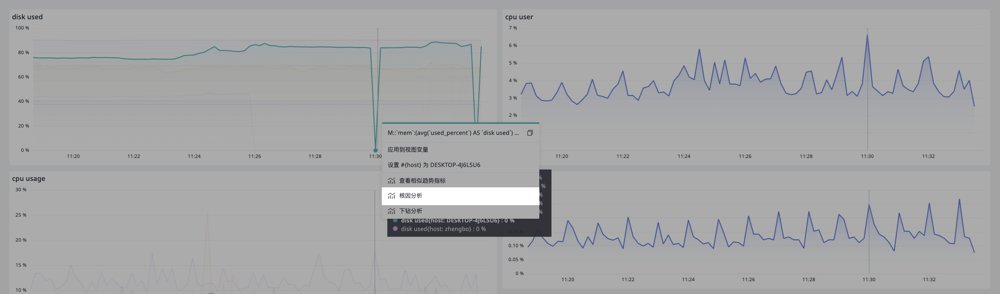

# 可视化图表
---

<<< custom_key.brand_name >>>配备了 20 余种标准化的可视化图表，您可以轻松根据业务需求定制仪表板。同时，利用视图变量等高级功能，可实现图表间的数据联动，确保数据展示的个性化与专业度。

<!--

- [ :fontawesome-solid-arrow-right-long: &nbsp; **时序图**](timeseries-chart.md)

- [ :fontawesome-solid-arrow-right-long: &nbsp; **概览图**](overview-chart.md)

- [ :fontawesome-solid-arrow-right-long: &nbsp; **表格图**](table-chart.md)

- [ :fontawesome-solid-arrow-right-long: &nbsp; **矩形树图**](treemap.md)

- [ :fontawesome-solid-arrow-right-long: &nbsp; **漏斗图**](funnel-chart.md)

- [ :fontawesome-solid-arrow-right-long: &nbsp; **饼图**](pie-chart.md)

- [ :fontawesome-solid-arrow-right-long: &nbsp; **柱状图**](bar-chart.md)

- [ :fontawesome-solid-arrow-right-long: &nbsp; **直方图**](histogram.md)

- [ :fontawesome-solid-arrow-right-long: &nbsp; **SLO**](slo-chart.md)

- [ :fontawesome-solid-arrow-right-long: &nbsp; **排行榜**](leaderboard.md)

- [ :fontawesome-solid-arrow-right-long: &nbsp; **仪表盘**](dashboard/index.md)

- [ :fontawesome-solid-arrow-right-long: &nbsp; **散点图**](scatter-plot.md)

- [ :fontawesome-solid-arrow-right-long: &nbsp; **气泡图**](bubble-chart.md)

- [ :fontawesome-solid-arrow-right-long: &nbsp; **中国地图**](china-map.md)

- [ :fontawesome-solid-arrow-right-long: &nbsp; **世界地图**](world-map.md)

- [ :fontawesome-solid-arrow-right-long: &nbsp; **蜂窝图**](cellular-map.md)

- [ :fontawesome-solid-arrow-right-long: &nbsp; **桑基图**](sankey.md)

- [ :fontawesome-solid-arrow-right-long: &nbsp; **图片**](picture.md)

- [ :fontawesome-solid-arrow-right-long: &nbsp; **文本**](text.md)

- [ :fontawesome-solid-arrow-right-long: &nbsp; **视频**](video.md)

- [ :fontawesome-solid-arrow-right-long: &nbsp; **命令面板**](command-panel.md)

- [ :fontawesome-solid-arrow-right-long: &nbsp; **IFrame**](iframe.md)

- [ :fontawesome-solid-arrow-right-long: &nbsp; **日志流图**](log-stream.md)

- [ :fontawesome-solid-arrow-right-long: &nbsp; **对象列表图**](object-list.md)

- [ :fontawesome-solid-arrow-right-long: &nbsp; **告警统计图**](alert-statistics.md)

- [ :fontawesome-solid-arrow-right-long: &nbsp; **拓扑图**](topology-map.md)

|                   :fontawesome-regular-circle-down: &nbsp;**图表详情**                 |                |                |   |   |
| :-------------------: | :--------------------: | :--------------------: | :--------------------: | :--------------------: |
| [时序图](timeseries-chart.md){ .md-button .md-button--primary } | [概览图](overview-chart.md){ .md-button .md-button--primary } | [表格图](table-chart.md){ .md-button .md-button--primary } |[矩形树图](treemap.md){ .md-button .md-button--primary } |[漏斗图](funnel-chart.md){ .md-button .md-button--primary } |
| [饼图](pie-chart.md){ .md-button .md-button--primary } | [柱状图](bar-chart.md){ .md-button .md-button--primary } | [直方图](histogram.md){ .md-button .md-button--primary } |[SLO](slo-chart.md){ .md-button .md-button--primary } |[排行榜](leaderboard.md){ .md-button .md-button--primary } |
| [仪表盘](dashboard/index.md){ .md-button .md-button--primary } | [散点图](scatter-plot.md){ .md-button .md-button--primary } | [气泡图](bubble-chart.md){ .md-button .md-button--primary } |[中国地图](china-map.md){ .md-button .md-button--primary } |[世界地图](world-map.md){ .md-button .md-button--primary } |
| [蜂窝图](cellular-map.md){ .md-button .md-button--primary } | [桑基图](sankey.md){ .md-button .md-button--primary } | [文本](text.md){ .md-button .md-button--primary } |[图片](picture.md){ .md-button .md-button--primary } |[视频](video.md){ .md-button .md-button--primary } |
| [命令面板](command-panel.md){ .md-button .md-button--primary } | [IFrame](iframe.md){ .md-button .md-button--primary } | [日志流图](log-stream.md){ .md-button .md-button--primary } |[对象列表图](object-list.md){ .md-button .md-button--primary } |[告警统计图](alert-statistics.md){ .md-button .md-button--primary } | 
| [拓扑图](topology-map.md){ .md-button .md-button--primary } |  |  |  |  |

-->

## 添加图表

1. 进入仪表板页面；
2. 开始添加图表；
3. 选择需要添加的图表类型；
4. 点击创建，即完成添加。

## 图表类型 {#type}

:material-numeric-1-circle: **常见图表**

- [时序图](./timeseries-chart.md)：用于展示数据随时间的趋势变化
    - 时序折线图
    - 时序柱状图
    - 时序面积图

- [分组柱状图](./bar-chart.md)：用于显示各项之间的对比情况
    - 分组柱状图
    - 分组条形图

- [排行榜](./leaderboard.md)：用于展示一段时间内分组数据的排名情况

- [饼图](./pie-chart.md)：用于展示数据的占比关系
    - 饼图
    - 环形图
    - 玫瑰图

- [概览图](./overview-chart.md)：用于展示一个关键的数值或指标

:material-numeric-3-circle: [**表格图**](./table-chart.md)

- 分组表格图：展示不同类别或分组的数据指标
- 时序表格图：展示随时间变化的数据趋势

:material-numeric-4-circle: **地图**

- [中国地图](./china-map.md)：用于在不同地理位置上的分布，通过颜色深浅表示数据大小
- [世界地图](./world-map.md)：用于展示数据在不同地理位置上的分布，通过颜色来表现数据大小

:material-numeric-5-circle: **散点图**

- [散点图](./scatter-plot.md)：将数据以点的形式展现，用于展示两个变量之间的关系及影响程度
- [气泡图](./bubble-chart.md)：用于展示三个变量之间的关系以及影响程度，以气泡的大小表示第三个变量

:material-numeric-6-circle: **分布图**

- [蜂窝图](./cellular-map.md)：用于展示多组数据的分布，通过色块颜色深浅表示数据大小
- [拓扑图](./topology-map.md)：用于展示不同事物之间的关系和相对位置
- [矩形树图](./treemap.md)：用于展示不同类别的占比情况，有效利用空间，相比饼图可以显示更多数据
- [直方图](./histogram.md)：又称质量分布图，由一系列高低不等的柱体表示数据分布情况
- [热力图](./heatmap_scene.md)：通过颜色深浅变化来表示数据的密度或强度，通常使用渐变色来表示不同的数值范围

:material-numeric-7-circle: **其他图表**

- [SLO](./slo-chart.md)：需直接选择已经设置好的 SLO 监控，以展示相关的性能数据
- [仪表盘](./dashboard.md)：用于展示指标的进度或完成情况
- [漏斗图](./funnel-chart.md)：用于展示业务流程中的转化情况
- [桑基图](./sankey.md)：是一种特殊的流程图，用于显示数据或能量的流动

:material-numeric-8-circle: **高级图表**

- [日志流图](./log-stream.md)：以时序表格图的形式展示日志数据，可以自定义显示的日志范围及显示列
- [对象列表图](./object-list.md)：以表格图的形式展示基础设施数据，包含“基础对象”和“资源目录”
- [告警统计图](./alert-statistics.md)：以列表的形式展示未恢复的告警事件，快速识别和响应系统中的紧急问题
- [监控器总览](./monitor_summary.md)：自动查询最近 2 天的监控器事件，并展示监控器最新一次触发的事件状态
- [文本](./text.md)：用于在 Markdown 格式的文档中添加提示、说明及各种内容，如文字、图像和超链接
- [视频](./video.md)：仪表板中可以通过添加视频地址来展示视频内容，增强信息的传达效果
- [图片](./picture.md)：在仪表板中展示图片，支持通过添加图片地址来实现，并提供多种图片显示选项，如填充、适应、拉伸和居中
- [命令面板](./command-panel.md)：由命令按钮组成，允许用户通过点击执行特定命令或跳转到指定链接
- [IFrame](./iframe.md)：用于在仪表板中嵌入外部页面，支持 https 和 http 链接

## 图表设置 {#settings}

- 修改：编辑图表配置；
- [组合图表](#conbine)；
- 复制：即复制该图表的一切配置；可用于当前或其他仪表板、笔记中；
- 克隆：直接克隆该图表至当前仪表板；
- 删除：删除当前图表；
- [分享](#share)：对外分享当前图表

### 时间间隔 {#interval}

图表外部的时间间隔显示受图表内部 > 高级设置 > 时间间隔的设置影响。

#### 锁定时间

在时间控件中按需选择数据查询的时间范围，保存后，图表外部会同步展示锁定时间。

#### 自动对齐

即通过调整时间轴，将不同时间点或频率采集的数据对齐到同一时间基准上。

在时序图等图表中，若时间间隔选择**自动对齐**，保存后，图表外部将同步显示时间间隔选项。

### 组合图表 {#conbine}

组合图表功能支持用户添加单个或多个图表，并可应用当前仪表板中的视图变量，实现灵活筛选与组合对比。

1. 点击修改，进入图表组合配置页面；
2. 定义当前组合图表的标题；
3. 为该组合图表配置变量；
4. 选择图表；
5. 点击确定。

### 分享 {#share}

#### 开始分享

1. 点击设置 > 分享；
2. 选择图表查询时间；
3. 获取嵌入代码；
4. 此时图表分享成功。

嵌入代码将根据图表的查询时间生成。例如，若图表查询时间为最近 15 分钟，则嵌入其他平台后，图表将显示最近 15 分钟的查询结果。

???+ warning "注意"

    - 图表若锁定时间，查询时间固定为锁定时间，不可更改；
    - 图表分享的宽高默认为视图尺寸，可通过嵌入代码修改；
    - 图表若关联视图变量，分享时按当前选中的变量值展示。

#### 查看分享

场景视图分享的图表存储于**管理 > 分享管理 > [分享图表](../../management/share-management.md)**中。

### 导出图表 {#download}

点击 :material-tray-arrow-down: 可将图表导出为 PNG 图片。

时序图、饼图、排行榜、柱状图、矩形树图等特定图表类型，还可额外导出为 CSV 文件，满足更多数据使用需求。

### 分析图表 {#analysis}

在仪表板中，点击图表上的**分析**按钮或双击图表空白处，可放大图表进行深入洞察。通过鼠标悬停可快速查看数据信息，选择[时间轴](timeseries-chart.md#timeline)可查看特定时间范围的指标趋势。

- hover 在某条时间线上时，若其他图表存在 by 分组条件且有相同 tags，相关图表会高亮显示对应区块，便于关联分析； 
- 单击图表可查看其 [DQL 查询语句](chart-query.md)，便于了解图表背后的数据逻辑。

#### [相似趋势指标](./timeseries-chart.md#similar) 

#### 相关查看

点击某条查询可查看关联分析，如日志、容器、进程、链路等；若图表查询包含主机（`host`）信息且分组条件为 `by host`，还可查看主机监控视图。

#### 下钻分析 {#deep}

下钻分析可从汇总数据逐层分解到更细粒度，定位问题发生的具体位置。

1. 点击进入下钻分析；
2. 框选目标时间区域；
3. 点击开始检索，即可查看该区域内的下钻标签及对应时序图结果。

???+ warning "注意"

    下钻分析仅支持简单查询。

#### 根因分析 {#root}

通过数据关联推理，找到问题的根本原因。根因分析支持对 `磁盘使用率` 以及 `内存使用率` 进行分析。

???+ warning "注意"

    根因分析仅支持简单查询。

