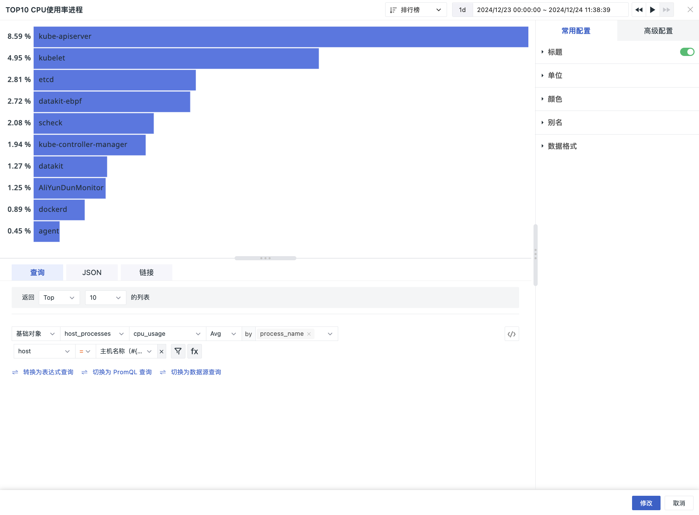

# 排行榜
---

排行榜是对某一相关同类事物的客观实力反映，简洁的展示出 Top N 或者 Bottom N 的升降序排行。

## 应用场景

观测云的排行榜用于显示某个指标数据的升降序排行。

## 图表查询

图表查询支持**简单查询**、**表达式查询**、**DQL 查询**和 **PromQL 查询**；默认添加简单查询；查询中默认内置【Top】/【Bottom】函数，预设 5、10、20、100，4 种排名数量，支持手动输入，最多为 100 条数据，可根据选定指标进行升降排序。排行榜不支持添加别名 **AS**。

**注意**：

- 单图表查询仅支持一条查询语句，默认为简单查询，点击**转换为表达式查询**切换为表达式查询，并将简单查询作为“查询 A”，支持相互切换。点击 :fontawesome-solid-code: 可切换至**DQL 查询** & **PromQL 查询**；   
- 若简单查询中使用了表达式查询不支持的转换函数，切换后，不会将函数带入到表达式查询。

> 更多图表查询条件详细说明，可参考 [图表查询](chart-query.md)。

## 图表链接

链接可以帮助您实现从当前图表跳转至目标页面；可添加平台内部链接和外部链接；还可通过模板变量修改链接中对应的变量值将数据信息传送过去，完成数据联动。

> 更多相关设置说明，可参考[图表链接](chart-link.md)。

## 常用配置

| 选项 | 说明 |
| --- | --- |
| 标题 | 为图表设置标题名称，设置完成后，在图表的左上方显示，支持隐藏。|
| 描述 | 为图表添加描述信息，设置后图表标题后方会出现【i】的提示，不设置则不显示。 |
| 单位 | **:material-numeric-1-box: 默认单位显示**： <li>若查询的数据为指标数据，且您在[指标管理](../../metrics/dictionary.md)中为指标设置了单位，则默认按照指标的单位进行进位显示； <li>若您在**指标管理**内无相关单位配置，则按照 [千分位](chart-query.md#thousand) 逗号间隔的数值进位方式显示。 **:material-numeric-2-box: 配置单位后**： 优先使用您自定义配置的单位进行进位显示，指标类数据支持针对数值提供两种选项：  **科学计数说明** <u>默认进位</u>：单位为万、百万，如10000 展示为 1 万，1000000 展示为 1 百万。保留两位小数点； <u>短级差制</u>：单位为 K, M, B。即以 thousand、million、billion、trillion 等依次表示中文语境下的千、百万、十亿、万亿等。如 1000 为 1 k，10000 为 10 k，1000000 为 1 million；保留两位小数点。|
| 颜色 | 可设置图表颜色。 |
| 别名 | 可参考 [别名](./timeseries-chart.md#legend)。 |
| 数据格式 | 您可以选择【小数位数】以及【千分位分隔符】。 <li>千位分隔符默认开启，关闭后将显示原始值，无分隔符。更多详情，可参考 [数据千分位格式](../visual-chart/chart-query.md#thousand)。 |

## 高级配置

| 选项 | 说明 |
| --- | --- |
| 锁定时间 | 即固定当前图表查询数据的时间范围，不受全局时间组件的限制。设置成功后的图表右上角会出现用户设定的时间，如【xx分钟】、【xx小时】、【xx天】。如锁定时间间隔30分钟，那么当调节时间组件无论查询什么时间范围视图，仍只会显示最近 30 分钟数据。 |
| 规则映射 | <li> 设置指标范围和对应的背景颜色、字体颜色。在范围内的指标将按设置的样式进行显示； <li> 设置指标范围及映射值，当指标值在设置的数据范围内时将显示为对应的映射值； <li> 当指标值同时满足多个设置时，显示为最后一个满足条件的设置样式。  设置值映射时，【显示为】和【颜色】都不是必选/必填项： &nbsp; &nbsp; &nbsp;【显示为】默认为空，即代表不做映射值显示； &nbsp; &nbsp; &nbsp;【颜色】默认为空，即不做颜色映射显示其原本颜色。  |
| 基线 | 支持添加基线值、基线标题以及基线颜色。 |
| 字段映射 | 配合视图变量的对象映射功能，默认为关闭，若在视图变量已配置对象映射： <li>开启字段映射时，图表显示查询的**分组字段**和对应的**映射字段**，未指定映射的分组字段不显示； <li>关闭字段映射时，图表正常显示，不显示映射的字段。  |
| 空间授权 | 被授权的工作空间列表，选择后即可通过图表查询并展示该工作空间数据。 |
| 数据采样 | 仅针对 Doris 日志数据引擎的工作空间；开启后，会对除“指标”外的其他数据进行采样查询，采样率不固定，会根据数据量大小动态调整。 |
| 时间偏移 | 非时序数据在入库后存在至少 1 分钟的查询延迟。选择相对时间查询时，可能导致最近几分钟的数据未能被采集，从而出现数据丢失的情况。 启用时间偏移后，当查询相对时间区间时，实际查询时间范围向前偏移 1 分钟，以防止入库延迟导致数据获取为空。如：当前为 12:30，查询最近 15 分钟的数据，开启时间偏移后，实际查询的时间是：12:14-12:29。 :warning:  <li>该设置仅针对相对时间生效，若查询时间区间为“绝对时间范围”，时间偏移不生效。 <li>针对有时间间隔的图表，如时序图，设定时间间隔超出 1min 则时间偏移不生效，<= 1m 的情况下才偏移生效。针对没有时间间隔的图表，如概览图、柱状图等，时间偏移保持生效。|

