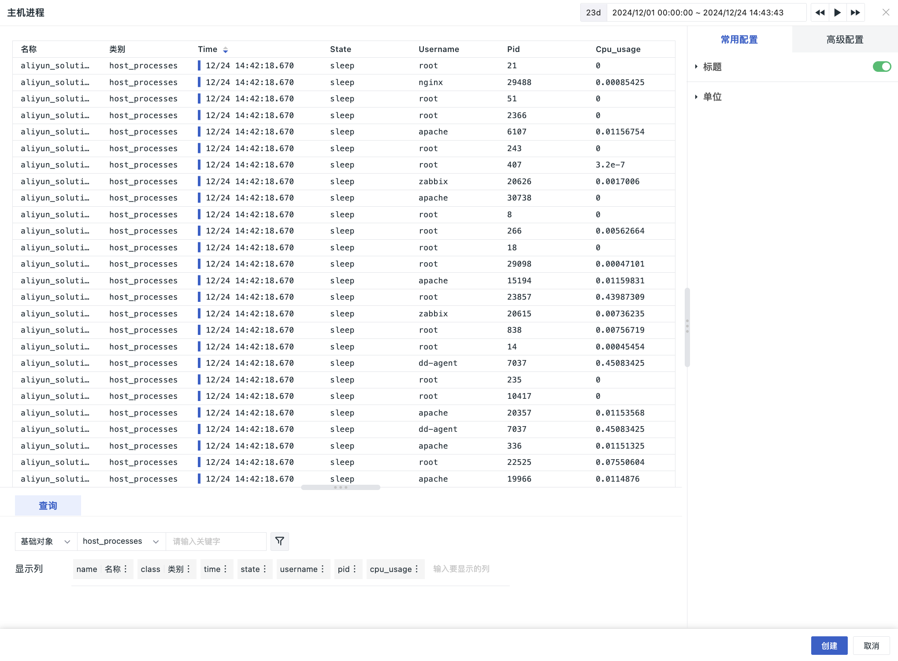

# 对象列表图
---

以表格图的形式展示基础设施数据，包含“基础对象”和“资源目录”。可对数据进行筛选过滤，以查看相应对象分类下的数据。

## 图表查询

1. 查询：数据查询来源固定为**基础对象**，支持关键字搜索；
2. 筛选：可输入筛选条件过滤查询的对象数据；
3. 显示列：选择要展示的显示列。`name`、`class` 内容默认存在，可重命名。

## 图表配置

> 更多详情，可参考 [图表配置](./chart-config.md)。

