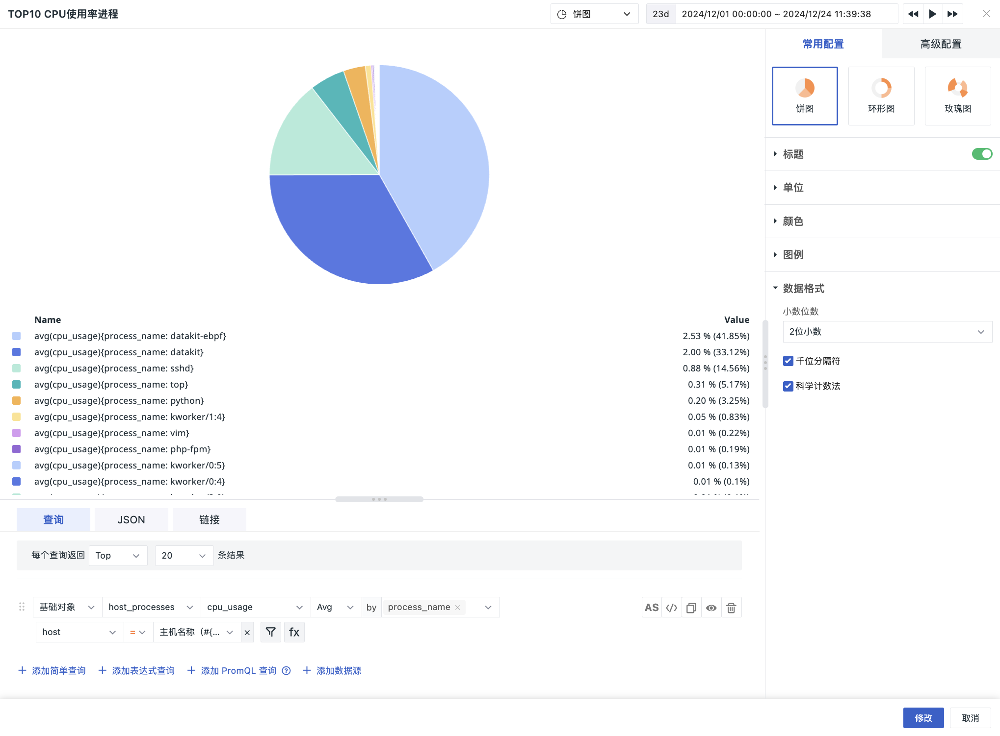

# 饼图
---

一般适用于表现数据分组的对比情况。

图表类型包含：

- 饼图：显示数据分组的对比情况，更多用于样本指标较少的场景；   
- 环形图：更多适用于反映多个样本指标各部分所占比例；    
- 玫瑰图：圆弧半径的大小表示数据的大小，适用于反映分类过多的场景，和数值大小相似的占比及对比场景。

## 图表配置

> 更多详情，可参考 [图表配置](./chart-config.md)。

### 合并数据项

若饼图中数据占比比例过小的切片太多，您可使用合并来聚合数据到【其他】的切片上，查看占比优先级更高的切片，提高饼图的可读性。

配置合并以后：饼图切片增加 “其他” 的切片，表示被合并的数据汇总显示。 

<!--
## 图表查询

图表查询支持**简单查询**、**表达式查询**、**DQL 查询**和 **PromQL 查询**；默认添加简单查询。每个查询预设 5 种返回结果数量，包括 5、10、20、50、100 ，默认返回 20 条数据，支持手动输入，最多为 100 条数据。

> 更多图表查询条件详细说明，可参考 [图表查询](chart-query.md)。

## 图表链接

链接可以帮助您实现从当前图表跳转至目标页面；可添加平台内部链接和外部链接；还可通过模板变量修改链接中对应的变量值将数据信息传送过去，完成数据联动。

> 更多相关设置说明，可参考 [图表链接](chart-link.md)。

## 常用配置

| 选项 | 说明 |
| --- | --- |
| 标题 | 为图表设置标题名称，设置完成后，在图表的左上方显示，支持隐藏。|
| 描述 | 为图表添加描述信息，设置后图表标题后方会出现【i】的提示，不设置则不显示。 |
| 单位 | **:material-numeric-1-box: 默认单位显示**： <li>若查询的数据为指标数据，且您在[指标管理](../../metrics/dictionary.md)中为指标设置了单位，则默认按照指标的单位进行进位显示； <li>若您在**指标管理**内无相关单位配置，则按照 [千分位](chart-query.md#thousand) 逗号间隔的数值进位方式显示。 **:material-numeric-2-box: 配置单位后**： 优先使用您自定义配置的单位进行进位显示，指标类数据支持针对数值提供两种选项：  **科学计数说明** <u>默认进位</u>：单位为万、百万，如10000 展示为 1 万，1000000 展示为 1 百万。保留两位小数点； <u>短级差制</u>：单位为 K, M, B。即以 thousand、million、billion、trillion 等依次表示中文语境下的千、百万、十亿、万亿等。如 1000 为 1 k，10000 为 10 k，1000000 为 1 million；保留两位小数点。|
| 颜色 | 可为图表设置字体颜色和背景颜色。 |
| 图例 | 更多详情，可参考 [图例说明](./timeseries-chart.md#legend)。 |
| 数据格式 | 您可以选择【小数位数】以及【千分位分隔符】。 <li>千位分隔符默认开启，关闭后将显示原始值，无分隔符。更多详情，可参考 [数据千分位格式](../visual-chart/chart-query.md#thousand)。 |

## 高级配置

| 选项 | 说明 |
| --- | --- |

| 锁定时间 | 即固定当前图表查询数据的时间范围，不受全局时间组件的限制。设置成功后的图表右上角会出现用户设定的时间，如【xx分钟】、【xx小时】、【xx天】。 |
| 时间分片 | 开启时间分片后，会先对原始数据按照一定的时间间隔进行分段聚合，再对聚合后数据集进行第二次聚合得到结果值，默认关闭。  若时间分片关闭，无时间间隔选项；若时间分片开启，时间间隔选项如下： <li>自动对齐：开启后，将按选择的时间范围和聚合时间间隔动态的调整查询，根据计算的时间间隔就近向上取整。  &nbsp; &nbsp; &nbsp;系统预设了多种时间间隔：1毫秒、10毫秒、50毫秒、100毫秒、500毫秒、1秒、5秒、15秒、30秒、1分钟、5分钟，10分钟、30分钟、1小时，6小时，12小时、1天、1周、1月； <li>自定义时间间隔：当选择【锁定时间】时，根据锁定时间的长短，自动匹配不同的可选时间间隔查询显示数据。（*例如：时间间隔选择 1 分钟，那么实际将按照 1 分钟的时间间隔发起查询*）   更多详情，可参考 [时间分片说明](chart-query.md#time-slicing)。 |
| 同期对比 | 与上一同等时间的数据进行对比。默认显示为关闭状态，开启同期对比后，对比维度支持 4 个选项：小时（与一小时前对比）、日（与一天前对比）、周（与一周前对比）、月（与一个月前对比）。 开启同期对比功能后，若对比的时间范围内数据断档，最直接显示为 N/A，例如：周同比 N/A。  支持多选对比维度，更多详情，可参考 [同期对比](time-comparison.md)。   |
| 混合图 | <li>开启后，可选择面积图或柱状图同时展示在图表中，帮助您在查询当前指标值的同时也能了解指标趋势； <li>开启后，值映射中会新增折线颜色设置项，在值映射设置折线颜色后，数据查询结果满足条件即显示在图表中。  您还可以选择勾选显示坐标轴。 |
| 空间授权 | 被授权的工作空间列表，选择后即可通过图表查询并展示该工作空间数据。 |
| 数据采样 | 仅针对 Doris 日志数据引擎的工作空间；开启后，会对除“指标”外的其他数据进行采样查询，采样率不固定，会根据数据量大小动态调整。 |
| 时间偏移 | 非时序数据在入库后存在至少 1 分钟的查询延迟。选择相对时间查询时，可能导致最近几分钟的数据未能被采集，从而出现数据丢失的情况。 启用时间偏移后，当查询相对时间区间时，实际查询时间范围向前偏移 1 分钟，以防止入库延迟导致数据获取为空。如：当前为 12:30，查询最近 15 分钟的数据，开启时间偏移后，实际查询的时间是：12:14-12:29。 :warning:  <li>该设置仅针对相对时间生效，若查询时间区间为“绝对时间范围”，时间偏移不生效。 <li>针对有时间间隔的图表，如时序图，设定时间间隔超出 1min 则时间偏移不生效，<= 1m 的情况下才偏移生效。针对没有时间间隔的图表，如概览图、柱状图等，时间偏移保持生效。|

## 示例图

下图为磁盘已使用空间和剩余空间的对比情况：

-->