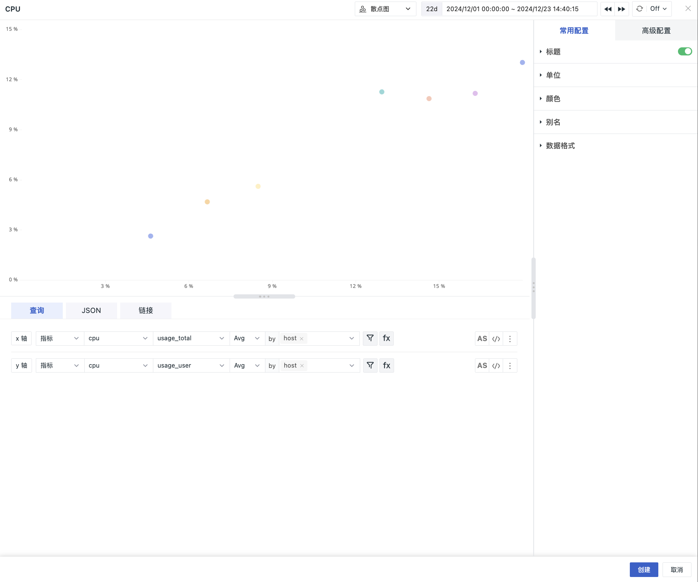

# 散点图
---

散点图表示因变量随自变量而变化的大致趋势，由此趋势可以选择合适的函数进行经验分布的拟合，进而找到变量之间的函数关系。可用来观察数据的分布和聚合情况。

## 应用场景

观测云的散点图用于观察数据的分布和聚合情况。例如您可以查看不同主机 CPU 系统使用率和用户使用率的分布情况。

## 图表查询

图表查询支持**简单查询**、**表达式查询**、**PromQL 查询**和**数据源查询**；默认添加 **x 轴**和 **y 轴**查询。查询的指标集以及指标可以不同，但 by（分组）的 Tag 必须一致，修改一个查询条件，另外一个查询条件自动同步修改。

> 更多图表查询条件详细说明，可参考 [图表查询](chart-query.md)。

## 图表链接

链接可以帮助您实现从当前图表跳转至目标页面；可添加平台内部链接和外部链接；还可通过模板变量修改链接中对应的变量值将数据信息传送过去，完成数据联动。

> 更多相关设置说明，可参考 [图表链接](chart-link.md)。

## 常用配置

| 选项 | 说明 |
| --- | --- |
| 标题 | 为图表设置标题名称，设置完成后，在图表的左上方显示，支持隐藏。|
| 描述 | 为图表添加描述信息，设置后图表标题后方会出现【i】的提示，不设置则不显示。 |
| 单位 | **:material-numeric-1-box: 默认单位显示**： <li>若查询的数据为指标数据，且您在[指标管理](../../metrics/dictionary.md)中为指标设置了单位，则默认按照指标的单位进行进位显示； <li>若您在**指标管理**内无相关单位配置，则按照 [千分位](chart-query.md#thousand) 逗号间隔的数值进位方式显示。 **:material-numeric-2-box: 配置单位后**： 优先使用您自定义配置的单位进行进位显示，指标类数据支持针对数值提供两种选项：  **科学计数说明** <u>默认进位</u>：单位为万、百万，如10000 展示为 1 万，1000000 展示为 1 百万。保留两位小数点； <u>短级差制</u>：单位为 K, M, B。即以 thousand、million、billion、trillion 等依次表示中文语境下的千、百万、十亿、万亿等。如 1000 为 1 k，10000 为 10 k，1000000 为 1 million；保留两位小数点。|
| 颜色 | 设置图表数据的显示颜色，支持自定义手动输入预设颜色，输入格式为：聚合函数(指标){"标签": "标签值"}，如 `last(usage_idle){"host": "guance_01"}`。 |
| 别名 | <li>支持对分组后的查询添加别名，在添加别名后，图例的名称也随之变化，方便更直观的区分相关指标。 <li>支持自定义手动输入预设别名，输入格式为：聚合函数(指标){"标签": "标签值"}，如 `last(usage_idle){"host": "guance_01"}`。 |
| 数据格式 | 您可以选择【小数位数】以及【千分位分隔符】。 <li>千位分隔符默认开启，关闭后将显示原始值，无分隔符。更多详情，可参考 [数据千分位格式](../visual-chart/chart-query.md#thousand)。 |

## 高级配置

| 选项 | 说明 |
| --- | --- |
| 锁定时间 | 即固定当前图表查询数据的时间范围，不受全局时间组件的限制。设置成功后的图表右上角会出现用户设定的时间，如【xx分钟】、【xx小时】、【xx天】。如锁定时间间隔30分钟，那么当调节时间组件无论查询什么时间范围视图，仍只会显示最近 30 分钟数据。 |
| 字段映射 | 配合视图变量的对象映射功能，默认为关闭，若在视图变量已配置对象映射： <li>开启字段映射时，图表显示查询的**分组字段**和对应的**映射字段**，未指定映射的分组字段不显示； <li>关闭字段映射时，图表正常显示，不显示映射的字段。  |
| 空间授权 | 被授权的工作空间列表，选择后即可通过图表查询并展示该工作空间数据。 |

