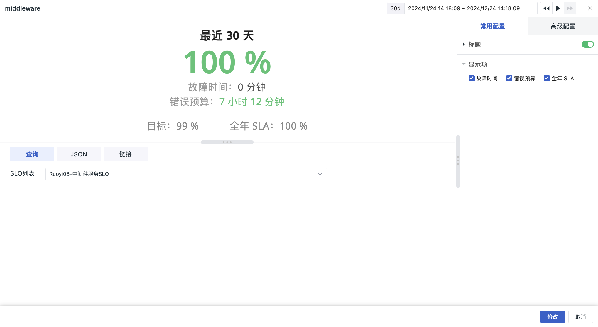

# SLO
---

需直接选择已经设置好的 SLO 监控，以展示相关的性能数据。

> 更多详细介绍，可参考 [什么是 SLO](../../monitoring/slo.md)。

## 图表查询

SLO 列表：包括当前工作空间内所有创建的 SLO，通过选择不同的 SLO 名称，同步展示 SLO 数据结果。

## 图表配置

> 更多详情，可参考 [图表配置](./chart-config.md)。

### 显示项

1. 故障时间：即监控器异常的时间/已用额度  
2. 错误预算：用于控制是否显示剩余额度数据  
3. 全年 SLA：用于控制是否实现全年 SLA 数据  

<!--
## 图表链接

链接可以帮助您实现从当前图表跳转至目标页面；可添加平台内部链接和外部链接；还可通过模板变量修改链接中对应的变量值将数据信息传送过去，完成数据联动。

> 更多相关设置说明，可参考 [图表链接](chart-link.md)。

## 常用配置

| 选项 | 说明 |
| --- | --- |
| 标题 | 为图表设置标题名称，设置完成后，在图表的左上方显示，支持隐藏。|
| 描述 | 为图表添加描述信息，设置后图表标题后方会出现【i】的提示，不设置则不显示。 |
| 显示项 | 故障时间：即监控器异常的时间/已用额度。 错误预算：用于控制是否显示剩余额度数据。 全年 SLA：用于控制是否实现全年 SLA 数据。|

## 高级配置

| 选项 | 说明 |
| --- | --- |
| 锁定时间 | 即固定当前图表查询数据的时间范围，不受全局时间组件的限制。设置成功后的图表右上角会出现用户设定的时间，如【xx分钟】、【xx小时】、【xx天】。如锁定时间间隔30分钟，那么当调节时间组件无论查询什么时间范围视图，仍只会显示最近 30 分钟数据。 |
| 空间授权 | 被授权的工作空间列表，选择后即可通过图表查询并展示该工作空间数据。 |

-->

