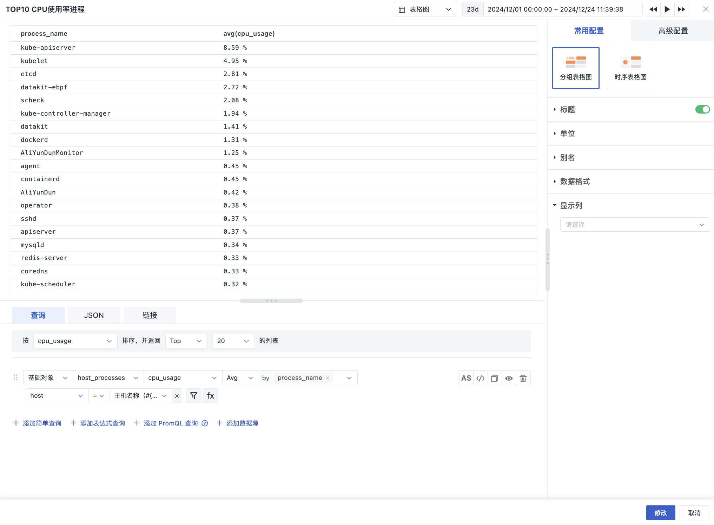

# 表格图
---

表格具有直观展示统计信息属性的特点，同时反映数据间的关系。

包含两种图表类型：

- 分组表格图（默认选中）
- 时序表格图

## 图表查询

1. 支持添加多个查询，但分组的标签必须一致，修改一个，另外的自动同步修改；
2. 支持指标排序，默认按第一个查询的指标排序，点击表头切换升降序，对应查询中的 Top/Bottom 同步调整，点击其他查询的指标进行排序，对应查询中的 Top/Bottom 同步调整。

> 更多详情，可参考 [图表查询](./chart-query.md)。

## 图表配置

> 更多详情，可参考 [图表配置](./chart-config.md)。

### 显示列 

即，您可以选择查询数据的显示列。如果列数较多，可以自定义手动输入列名。最终的查询结果值可以作为[值变量](chart-link.md#z-variate)做链接跳转使用；

在图表的编辑模式下，您可以手动调整列宽，保存当前图表后可根据列宽展示列表信息；还可以**拖拽**调整显示列顺序，列表将根据配置顺序依次展示。 

<!--
## 常用配置 {#set}

表格图包含两种图表类型：分组表格图、时序表格图（默认选中前者)。

### 标题

1. 标题：为图表设置标题名称，设置完成后，在图表的左上方显示，支持隐藏。
2. 描述：为图表添加描述信息，设置后图表标题后方会出现【i】的提示，不设置则不显示。

### 单位

???+ abstract "关于指标数据的单位显示"

    :material-numeric-1-circle: 默认单位显示：

    - 若查询的数据为指标数据，且您在[指标管理](../../metrics/dictionary.md)中为指标设置了单位，则默认按照指标的单位进行进位显示；
    - 若您在**指标管理**内无相关单位配置，则按照[千分位](chart-query.md#thousand)逗号间隔的数值进位方式显示。

    :material-numeric-2-circle: 配置单位后：优先使用您自定义配置的单位进行进位显示。指标类数据支持针对数值提供两种选项：
    
    - 默认进位：单位为万、百万，如10000 展示为 1 万，1000000 展示为 1 百万。保留两位小数点；
    - 短级差制：单位为 K, M, B。即以 thousand、million、billion、trillion 等依次表示中文语境下的千、百万、十亿、万亿等。如 1000 为 1 k，10000 为 10 k，1000000 为 1 million；保留两位小数点。

- 全局：

包含不同维度下通用的单位格式，如数据大小、时间间隔、时间戳等。

在该模式下，还可在下拉框中选择输入自定义单位，回车后即可应用于当前图表。

- 自定义：选择当前查询条件下包含的指标，输入自定义单位。

### 别名

即对分组后的查询添加别名。添加别名后，图例的名称也随之变化，方便更直观地区分相关指标。

您可以手动输入预设别名，输入格式为：聚合函数(指标){"标签": "标签值"}，如 `last(usage_idle){"host": "guance_01"}`。 

### 数据格式

1. 小数位数：可选择 0、1、2、3 位小数或全精度。

2. [千分位分隔符](../visual-chart/chart-query.md#thousand)：千位分隔符默认开启，关闭后将显示原始值，无分隔符。

## 高级配置

### 时间

锁定时间：即固定当前图表查询数据的时间范围，不受全局时间组件的限制。设置成功后的图表右上角会出现用户设定的时间，如【xx分钟】、【xx小时】、【xx天】。假设锁定时间间隔 30 分钟，那么当调节时间组件无论查询什么时间范围视图，仍只会显示最近 30 分钟数据。 

### 规则映射 

即为不同的列设置指标范围和对应的背景颜色、字体颜色。在范围内的指标将按设置的样式进行显示。

设置指标范围及映射值，当指标值在设置的数据范围内时将显示为对应的映射值。

当指标值同时满足多个设置时，显示为最后一个满足条件的设置样式。

设置值映射时，【显示为】和【颜色】都不是必选/必填项：

- 【显示为】默认为空，即代表不做映射值显示；
- 【颜色】默认为空，即不做颜色映射显示其原本颜色。

### 空间授权

启用后，即可在当前工作空间的当前图表下查询外部工作空间的数据。 

在图表下方，可在被授权的工作空间下拉框中选定目标工作空间进行查询。

### 数据采样

仅针对 Doris 日志数据引擎的工作空间。

开启后，会对除“指标”外的其他数据进行采样查询，采样率不固定，会根据数据量大小动态调整。 

### 时间偏移

由于非时序数据在入库后存在至少 1 分钟的查询延迟。选择相对时间查询时，可能导致最近几分钟的数据未能被采集，从而出现数据丢失的情况。

启用时间偏移后，当查询相对时间区间时，实际查询时间范围向前偏移 1 分钟，以防止入库延迟导致数据获取为空。如：当前为 12:30，查询最近 15 分钟的数据，开启时间偏移后，实际查询的时间是：12:14-12:29。

???+ warning "注意事项"

    1. 该设置仅针对相对时间生效，若查询时间区间为“绝对时间范围”，时间偏移不生效。
    2. 针对有时间间隔的图表，如时序图，设定时间间隔超出 1min 则时间偏移不生效，<= 1m 的情况下才偏移生效。针对没有时间间隔的图表，如概览图、柱状图等，时间偏移保持生效。

-->

