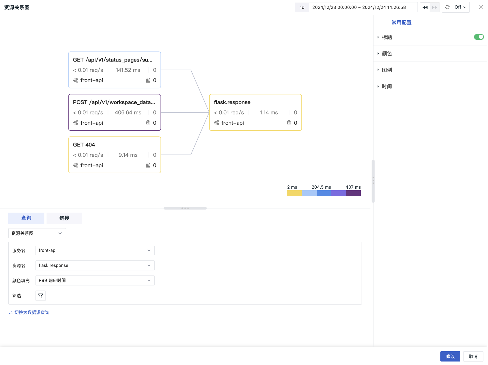

# 拓扑图

为了增强仪表板的可视化效果，观测云根据现有的服务拓扑以及资源调用图进行组件化。

## 图表查询

### 服务关系图

1. 服务名：可选择所有相关的视图变量或具体的值；
2. 颜色填充：包含请求数、P50 响应时间、P75 响应时间、P99 响应时间和错误率；
3. 筛选：可选 `env`、`version`、`project`、`source_type` 四种字段。

点击服务图标，即可查看当前服务的上下游关联、服务概览、日志等信息。

> 此处同样支持 [Service Map 跨工作空间查询](../service-manag.md#servicemap)。

### 资源关系图

1. 服务名：可选择所有相关的视图变量或具体的值；
2. 资源名：可选择所有相关的视图变量或具体的值；
3. 颜色填充：包含 P99 响应时间、请求错误率、事件状态；
4. 筛选：可选 `env`、`version` 两种字段。

**注意**：资源关系图仅支持针对单个资源进行绘制。因此，当**资源名**选择了单个值，此时服务名也需为单个值。若服务名选择了某个视图变量且该变量包含多个值，此时图表会报错。

点击资源图标，即可查看当前资源相关的日志、用户访问、事件等信息。

## 常用配置

| 选项 | 说明 |
| --- | --- |
| 标题 | 为图表设置标题名称，设置完成后，在图表的左上方显示，支持隐藏。|
| 描述 | 为图表添加描述信息，设置后图表标题后方会出现【i】的提示，不设置则不显示。 |
| 颜色 | 色系：包含三种渐变色系； 最大值 & 最小值：自定义请求数上下限。 |
| 图例 | 更多详情，可参考 [图例说明](./timeseries-chart.md#legend)。 |
| 锁定时间 | 即固定当前图表查询数据的时间范围，不受全局时间组件的限制。设置成功后的图表右上角会出现用户设定的时间，如【xx分钟】、【xx小时】、【xx天】。 |