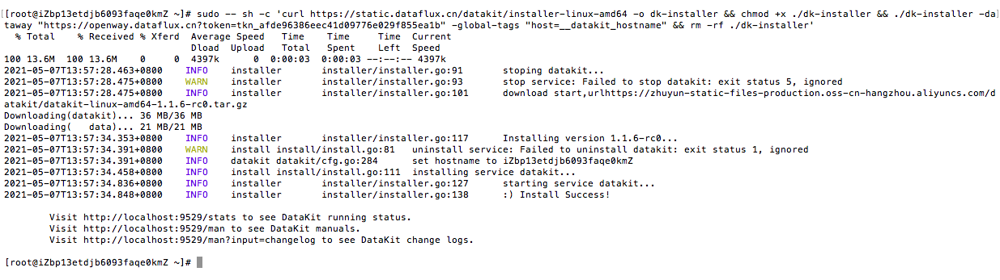
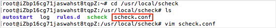
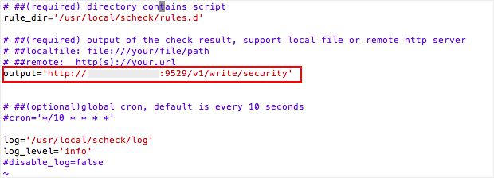
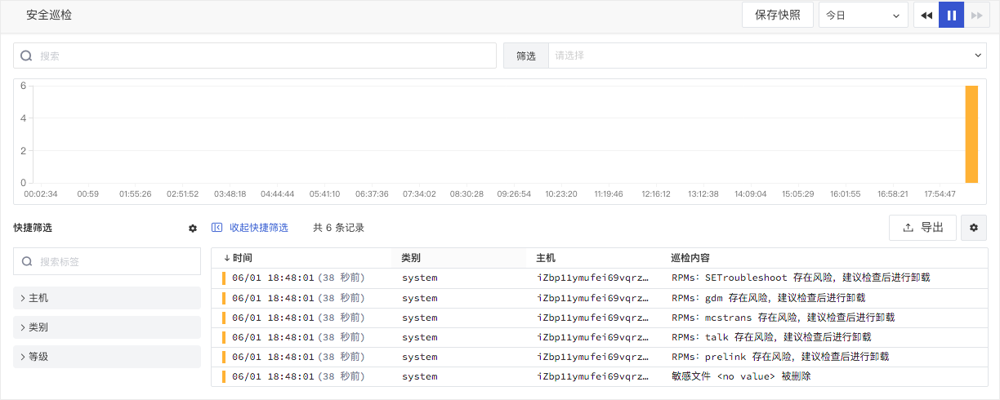

# 安装配置示例
---
- 版本：1.0.7-7-g251eead
- 发布日期：2023-04-06 11:17:57
- 操作系统支持：windows/amd64,windows/386,linux/arm,linux/arm64,linux/386,linux/amd64


{{{ custom_key.brand_name }}}支持通过 Scheck 采集主机、系统、容器、网络等存在的漏洞和异常，并上报到工作空间。本文介绍 Scheck 安装配置示例。

### 1. 安装 DataKit

在{{{ custom_key.brand_name }}}工作空间「集成」-「DataKit」，选择DataKit安装方式，获取「安装指令」在主机执行。更多详情可参考 [DataKit 安装文档](../datakit/datakit-install.md)。



### 2. 安装安全巡检采集器

在主机上执行如下命令安装安全巡检采集器。更多详情可参考 [Scheck 安装文档](scheck-install.md)。

```shell
$ sudo datakit install --scheck
```

####  字段说明
| 字段名 | 说明 |
| --- | --- |
| date | 时间单位：微秒 |
| rule | 规则 |
| host | 主机名称 |
| category | 事件分类，包括：`network`，`storage`，`database`，`system`，`webserver`，`Kubernetes` |
| level | 巡检事件等级，支持：`info`，`warn`，`critical` |
| title | 巡检事件的标题 |
| message | 巡检事件内容 |
| suggestion | 建议内容，包括说明、风险、影响、审计、补救措施等 |

### 3. 配置安全巡检采集器
配置巡检结果输出到 DataKit，在`/usr/local/scheck`目录下，编辑配置文件`scheck.conf`。



确认 output 配置是否默认将数据发送给DataKit接口。



### 4. 重启安全巡检采集器
重启安全巡检和DataKit，分别执行命令 `service scheck restart` 和 `datakit --restart` 。


### 5. 在{{{ custom_key.brand_name }}}工作空间查看安全巡检数据
安装、配置、重启完安全巡检采集器后，即可在{{{ custom_key.brand_name }}}工作空间的「安全巡检」，查看到主机根据安全脚本触发的巡检事件。


