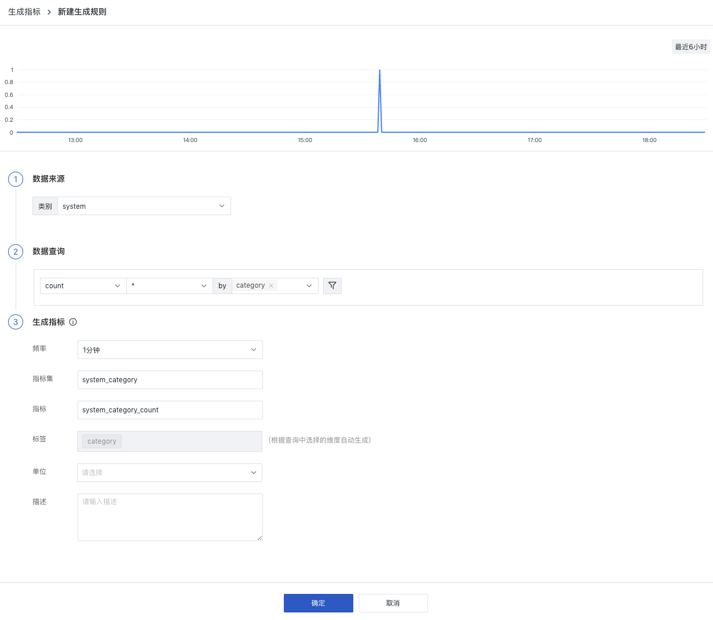
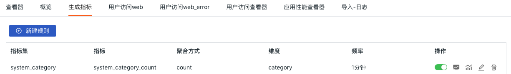
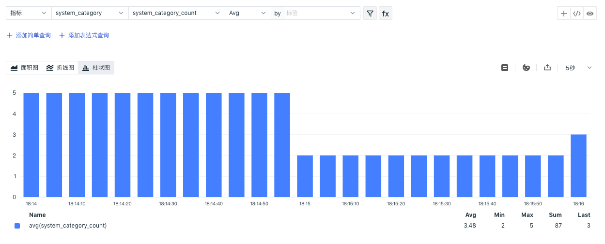
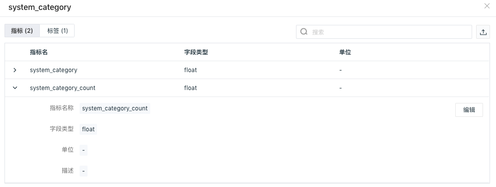
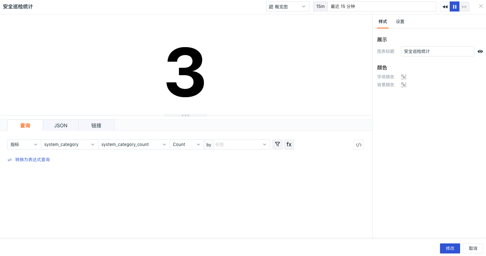
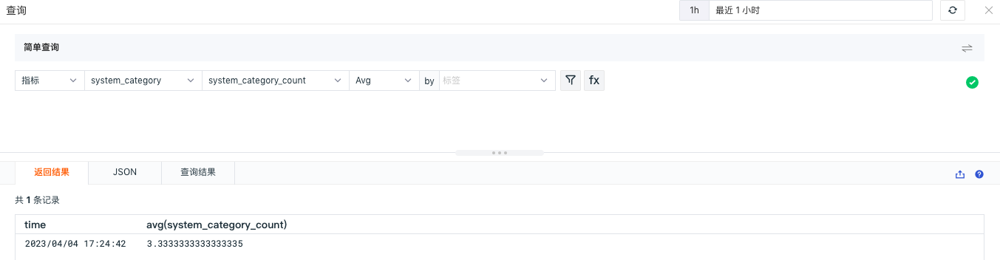

# 生成指标
---
- 版本：1.0.7-7-g251eead
- 发布日期：2023-04-06 11:17:57
- 操作系统支持：windows/amd64,windows/386,linux/arm,linux/arm64,linux/386,linux/amd64

观测云支持基于当前空间内的现有数据生成新的指标数据，以便于您依据需求设计并实现新的技术指标。

???+ warning 

    - 生成指标需有“生成指标配置管理”操作权限的角色可创建编辑，更多详情可参考 [权限清单](../management/role-list.md)。
    - 指标生成以后会按照当前默认的 [数据存储策略](../billing-method/data-storage.md) 进行指标数据存储，并根据产生的 [时间线数量](../billing-method/index.md#time-example) 进行收费。
    - 指标生成以后，若期间没数据上报，则无法在工作空间中查询和分析，如在「指标分析」、「图表」、「DQL 查询工具」中查询指标数据。	

## 新建/克隆规则

进入**安全巡检 > 生成指标**页面，

- 点击**新建规则**，即可开始创建新的生成指标规则；
- 点击 :octicons-copy-24: 图标，可以克隆已有规则创建新的规则。

**Step 1**: 数据来源。筛选出当前空间已有的全部/单个类别的数据来源。

- 类别：安全巡检采集器开启后，类别包括`network`，`storage`，`database`，`system`，`webserver`，`Kubernetes`。**注意：“ * ”表示为全部。**

**Step 2:** 数据查询。基于选定的类别，选择聚合方法，查询统计不同维度的数据。

-  聚合方法：见下表

| 聚合方法 | 说明 |
| --- | --- |
| count | 统计个数 |
| avg | 统计平均值，需选择聚合的字段 |
| max | 统计最大值，需选择聚合的字段 |
| min | 统计最小值，需选择聚合的字段 |
| P75 | 统计指定字段75%!的(MISSING)值，需选择聚合的字段 |
| P95 | 统计指定字段95%!的(MISSING)值，需选择聚合的字段 |
| P99 | 统计指定字段99%!的(MISSING)值，需选择聚合的字段 |

- 维度：按照所选对象进行数据聚合，即对数据请求中的每一个所选对象都生成一个统计值
- 筛选：支持对现有标签数据添加一个/多个筛选过滤条件，并对同一行筛选条件添加“并且“ (and)、“或者”(or)关系

**Step 3:** 生成指标。对生成指标的方式和结果进行设置，包括生成指标的周期、新生成指标的名称和指标集名称。

- 频率：生成指标的执行周期，默认1分钟，即每1分钟生成一次新的指标数据；频率所选时间也作为聚合时间，择频率1分钟，那么就是每隔1分钟聚合生成一次指标，每次聚合的时间范围也是1分钟。
- 时间范围：基于所选频率作为时间间隔，图表默认查询为6小时，即6小时内某数据统计展示的效果；当修改【频率】>=1小时，查询时间范围固定为7天。
- 指标集：设置指标存放的指标集的名称
- 指标：设置指标的名称，其中指标名称不允许重复，可添加多个指标
- 标签：根据查询中选择的维度自动生成
- 单位：可选填，设置指标的单位，生成的指标设置单位后，即可在图表查询中应用
- 描述：可选填，设置指标的描述，生成的指标设置描述后，即可在图表查询中应用

**Step 4:** 完成生成规则的填写后，点击「确定」即可完成生成指标规则并开启数据采集。

## 操作说明

所有已添加的规则都将展示在「生成指标」的界面中，，用户可进行「启用/禁用」、「在指标分析中打开」、「在指标管理中打开」、「编辑」和「删除」等操作。

### 编辑规则

在「生成指标」页面，您可以查看全部已创建的全部生成指标规则，并对生成指标规则进行编辑。

**注意：由于生成指标规则的数据来源、聚合表达式等决定了数据类型，所以部分规则不支持编辑和修改。**

### 启用/禁用规则

在「生成指标」页面，可以对规则状态进行修改。指标生成规则被禁用后，对应的数据将不会写入指标集，待启用后恢复写入。

### 删除规则

在「生成指标」页面，不需要的规则可以删除，规则被“删除”后，指标集不会被删除，但停止数据写入。

### 批量操作 {#batch}

您可以针对特定规则进行批量操作，包括启用、禁用和删除规则。

### 查看指标

#### 在指标分析中查看

在「生成指标」页面，点击规则右侧的「在指标分析中打开」按钮，即可跳转至「指标分析」页面进行查询和分析。

#### 在指标管理中查看

在「生成指标」页面，点击规则右侧的「在指标管理中打开」按钮，即可跳转至「指标管理」页面查看指标和标签，支持对指标单位和描述进行编辑。

## 更多场景应用

### 在图表查询中应用

指标生成以后，可以在「场景」-「仪表板」—「新建仪表板」，在[可视化图表](../scene/visual-chart/chart-query.md)中进行指标数据查询和分析。

### 在 DQL 查询工具中应用

指标生成以后，可以在「快捷入口」-「 [DQL 查询](../dql/query.md) 」中进行指标数据查询和分析。

