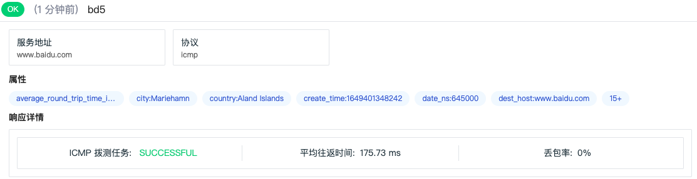

# 可用性监测查看器
---

可用性监测通过查看器为您提供拨测任务的全部数据详情，比如：网络站点的 DNS、SSL、TTFB 等性能测试结果，以及失败拨测的响应详情和失败原因。

## 查询分析

您可通过多种方式对拨测数据进行查询和分析：

- 自定义数据展示的[时间范围](../getting-started/function-details/explorer-search.md#time)；

- 在查看器搜索栏，支持[多种搜索方式和筛选方式](../getting-started/function-details/explorer-search.md)；

- 在查看器 > 快捷筛选，可编辑[筛选字段](../getting-started/function-details/explorer-search.md#quick-filter)；

- 通过[显示列](../getting-started/function-details/explorer-search.md#columns)自定义添加、编辑、删除、拖动显示列。

- 在查看器[分析栏](../getting-started/function-details/explorer-search.md#analysis)，支持基于 1-3 个标签进行多维度分析统计，并支持多种数据图表分析方式。

### 分布图

{{{ custom_key.brand_name }}}会依据选择的时间范围统计一定时间段内存在的拨测数据数量。您可以通过堆积柱状图，查看不同时间段存在的不同状态拨测数据数量。

不同数据类型存在不同的数据状态，http(API 拨测）数据的状态包括，

- `OK`：成功的请求；  
- `FAIL`：失败的请求

### 数据导出

在可用性监测查看器列表，您可以先筛选出想要的数据导出后进行查看和分析，支持导出 CSV 文件到本地设备或者导出到场景仪表板或者笔记。

如果需要导出某条数据，打开该条数据详情页，点击右上角 :material-tray-arrow-up: 图标即可。

<!--
## HTTP 拨测

在可用性监测**查看器**，选择 **HTTP 拨测**，即可查看配置的所有 HTTP 拨测任务的数据结果。

在可用性监测查看器列表，点击想要查看的拨测数据即可查看对应的拨测数据详情，您可查看到属性、测试性能、响应详情、响应头、响应内容等数据详情。

当鼠标点击属性字段，支持以下操作：

| 字段 | 说明 |
| --- | --- |
| 筛选字段值 | 即添加该字段至查看器，查看与该字段相关的全部数据。 |
| 反向筛选字段值 | 即添加该字段至查看器，查看除了该字段以外的其他数据。 |
| 添加到显示列 | 即添加该字段到查看器列表进行查看。 |
| 复制 | 即复制该字段至剪贴板。  |

## TCP 拨测

在可用性监测**查看器**，选择 **TCP 拨测**，即可查看配置的所有 TCP 拨测任务的数据结果。

在可用性监测查看器列表，点击想要查看的拨测数据即可查看对应的拨测数据详情，您可查看到属性、测试性能、响应详情、路由跟踪结果等数据详情。

## ICMP 拨测

在可用性监测**查看器**，选择 **ICMP 拨测**，即可查看配置的所有 ICMP 拨测任务的数据结果。

在可用性监测查看器列表，点击想要查看的拨测数据即可查看对应的拨测数据详情，您可查看到属性、响应详情等数据详情。

## WEBSOCKET 拨测

在可用性监测**查看器**，选择 **WEBSOCKET 拨测**，即可查看配置的所有 WEBSOCKET 拨测任务的数据结果。

在可用性监测查看器列表，点击想要查看的拨测数据即可查看对应的拨测数据详情，您可查看到属性、发送消息、响应详情、响应头、响应内容等数据详情。

-->