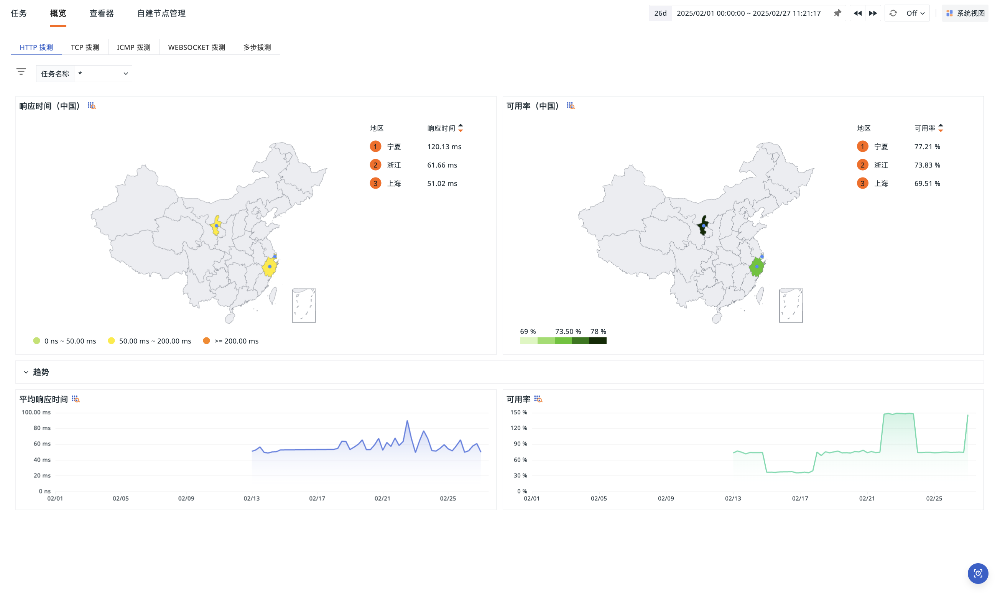

# 概览
---

在可用性监测 > 概览中，您可以通过地理和趋势两个维度，分析当前拨测任务下目标对象的应用性能，涵盖响应时间、往返时间、连接时间和可用率等关键指标。

## 概念先解

| 指标 | 说明 |
| --- | --- |
| 响应时间 | 从请求端发出请求开始，到系统响应的时间。 |
| 往返时间 | 从请求端发送数据包开始，到接收数据包往返的时间。 |
| 连接时间 | 从请求端发出请求开始，到建立连接的时间。 |
| 可用率 | 请求端访问成功率。 |

## 看板分析

根据拨测类型，您可以筛选并查看不同任务下的数据分布情况及趋势走向，涵盖多种关键指标。

### 看板设置

> 可参考 [图表设置](../scene/visual-chart/chart-config.md)、[系统视图](../scene/built-in-view/index.md#system)、[查看器设置](../getting-started/function-details/explorer-search.md)。