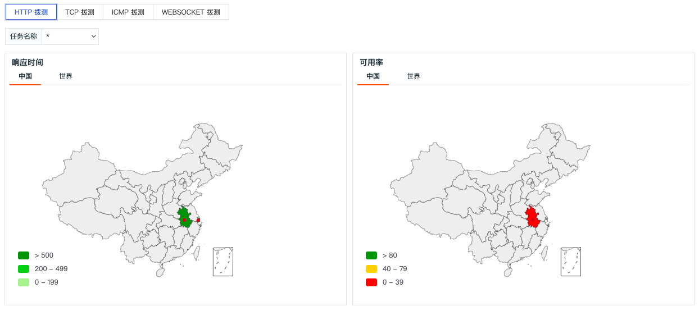
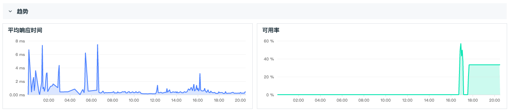
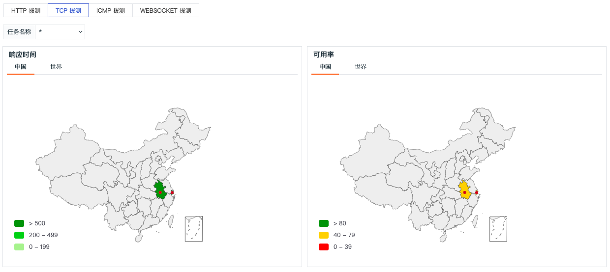
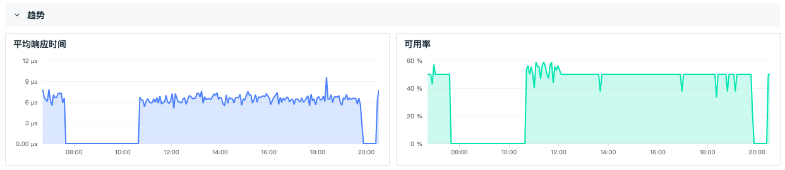
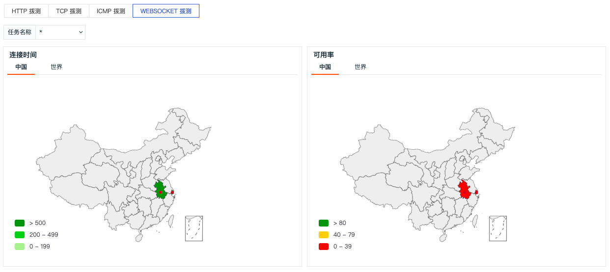

# 概览
---

在可用性监测**概览**，您可以从地理和趋势两个维度分析当前拨测任务下目标对象的应用性能，包括响应时间、往返时间、连接时间和可用率。

| 字段 | 说明 |
| --- | --- |
| 响应时间 | 从请求端发出请求开始，到系统响应的时间。 |
| 往返时间 | 从请求端发送数据包开始，到接收数据包往返的时间。 |
| 连接时间 | 从请求端发出请求开始，到建立连接的时间。 |
| 可用率 | 请求端访问成功率。 |

## HTTP 拨测

在可用性监测**概览**，选择 **HTTP 拨测**，通过左上角**中国**/**世界**按钮，您可以查看在不同地区、城市、国家的请求响应时间和可用率。

通过底部的响应时间和可用率趋势可直观的查看对应的拨测的应用性能数据。

## TCP 拨测

在可用性监测**概览**，选择 **TCP 拨测**，通过左上角**中国**/**世界**按钮，您可以查看在不同地区、城市、国家的请求响应时间和可用率。

通过底部的响应时间和可用率趋势可直观的查看对应拨测任务数据传输的稳定性。

## ICMP 拨测

在可用性监测**概览**，选择 **ICMP 拨测**，通过左上角**中国**/**世界**按钮，您可以查看在不同地区、城市、国家的请求往返时间和可用率。

通过底部的往返时间、丢包率和可用率趋势可直观的查看对应拨测任务的网络质量。

## WEBSOCKET 拨测

在可用性监测**概览**，选择 **WEBSOCKET 拨测**，通过左上角**中国**/**世界**按钮，您可以查看在不同地区、城市、国家的请求连接时间和可用率。

通过底部的连接时间和可用率趋势可直观的查看对应拨测任务网络传输的稳定性。

  