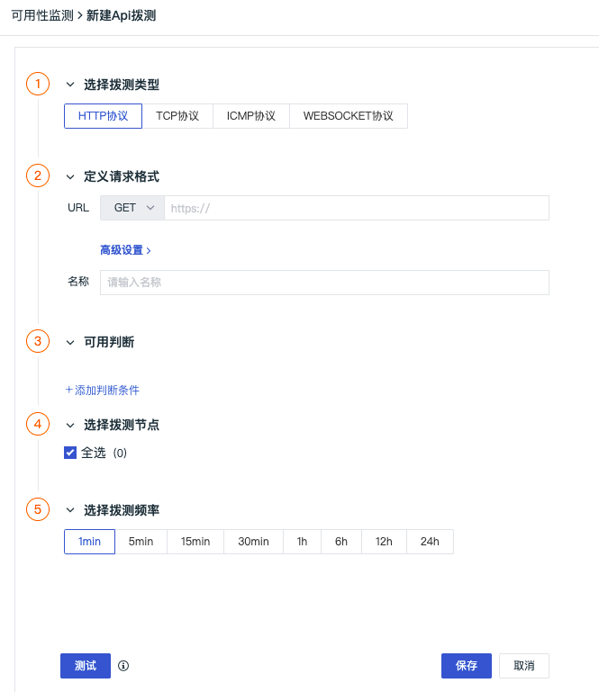

# 创建 HTTP 拨测任务
---

HTTP 拨测对基于 `HTTP` 协议下的网站、域名、后台接口等进行周期的可用性监测。通过对站点的实时监测，统计其可用情况，提供拨测日志和实时告警，帮助您快速发现网络问题，提高网络访问质量。

HTTP 拨测允许您向应用程序的 API 接口发送 HTTP 请求，以验证定义请求和判断条件，例如请求头、状态码、响应时间等。

## 创建任务

在观测云工作空间，点击**新建 > API 拨测**，选择 **HTTP 协议**。

您可在左上角为当前拨测任务添加[标签](../../management/global-label.md)，通过全局标签实现当前工作空间的数据联动。已添加的标签保存后可直接在列表内显示。您可以根据左侧**快捷筛选 > 标签**快速查找对应标签下所包含的拨测任务。

**标签逻辑补充**：设置拨测任务节点为 `node_name:华南-广州-中国电信`，若您为拨测任务添加了标签 `node_name:自建节点`，则丢弃自定义标签 `node_name:自建节点`不写入到拨测结果属性中。

### 定义请求格式

1. URL：同时支持输入 HTTP 或者 HTTPS 的 URL，包括四种请求方式 `GET`、`POST`、`PUT` 和 `HEAD`；  
2. 高级设置：根据实际情况进行高级设置，包括请求设置、请求体内容、证书、代理、隐私；  
3. 名称：自定义 HTTP 拨测任务名称，在当前空间内不支持重名。

### 可用判断 {#test}

您可添加判断条件，基于筛选条件来最终匹配数据。当选择多个判断条件时，多个判断条件之间可以通过选择“所有”或者“任意”来判断 `AND` 或 `OR` 关系。

定义好请求格式，且添加完成可用判断条件后，可点击 URL 右侧的**测试**，判断拨测连接配置是否成功。

**注意**：测试与选择的节点无关。

### 选择拨测节点

目前观测云在全球已覆盖 14 个拨测节点。您可选择中国地区、海外地区（仅支持商业版及以上版本用户）的一个或多个节点，快速开启站点的服务质量监测。

### 选择拨测频率

选择云拨测的数据返回频率，支持 1 分钟（仅支持商业版及以上版本用户）、5 分钟（仅支持商业版及以上版本用户）、15 分钟（仅支持商业版及以上版本用户）、30 分钟、1 小时、6 小时、12 小时、24 小时等 8 种选择。

