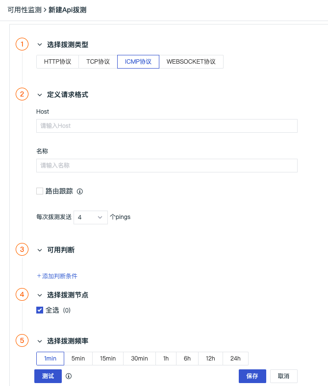

# 创建 ICMP 拨测任务
---

ICMP 拨测允许您监测主机的网络通信问题。通过设置一个或多个 pings，可帮助检测数据包连接、丢包率、往返时间等情况。若配置了路由跟踪或者网络跳数，会返回路由跟踪结果，可跟踪连接到主机所需的网络跳转次数，以及每个网络跳转的详细信息。

## 创建 ICMP 拨测任务

在观测云工作空间，点击**新建 > API 拨测**，选择 **ICMP 协议**。

### 定义请求格式

- Host：输入主机，支持输入 `www.example.com` 格式或者直接输入网关号如 `192.186.0.1`；  
- 名称：自定义 ICMP 拨测任务名称，在当前空间内不支持重名；  
- 路由跟踪：开启后将打开一个路由跟踪探针（traceroute），用于发现到主机目的路径上的所有网关；  
- 每次拨测发送 pings ：支持选择 1 ～ 10 的任意数量。

### 可用判断

支持添加判断条件匹配数据，当选择多个判断条件时，多个判断条件之间可以通过选择“所有”或者“任意”来判断是“全且”或“全或”关系。

???+ warning

    - 在可用判断选择配置“网络跳数”，类似于开启路由跟踪，会返回路由跟踪的数据；  
    - 若当前拨测任务没有 ping 通，往返时间设置为 0，即无往返时间。

### 选择拨测节点

目前观测云在全球已覆盖 16 个节点，支持选择中国地区、海外地区（仅支持商业版及以上版本用户）的一个或多个节点，快速开启站点的服务质量监测。

### 选择拨测频率

选择云拨测的数据返回频率，支持 1 分钟（仅支持商业版及以上版本用户）、5 分钟（仅支持商业版及以上版本用户）、15 分钟（仅支持商业版及以上版本用户）、30 分钟、1 小时、6 小时、12 小时、24 小时等 8 种选择。

### 测试

配置完成后，点击**测试**按钮，确认配置是否成功，并基于选择的每次拨测发送 pings 返回发送/接收的数据包数量，若配置了路由跟踪或者网络跳数，同时会返回路由跟踪结果。

