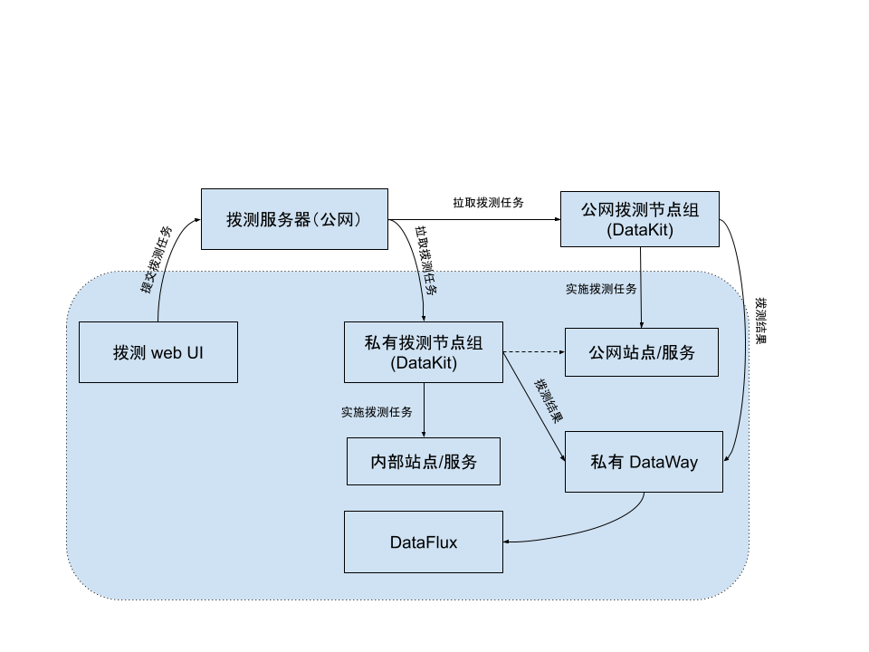

# 自建节点管理
---

除{{{ custom_key.brand_name }}}系统内置的 14 个节点外，您还可以在全球范围内自建新的拨测节点.基于不同地理位置、不同运营商自建节点，从多地域进行可用性监测，充分了解站点的可用性。

## 新建节点

进入**可用性监测 > 自建节点管理**，点击**新建节点**。

1. 选择国家/地区以及省份或城市；
2. 选择运营商；
3. 节点 code 自动填入；在当前空间内节点 Code 不支持重复；  
4. 输入节点名称；在当前空间内节点名称不支持重复；
5. 点击确定。 

## 节点管理

在节点列表，您可以通过以下操作统一查看和管理当前工作空间所有自建节点：

1. hover 在节点名称上，点击编辑按钮即可修改节点名称；  
2. 点击获取配置，即可在弹出的窗口直接复制配置信息；
3. 点击删除，即可删除当前节点。如果自建节点关联了拨测任务，删除后，该任务中此节点将不再上报数据，已上报的数据不受影响。

## 安装节点

新建节点后，您需要在 DataKit 中完成安装，才能够开启节点的使用。

1. 创建自建节点后，你需要通过**自建节点管理 > 获取配置**获取指定节点的配置信息；  

2. 在 DataKit 中完成拨测节点的[安装](../integrations/dialtesting.md)，并确保部署拨测节点的服务器可探测到目标节点（国家、地区、运营商）。

