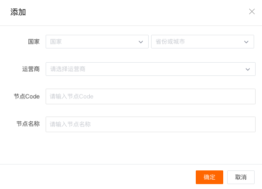

# 自建节点管理
---

观测云平台支持在全球范围内自建新的拨测节点，即通过**自建节点管理**您可以快速建立分布于全球的服务质量监测点。

## 新建节点

进入**云拨测 > 自建节点管理**，点击**新建节点**。

| 字段 | 说明 |
| --- | --- |
| 国家 | 选择自建节点的地理位置，包括国家、省份或城市。 |
| 运营商 | 选择运营商。 |
| 节点 Code | 用于获取节点信息的 Code 码，在当前空间内节点 Code 不支持重复。 |
| 节点名称 | 用户自定义的节点名称，在当前空间内节点名称不支持重复。 |

## 节点管理

在**自建节点管理**页面中，您可以统一查看和管理现有自建节点。

- 将鼠标悬停在节点名称时，点击编辑按钮即可重新编辑节点名称；  
- 点击**获取配置**，即可获取该节点的配置信息，用于在DataKit 中完成拨测节点的安装；  
- 点击**删除**即可删除该节点。**节点一经删除，与该节点对应的拨测任务也会被删除**。

## 拨测服务架构图

## 安装拨测节点

新建节点后，您需要在 DataKit 中完成安装后，才能够开启节点的使用。安装拨测节点的步骤如下：

**Step 1**：创建自建节点后，你需要通过**自建节点管理 > 获取配置**获取指定节点的配置信息；  

**Step 2**：在 DataKit 中完成拨测节点的安装，并确保部署拨测节点的服务器可探测到目标节点（国家、地区、运营商）。

> 更多详情，可参考 [网络拨测](../integrations/dialtesting.md)。

完成拨测节点的安装后，您可以在配置**云拨测**时选择**自建**节点。
